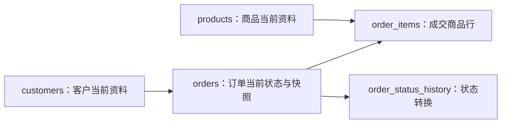

# 规范化、反规范化、状态与历史

规范化用函数依赖拆分关系，减少同一事实被重复保存造成的插入、更新和删除异常。反规范化有意识地复制或预计算事实以改善已测量的读取路径。状态字段保存当前生命周期位置；历史记录保存状态怎样变化，二者不能互相替代。

建表、事务和时间函数示例以 PostgreSQL 18.4 为运行环境。

## 先确定关系表达的事实

表设计的第一步不是套范式名称，而是写清每一行表达什么。例如：

- `orders`：一行是一张订单的当前状态。
- `order_items`：一行是一张订单中的一个商品行。
- `order_status_history`：一行是一次已经发生的状态转换。

若一张表混合多种行粒度，后续主键、依赖和聚合都会模糊。

### 函数依赖

函数依赖 `X → Y` 表示：任意合法数据库状态中，只要两行的 `X` 相同，它们的 `Y` 就必须相同。

以下宽表以 `(order_id, product_id)` 为候选键：

| order_id | ordered_at | customer_id | customer_name | product_id | product_name | quantity | unit_price |
|---:|---|---:|---|---:|---|---:|---:|
| 1001 | 2026-07-17 | 7 | Lin | 11 | Keyboard | 2 | 399.00 |
| 1001 | 2026-07-17 | 7 | Lin | 12 | Mouse | 1 | 199.00 |

已知依赖：

- `order_id → ordered_at, customer_id`
- `customer_id → customer_name`
- `product_id → product_name`
- `(order_id, product_id) → quantity, unit_price`

`unit_price` 是成交时的价格，依赖订单明细键；它不应依赖 `product_id`，因为商品当前价改变不能改写历史订单。

## 更新异常

未拆分的宽表会产生三种典型异常：

1. **更新异常**：客户名称出现于每条明细，漏改一行就产生矛盾。
2. **插入异常**：没有订单时无法只保存新商品，因为主键需要 `order_id`。
3. **删除异常**：删除商品最后一条订单明细会同时丢失商品名称。

规范化让每个独立事实有一个受约束的事实来源。

## 第一范式：列值属于声明的域

第一范式通常要求关系中的每个属性在每行只有一个该属性域中的值，不把重复组塞进同一列。下面的设计难以约束、连接和索引：

```text
orders(id, product_ids = "11,12", quantities = "2,1")
```

应把重复商品组变成明细关系：

```sql
CREATE TABLE order_items (
  order_id bigint NOT NULL REFERENCES orders(id),
  product_id bigint NOT NULL REFERENCES products(id),
  quantity integer NOT NULL CHECK (quantity > 0),
  unit_price numeric(12, 2) NOT NULL CHECK (unit_price >= 0),
  PRIMARY KEY (order_id, product_id)
);
```

PostgreSQL 数组和 `jsonb` 本身是合法类型，但“数据库支持容器类型”不代表任何一对多关系都应嵌入。若元素需要独立外键、唯一性、频繁按元素查询或单独更新，关系表通常更合适。数组适合有界、同质且作为整体读写的值；JSON 适合结构确实开放且有校验边界的附属数据。

## 第二范式：消除对复合键一部分的依赖

第二范式要求在第一范式基础上，每个非主属性完全依赖每个候选键，而不是只依赖复合候选键的一部分。

宽表候选键为 `(order_id, product_id)`，但：

- `ordered_at` 只依赖 `order_id`。
- `product_name` 只依赖 `product_id`。

拆分后：

```text
orders(order_id, ordered_at, customer_id)
products(product_id, product_name)
order_items(order_id, product_id, quantity, unit_price)
```

若表只有单列候选键，不存在“依赖候选键的一部分”，它在满足第一范式后不会因部分依赖违反第二范式。

## 第三范式：消除非键决定非键的传递依赖

第三范式的一种实用表述是：对每个非平凡函数依赖 `X → A`，`X` 是超键，或者 `A` 是某个候选键的一部分。

`orders(order_id, customer_id, customer_name)` 中：

```text
order_id → customer_id
customer_id → customer_name
```

因此 `order_id → customer_name` 是传递依赖。把客户名称移到 `customers`：

```text
customers(customer_id, customer_name)
orders(order_id, customer_id)
```

这里必须区分当前客户名称和下单快照。如果发票依法必须保留成交时抬头，那么 `billing_name_snapshot` 是订单事实，而不是无意重复的客户当前名称。字段名和更新规则应明确它不可随客户资料变化。

## BCNF：每个决定因素都必须是超键

BCNF 比常见的第三范式条件更严格：每个非平凡函数依赖 `X → Y` 中，`X` 必须是超键。

考虑排课关系：

```text
class_room(student, subject, teacher)
```

规则：

- 每个学生对每门课程只有一位教师：`(student, subject) → teacher`。
- 每位教师只教授一门课程：`teacher → subject`。

候选键是 `(student, subject)` 和 `(student, teacher)`。所有属性都属于某个候选键，因此它可满足第三范式；但 `teacher → subject` 的决定因素 `teacher` 不是超键，所以不满足 BCNF。

可拆为：

```text
teacher_subject(teacher, subject)
student_teacher(student, teacher)
```

拆分必须检查两项：

- **无损连接**：把子关系连接回去不会产生虚假行，也不会丢失合法行。
- **依赖保持**：原依赖是否能只靠各子表约束检查。BCNF 拆分可能无法保持所有依赖；有时保留第三范式是为了让约束可直接执行。

上述拆分保留 `teacher → subject`，但 `(student, subject) → teacher` 跨越两张表，不能只检查某一张子表来保证。若该依赖必须由数据库局部约束直接执行，需要重新权衡第三范式设计或增加受控的跨表约束机制。

范式不是表数量竞赛。目标是让事实来源、键和依赖明确，同时保存可执行的不变量。

## 一套规范化订单模型



```sql
CREATE TABLE customers (
  id bigint GENERATED ALWAYS AS IDENTITY PRIMARY KEY,
  tenant_id bigint NOT NULL,
  name text NOT NULL,
  UNIQUE (tenant_id, id)
);

CREATE TABLE products (
  id bigint GENERATED ALWAYS AS IDENTITY PRIMARY KEY,
  sku text NOT NULL UNIQUE,
  current_name text NOT NULL,
  current_price numeric(12, 2) NOT NULL CHECK (current_price >= 0)
);

CREATE TABLE orders (
  id bigint GENERATED ALWAYS AS IDENTITY PRIMARY KEY,
  tenant_id bigint NOT NULL,
  customer_id bigint NOT NULL,
  billing_name_snapshot text NOT NULL,
  status text NOT NULL,
  created_at timestamptz NOT NULL DEFAULT now(),
  updated_at timestamptz NOT NULL DEFAULT now(),
  updated_by bigint,
  paid_at timestamptz,
  version integer NOT NULL DEFAULT 1 CHECK (version > 0),
  UNIQUE (tenant_id, id),
  FOREIGN KEY (tenant_id, customer_id)
    REFERENCES customers (tenant_id, id),
  CHECK (status IN ('draft', 'submitted', 'paid', 'canceled'))
);

CREATE TABLE order_items (
  order_id bigint NOT NULL REFERENCES orders(id) ON DELETE CASCADE,
  product_id bigint NOT NULL REFERENCES products(id),
  product_name_snapshot text NOT NULL,
  quantity integer NOT NULL CHECK (quantity > 0),
  unit_price numeric(12, 2) NOT NULL CHECK (unit_price >= 0),
  PRIMARY KEY (order_id, product_id)
);
```

商品当前名称和价格只存在 `products`；订单快照字段由下单事务复制，此后不随商品变化。这是由业务语义决定的受控重复，而不是无主的双写。

## 何时反规范化

反规范化是在保留明确事实来源的前提下，为读取成本建立派生表示。常见形式：

| 形式 | 示例 | 刷新方式 | 主要风险 |
|---|---|---|---|
| 快照字段 | 订单中的成交商品名 | 创建订单时一次写入 | 与当前资料含义混淆 |
| 缓存计数 | 项目的 `open_issue_count` | 同事务维护或异步重算 | 丢事件导致漂移 |
| 物化视图 | 每日租户收入 | 定时/按需刷新 | 数据有延迟，刷新有成本 |
| 汇总表 | 每小时指标桶 | 流式或批处理 | 重复消费、迟到数据 |
| 搜索文档 | 合并多表供搜索 | CDC/事件更新 | 最终一致、重建复杂 |

采用反规范化前应回答：

1. 哪条真实查询已经出现性能或可用性问题。
2. 唯一事实来源在哪里。
3. 派生值允许延迟多久。
4. 更新是同事务、异步事件还是定时重算。
5. 怎样检测漂移、怎样全量重建。
6. 写放大、锁、存储和回填成本是多少。

### 缓存计数的两种路径

同事务维护保证立即一致，但所有写入都要更新热点行：

```sql
BEGIN;
INSERT INTO issues (project_id, status, title)
VALUES ($1, 'open', $2);
UPDATE projects
SET open_issue_count = open_issue_count + 1
WHERE id = $1;
COMMIT;
```

异步维护降低主事务耦合，但必须处理重复、乱序和漏消息，并定期与事实表重算对账。若读取量不大，直接 `count(*)` 配合索引可能比维护缓存字段更可靠。

## 当前状态、审计字段和历史

### 当前状态

`orders.status` 用于快速判断当前生命周期位置。状态值需要：

- 有限集合；
- 明确进入与退出条件；
- 明确终态是否可恢复；
- 转换权限与副作用；
- 幂等行为。

数据库 `CHECK` 能限制值域，但不能单独表达“`paid` 不能回到 `draft`”这类依赖旧值、权限和外部副作用的规则。

### 审计字段

| 字段 | 回答的问题 | 不能回答的问题 |
|---|---|---|
| `created_at` | 当前行何时创建 | 谁创建、当时完整内容 |
| `created_by` | 哪个主体创建 | 主体为何有权限 |
| `updated_at` | 当前行最近何时修改 | 哪些字段改变 |
| `updated_by` | 最近由谁修改 | 之前的修改者和旧值 |
| `version` | 当前经历多少次受控更新 | 每次更新的具体差异 |

时间点使用 `timestamptz` 保存绝对时刻；展示时再按用户时区转换。数据库的 `now()` 在同一事务内保持事务开始时刻；需要语句或时钟时刻时分别了解 `statement_timestamp()` 和 `clock_timestamp()` 的语义。

### 状态历史

```sql
CREATE TABLE order_status_history (
  id bigint GENERATED ALWAYS AS IDENTITY PRIMARY KEY,
  tenant_id bigint NOT NULL,
  order_id bigint NOT NULL,
  from_status text,
  to_status text NOT NULL,
  changed_at timestamptz NOT NULL DEFAULT now(),
  changed_by bigint NOT NULL,
  reason text,
  request_id uuid NOT NULL,
  FOREIGN KEY (tenant_id, order_id) REFERENCES orders (tenant_id, id),
  CHECK (from_status IS NULL OR from_status <> to_status),
  UNIQUE (tenant_id, request_id)
);

CREATE INDEX order_status_history_order_time_idx
  ON order_status_history (tenant_id, order_id, changed_at, id);
```

`request_id` 让重试同一命令时不会重复记历史。历史行通常只追加，不允许普通业务路径更新或删除；保留期、访问权限和敏感字段脱敏必须单独设计。

## 完整案例：提交并支付订单

### 输入

订单 `501` 当前为 `submitted`、版本 `3`。支付服务收到：

```json
{
  "tenantId": 9,
  "orderId": 501,
  "expectedVersion": 3,
  "actorId": 27,
  "requestId": "8aa2d84a-4232-4c20-9d8f-0e9ca26f0438",
  "paidAt": "2026-07-17T03:20:00Z"
}
```

### 步骤一：锁定并验证当前状态

```sql
BEGIN;

SELECT status, version
FROM orders
WHERE tenant_id = 9 AND id = 501
FOR UPDATE;
```

预期读取 `submitted, 3`。服务端验证允许 `submitted -> paid`，并确认操作者权限和支付凭据。状态机规则必须在一个受控命令中执行，而不是开放任意 `UPDATE status`。

### 步骤二：更新当前状态并记录历史

```sql
UPDATE orders
SET status = 'paid',
    paid_at = '2026-07-17T03:20:00Z',
    updated_at = now(),
    updated_by = 27,
    version = version + 1
WHERE tenant_id = 9
  AND id = 501
  AND status = 'submitted'
  AND version = 3
RETURNING status, version;

INSERT INTO order_status_history (
  tenant_id, order_id, from_status, to_status,
  changed_by, reason, request_id
) VALUES (
  9, 501, 'submitted', 'paid',
  27, 'payment_confirmed',
  '8aa2d84a-4232-4c20-9d8f-0e9ca26f0438'
);

COMMIT;
```

更新输出应为 `paid, 4`，且当前行与历史行在同一事务提交。任何一步失败都会回滚两者，避免“状态已改但历史缺失”。

### 验证

```sql
SELECT status, version, paid_at
FROM orders WHERE tenant_id = 9 AND id = 501;

SELECT from_status, to_status, changed_by, request_id
FROM order_status_history
WHERE tenant_id = 9 AND order_id = 501
ORDER BY changed_at, id;
```

还应执行对账查询，寻找历史末状态与当前状态不一致的订单，并把结果作为监控信号。

### 失败分支

- 若版本已变为 `4`，`UPDATE ... WHERE version = 3` 返回零行；服务返回并发冲突，不写历史。
- 若同一 `request_id` 重试，历史唯一约束阻止重复；命令处理器应读取已完成结果并返回幂等成功。
- 若试图从 `canceled` 转到 `paid`，状态机在更新前拒绝；不能只依赖值域 `CHECK`。
- 若历史写入因约束失败，同一事务会回滚订单更新。

## 历史表、系统版本表与事件溯源的边界

| 方式 | 当前状态来源 | 保存内容 | 适用场景 |
|---|---|---|---|
| 当前表 + 审计字段 | 当前表 | 最近修改摘要 | 只需基本运维追踪 |
| 当前表 + 历史表 | 当前表 | 选定变化或版本快照 | 审计、客服追踪、状态时间线 |
| 事件溯源 | 事件日志重放结果 | 领域事件为事实来源 | 需要时点重建、复杂领域行为 |

事件溯源不是“多加一张 history 表”。它改变写模型、并发控制、投影重建、事件版本和删除策略，只有需求确实需要时才采用。

## 调试与验证

### 检查重复事实

对每一列询问：它依赖哪个候选键？若依赖另一个实体的键，它是否应移到那个实体？若必须保留快照，字段名、创建时机和不再同步的规则是否明确？

### 检查派生数据漂移

```sql
SELECT p.id, p.open_issue_count, count(i.id) AS actual_count
FROM projects AS p
LEFT JOIN issues AS i
  ON i.project_id = p.id AND i.status = 'open'
GROUP BY p.id, p.open_issue_count
HAVING p.open_issue_count <> count(i.id);
```

该查询的返回行数应为零。若不为零，先修复同步机制，再执行可审计的回填。

### 检查历史连续性

使用 `lag(to_status)` 对照下一行的 `from_status`，并确认每个订单最后一条 `to_status` 等于当前表状态。并发更新时还要核对版本连续递增。

## 练习：订阅计费模型

设计客户、套餐、订阅、价格版本和订阅状态历史：套餐价格会变化，但已开账单必须保留成交价格；订阅有 `trialing -> active -> past_due -> canceled` 生命周期。

完成标准：

- 写出每张表的一句话行粒度和候选键。
- 标注至少五条函数依赖，并说明模型达到哪一范式。
- 区分套餐当前价格、价格版本和账单快照。
- 用一个事务完成合法状态转换与历史追加。
- 给出并发版本冲突、重复请求、非法状态转换三个失败分支。
- 若增加 `active_subscription_count`，说明一致性时限、更新方式、对账 SQL 和重建步骤。

## 来源

- [PostgreSQL 18：Constraints](https://www.postgresql.org/docs/18/ddl-constraints.html)（访问日期：2026-07-17）
- [PostgreSQL 18：Date/Time Types](https://www.postgresql.org/docs/18/datatype-datetime.html)（访问日期：2026-07-17）
- [PostgreSQL 18：Date/Time Functions](https://www.postgresql.org/docs/18/functions-datetime.html)（访问日期：2026-07-17）
- [PostgreSQL 18：Materialized Views](https://www.postgresql.org/docs/18/rules-materializedviews.html)（访问日期：2026-07-17）
