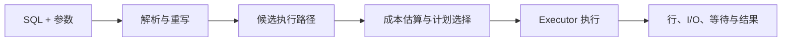

# PostgreSQL EXPLAIN 与慢查询诊断

慢查询诊断不是看到 `Seq Scan` 就加索引，而是从可复现 SQL、参数、数据分布和等待时间出发，比较优化器估算与实际执行，定位时间、行数和 I/O 被消耗的位置。本文以 PostgreSQL 18.4 为主。

## 1. 查询从 SQL 到执行



优化器依据统计信息、成本参数、可用索引和 SQL 语义选择预计成本最低的计划。cost 是内部相对单位，不是毫秒；`cost=startup..total` 分别表示产生第一行前和全部结果的估计成本。`rows` 是节点预计输出行数，`width` 是平均行宽字节估计。

## 2. EXPLAIN 的安全使用

```sql
EXPLAIN (FORMAT TEXT)
SELECT * FROM orders WHERE tenant_id = '...';
```

普通 `EXPLAIN` 不执行查询，适合先查看写操作计划。`EXPLAIN ANALYZE` 会真实执行，包括 `INSERT/UPDATE/DELETE` 的副作用。诊断写操作时在测试环境或事务中执行并回滚：

```sql
BEGIN;
EXPLAIN (ANALYZE, BUFFERS, WAL, SETTINGS, VERBOSE, FORMAT TEXT)
UPDATE inventory SET available = available - 1
WHERE sku = 'sku_8' AND available > 0;
ROLLBACK;
```

即使最终回滚，语句仍会取得锁、触发 trigger、产生临时工作和 WAL；不能把它当完全无副作用。生产执行 `ANALYZE` 前确认语句成本和影响。

常用选项：

- `ANALYZE`：执行并给实际时间、行数、loops。
- `BUFFERS`：显示 shared/local/temp block 的 hit/read/dirtied/written。
- `WAL`：显示 WAL records、full page images 和 bytes。
- `VERBOSE`：显示输出列、schema 和更完整表达式。
- `SETTINGS`：显示影响计划的非默认设置。
- `FORMAT JSON`：适合机器分析和保存；文本适合阅读。
- `TIMING OFF`：仍统计总执行但减少逐节点计时开销，适合极短节点很多的计划。

## 3. 逐项读取执行计划

计划是树，从最深层扫描开始，数据向上流动。实际字段：

```text
actual time=0.120..12.450 rows=800 loops=3
```

time 是每次 loop 的平均首行/末行时间，rows 也是每 loop 平均行数；估算节点总工作时要考虑 loops，不能直接把所有节点 time 相加，因为父节点时间通常包含子节点。

优先检查：

1. 估算 rows 与 `actual rows` 是否相差数量级。
2. 哪个节点丢弃大量 `Rows Removed by Filter`。
3. 哪个节点发生大量 blocks read 或 temp read/write。
4. loops 是否因嵌套循环异常放大。
5. sort/hash 是否溢出到磁盘，批次数是否过多。
6. planning time 与 execution time 谁占主要部分。

## 4. 常见扫描节点

### Seq Scan

顺序扫描读取表的大部分或全部页面。查询需要很大比例行时，它可能比随机索引访问更快，并非错误。若实际只返回极少行且过滤丢弃百万行，再检查索引、类型转换、函数表达式和统计信息。

### Index Scan

从索引定位，再访问 heap 获取列与可见性。返回很多分散行时随机 heap I/O 可能昂贵。

### Index Only Scan

所需列可从索引取得，但是否真正避免 heap 访问取决于 visibility map；计划中的 `Heap Fetches` 显示额外 heap 检查。频繁更新表即使有 covering index 也未必纯索引读取。

### Bitmap Index/Heap Scan

先收集匹配页面位图，再按页面访问 heap，常介于顺序扫描和单条索引访问之间。`lossy` bitmap 需要重新检查更多行，可能因 `work_mem` 不足。

## 5. Join、Sort 与 Aggregate

- Nested Loop：外侧每行驱动内侧查找；外侧小且内侧有高效索引时很好，估算错误导致外侧巨大时会灾难性放大。
- Hash Join：为一侧构建 hash，适合等值连接；hash 超内存会多 batch 并使用临时 I/O。
- Merge Join：两侧按连接键有序，适合有序输入或大范围连接；可能需要额外 sort。
- Sort：查看 Sort Key、Method、Memory/Disk。外部归并说明溢出磁盘。
- HashAggregate/GroupAggregate：前者使用 hash，后者利用排序；分组基数估算影响选择和内存。

不要全局盲目增大 `work_mem`。它大致可由每个并发查询的多个 sort/hash 节点分别使用，总内存可能成倍放大。先对具体会话/事务测试，并计算并发上限。

## 6. 估算错误与统计信息

`ANALYZE` 采样列值分布、null 比例、distinct、most-common values 和 histogram。数据大幅变化后统计陈旧会使估算错误。先运行适当 ANALYZE，而不是用 `enable_seqscan=off` 强迫计划。

相关列是常见误差来源。例如 `country` 与 `city` 强相关，独立选择率相乘会错误。PostgreSQL extended statistics 可记录 dependencies、ndistinct 和 MCV：

```sql
CREATE STATISTICS orders_tenant_status_stats (dependencies, mcv)
ON tenant_id, status FROM orders;
ANALYZE orders;
```

表达式、隐式类型转换和函数也会阻止普通索引使用。`WHERE lower(email)=...` 需要表达式索引或规范化存储；`WHERE id::text=...` 可能无法使用整数索引，正确做法是把参数解析为列类型。

## 7. 参数化计划与数据倾斜

预备语句可能选择 custom plan 或 generic plan。若不同 tenant 数据量差异巨大，一个通用计划可能对小租户好、对大租户差。诊断必须保存实际参数类别，而不记录敏感原值；比较典型小/大 tenant 的计划。

不要通过字符串拼接避免参数计划；这会引入 SQL 注入。可重新建模、改善统计、拆分极端路径，或谨慎评估计划缓存设置。

## 8. 等待并不总显示为“坏计划”

查询慢可能因为锁等待、I/O、CPU 饱和、连接池排队、客户端读取慢或网络，而非计划本身。结合：

- `pg_stat_activity`：状态、wait_event_type、wait_event、query_start、事务时间。
- `pg_locks` 与 `pg_blocking_pids(pid)`：阻塞关系。
- `pg_stat_statements`：规范化语句的 calls、总/平均执行时间、行数和 I/O 时间（需启用扩展）。
- 系统指标：CPU、磁盘延迟、缓存命中、连接和 checkpoint/WAL。

`EXPLAIN ANALYZE` 的客户端输出时间不一定包括传输/渲染全部结果；比较服务端执行与端到端耗时。

## 9. 诊断闭环

1. 从慢请求 trace 找到规范化 SQL、参数类别、数据库和时间窗。
2. 确认是执行、锁等待、连接池还是网络慢。
3. 在有代表性数据和设置上复现，保存基线计划与耗时分布。
4. 找最大估算偏差、loops 放大、过滤行和 I/O 节点。
5. 提出一个原因假设：统计、索引、SQL 形状、返回过多或事务锁。
6. 一次只改变一个因素，比较实际行、buffers、WAL 和 p95。
7. 验证写放大、磁盘、维护和其他查询回归。
8. 上线后用同一指标观察，保留回滚路径。

## 10. 完整案例：租户订单列表

### 输入

`orders` 有 3000 万行，租户 `t_small` 有 500 行，`t_large` 有 800 万行。接口查询最近 50 条已支付订单：

```sql
SELECT id, created_at, total_cents
FROM orders
WHERE tenant_id = $1 AND status = 'paid'
ORDER BY created_at DESC, id DESC
LIMIT 50;
```

大租户 p95 2.8 s，小租户 20 ms。

### 步骤

1. trace 证明数据库执行占 95%，无锁等待。
2. 对两类参数执行 `EXPLAIN (ANALYZE, BUFFERS)`；大租户计划从仅按 `created_at` 索引扫描，过滤数百万非目标 tenant/status 行。
3. 估算错误来自 tenant/status 相关分布；建立 extended statistics 并 ANALYZE。
4. 建立与查询和排序匹配的索引：

```sql
CREATE INDEX CONCURRENTLY orders_tenant_status_created_id_idx
ON orders (tenant_id, status, created_at DESC, id DESC)
INCLUDE (total_cents);
```

5. 再比较计划；目标节点只读取接近 50 条，buffers read 大幅下降。
6. 观察索引大小、写入延迟、autovacuum 和 Heap Fetches。

### 输出

大租户 p95 降到 45 ms，计划使用新索引；小租户无回归。最终是否 index-only 由 visibility map 决定，不把它作为唯一验收目标。

### 验证

- 同一数据快照下结果 ID/顺序完全一致。
- 典型小/大租户分别压测，p50/p95/p99 与 buffers 都记录。
- 新索引创建使用 `CONCURRENTLY`，失败后检查 invalid index。
- 写入吞吐和磁盘在预算内。
- 通过 `pg_stat_statements` 观察一周，无其他关键语句回归。

### 失败分支

如果索引建成后计划仍不使用，先检查参数类型、统计和返回比例，不强制关闭顺序扫描。若接口允许不带 tenant/status 的全量查询，新索引并不能覆盖，应在产品契约中限制筛选或设计另一条有明确成本的路径。

## 11. 常见错误

- 把任何 Seq Scan 判为问题。
- 只看估算 cost，不运行有代表性的 ANALYZE。
- 把父子节点 actual time 直接相加。
- 在生产对写语句运行 EXPLAIN ANALYZE 而不控制事务。
- 为一个慢查询添加多个重叠索引，不评估写放大。
- 全局调大 work_mem 导致并发内存失控。
- 只优化平均值，忽略参数倾斜和 p99。
- SQL 更快但返回结果语义变化，未做结果对比。

## 12. 练习

建立百万级订单测试数据，设计一个估算错误或缺索引的查询。保存优化前后 JSON 计划，解释每个主要节点的 estimated/actual rows、loops、buffers 和 sort/hash 状态。

完成标准：查询结果相同；提出的原因由计划证据支持；p95 与 I/O 有量化改善；索引写入/磁盘成本已测；能识别并解释一个锁等待案例；所有测试使用与列类型匹配的参数。

## 来源

- [PostgreSQL 18: Using EXPLAIN](https://www.postgresql.org/docs/18/using-explain.html)（访问日期：2026-07-17）
- [PostgreSQL 18: EXPLAIN](https://www.postgresql.org/docs/18/sql-explain.html)（访问日期：2026-07-17）
- [PostgreSQL 18: Planner Statistics](https://www.postgresql.org/docs/18/planner-stats.html)（访问日期：2026-07-17）
- [PostgreSQL 18: Monitoring Database Activity](https://www.postgresql.org/docs/18/monitoring-stats.html)（访问日期：2026-07-17）
- [PostgreSQL 18.4 Release Notes](https://www.postgresql.org/docs/release/18.4/)（访问日期：2026-07-17）
