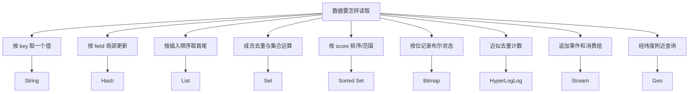

# Redis 数据类型、原子命令与内存模型

Redis 是以内存数据结构和命令为接口的数据服务。选择类型时要同时考虑访问模式、单键大小、原子边界、持久化、复制、Cluster 分片和故障后可接受的数据损失，而不是把所有对象序列化成 String。

## 1. 能力边界与前置知识

本文假定已经掌握哈希表、链表、集合、堆、数据库事务和缓存事实来源。Redis Open Source 8.8 包含传统核心类型，也集成了 JSON、概率结构、Time Series、Search 与 Vector Set 等能力；本文聚焦 roadmap 指定的 String、Hash、List、Set、Sorted Set、Bitmap、HyperLogLog、Stream 与 Geo。

Redis 命令通常在服务端事件循环中按命令原子执行。原子只表示其他命令不会观察到该命令的中间状态，不表示多个独立命令自动组成事务，也不表示主节点确认的写一定在故障转移后保留。

## 2. 从访问模式选择类型



一个业务对象可以由多个 key 表达，但多键操作在 Cluster 中受 hash slot 限制。高频更新集中在单个大 key 会形成热点；把数据拆成大量微小 key 又增加 key 元数据、网络往返和过期管理成本。

## 3. String：字节序列、计数器与条件写

String 保存二进制安全字节序列，值最大长度受 Redis 限制和部署内存约束。常用命令：

| 命令 | 原子行为 | 典型用途 | 边界 |
|---|---|---|---|
| `GET key` | 读完整值 | 缓存 JSON/二进制 | 大值产生网络和复制成本 |
| `SET key value NX PX ms` | 不存在才写并设置毫秒 TTL | 抢占、初始化 | 锁还需唯一值与 fencing |
| `MGET`/`MSET` | 批量读写 | 降低往返 | Cluster 跨 slot 可能受限 |
| `INCRBY` | 整数解析并原子增加 | 计数、序列 | 溢出/业务上限需处理 |
| `GETEX` | 读取并修改过期 | 滑动会话 | 每读续期会保留冷数据 |
| `GETDEL` | 读取并删除 | 一次性 token | 故障/重试后需明确语义 |

```text
SET session:7:Rk3... '{"user_id":"u_9"}' EX 1800 NX
GET session:7:Rk3...
INCRBY quota:tenant:t_7:20260717 3
```

计数器的非负约束不能用 `GET` 后 `DECRBY` 两条命令保证；使用 Lua/Function 在服务端检查并修改，或让数据库承担资金、库存等最终不变量。

## 4. Hash：同一对象的字段集合

Hash 把 field 映射到 value，适合局部读写扁平对象：

```text
HSET product:p_8 name "Keyboard" price_cents 69900 stock_hint 12
HGET product:p_8 price_cents
HMGET product:p_8 name price_cents
HINCRBY product:p_8 view_count 1
```

Hash field 不是独立 key。key 级 TTL 不会因删除一个 field 自动分离；Redis 8 系列还提供 hash field expiration 能力，但客户端、部署版本和命令兼容必须确认。需要所有字段一起失效时仍优先 key TTL。

Hash 适合几十到几百个字段的对象，不适合把整个租户百万用户塞进一个 hash：单 key 迁移、删除、持久化和热点风险集中。字段值依旧是字节序列，不会自动建立二级索引或类型约束。

## 5. List：有序序列和阻塞弹出

List 按插入顺序保存字符串，支持首尾 push/pop、范围和阻塞读取。`LPUSH` + `BRPOP` 可构造简单工作队列；`LMOVE`/`BLMOVE` 可先把任务移入 processing list 再处理，减少消费者取出后崩溃导致的直接丢失。

```text
LPUSH queue:thumbnail job_103
BRPOPLPUSH queue:thumbnail queue:thumbnail:processing 5
LREM queue:thumbnail:processing 1 job_103
```

这仍不是完整消息系统：没有内建尝试次数、消费组、事件重放、schema、分区扩展和稳定审计。重入队列过程可能重复，消费者必须幂等。大量 `LRANGE 0 -1` 会返回整个大列表，应限制范围。

## 6. Set：唯一成员与集合运算

Set 是无序唯一字符串集合。成员增删和存在判断适合标签、权限集合、去重标识：

```text
SADD user:u_9:roles editor auditor
SISMEMBER user:u_9:roles editor
SINTER project:p_2:members tenant:t_7:active_users
```

`SINTER`、`SUNION`、`SDIFF` 的成本与参与集合大小有关，不能在请求路径对百万级集合无界运算。`SSCAN` 是增量遍历，不保证一次迭代期间无重复，也不能提供事务快照；调用方去重并容忍并发变化。

Set 成员只携带存在性，没有 score 和关联字段。需要排名用 Sorted Set，需要成员属性用 Hash/数据库。

## 7. Sorted Set：score 排序和范围索引

Sorted Set 的 member 唯一，每个 member 有双精度 score；按 score 排序，相同 score 再按 member 字典序确定顺序。常用于排行榜、时间索引、延迟队列候选集合。

```text
ZADD leaderboard:weekly 9830 user:u_9 9750 user:u_2
ZREVRANGE leaderboard:weekly 0 9 WITHSCORES
ZADD delayed:email 1784246400000 job_55
ZRANGEBYSCORE delayed:email -inf 1784246400000 LIMIT 0 100
```

浮点 score 不适合精确货币累计。毫秒时间戳在当前范围内可精确表示整数，但要确认长期和复合编码边界。多个 worker 读取到期任务后还需原子领取，不能 `ZRANGE` 后独立 `ZREM` 假定只有一个成功处理。

排行榜更新和读取很快，但分数权威规则、反作弊和持久历史仍应在受控系统。只在 Redis 中维护且无可重建事件时，故障可能永久丢失排名。

## 8. Bitmap：String 上的位操作

Bitmap 不是独立值类型，而是对 String 的 bit 访问。偏移从 0 开始；访问很大偏移会扩展字符串到对应位置，稀疏超大 ID 会浪费内存。

```text
SETBIT active:2026-07-17 42 1
GETBIT active:2026-07-17 42
BITCOUNT active:2026-07-17
BITOP AND active:two-days active:2026-07-16 active:2026-07-17
```

适合把稠密整数 ID 映射为每日活跃布尔值。若用户 ID 是 UUID，应先维护稳定紧凑映射；映射本身要持久。`BITCOUNT` 是精确计数，扫描成本取决于字符串范围，可用 byte 范围限制。

## 9. HyperLogLog：近似基数

HyperLogLog 用固定量级内存估算不同元素数量。`PFADD` 添加，`PFCOUNT` 估算，`PFMERGE` 合并。误差是算法性质，不能用于计费、法定人数或精确库存。

```text
PFADD uv:2026-07-17 user:u_1 user:u_2 user:u_1
PFCOUNT uv:2026-07-17
PFMERGE uv:week uv:2026-07-17 uv:2026-07-18
```

适合看板 UV、监控趋势和实验早期估算。验收应声明误差预算，并用小比例精确集合定期比较。HyperLogLog 无法列出添加过的成员，也不能删除单个成员。

## 10. Stream：追加日志与消费组

Stream entry 有单调有序 ID 和 field-value 列表。`XADD key *` 自动生成 ID；`XRANGE` 回放；`XREAD` 多读者各自读取；`XREADGROUP` 让组内消费者分工并把已投递未确认项放入 Pending Entries List（PEL）。

```text
XADD order-events MAXLEN ~ 100000 * type order.paid order_id o_9 version 3
XGROUP CREATE order-events search-indexer 0 MKSTREAM
XREADGROUP GROUP search-indexer worker-1 COUNT 10 BLOCK 5000 STREAMS order-events >
XACK order-events search-indexer 1784246400000-0
```

`>` 只读取从未投递给该组的新消息；恢复自己 pending 项需要使用相应 ID 范围。消费者永久失联时用 `XPENDING` 观察、`XAUTOCLAIM`/`XCLAIM` 转移。确认前完成业务写且业务写幂等；否则 ack 后崩溃会丢处理，处理后 ack 前崩溃会重复。

Stream 裁剪是近似/精确两种策略，删除 entry 与 consumer-group 引用在新版本中有更细控制。异步复制和默认持久化并不提供 Kafka 风格的独立副本确认语义；对不可丢事件要评估 AOF fsync、复制、failover 窗口和 `WAIT` 的有限保证。

## 11. Geo：经纬度成员索引

Geo 命令底层使用 Sorted Set 编码位置，支持添加坐标和按半径/边界查询。经度在前、纬度在后：

```text
GEOADD stores 116.397389 39.908722 store:beijing
GEOSEARCH stores FROMLONLAT 116.4 39.9 BYRADIUS 5 km WITHDIST ASC COUNT 20
```

适合附近门店候选，不替代专业 GIS 的复杂多边形、道路距离、坐标系转换。输入必须验证范围和采用的坐标系；中国业务常见 GCJ-02 与 WGS84 混用会产生位置偏差。Redis Geo 结果是几何距离候选，实际配送范围还需道路/行政规则。

## 12. 多命令原子性：事务、Lua 与 Functions

`MULTI`/`EXEC` 将排队命令按顺序执行，中间不会插入其他客户端命令；它没有关系数据库式自动回滚。排队时语法错误可能使 EXEC 拒绝，运行时某条命令错误不会回滚其他已执行命令。

`WATCH` 提供乐观检查：被监视 key 在 EXEC 前改变则事务失败，客户端重新读取并重试。高争用下重试成本上升。

Lua/Redis Functions 在服务端原子执行，适合检查后修改多个 key。脚本必须有界，长脚本会阻塞其他命令；Cluster 中所有访问 key 必须满足 slot 规则并显式声明。脚本返回前不能调用外部服务。

## 13. Cluster、hash slot 与 key 设计

Redis Cluster 将 key 映射到 16384 个 slot。多 key 命令通常要求 key 在同一 slot；`{...}` hash tag 让花括号内部分参与 slot 计算：

```text
cart:{tenant7:user9}:items
cart:{tenant7:user9}:total
```

hash tag 便于原子操作，也可能把一个大租户所有 key 集中到单 slot。只把必须共同操作的最小实体放同 tag。key 名包含环境、业务、租户和实体，但避免 PII；Redis 管理/慢日志可能暴露 key。

## 14. 内存、持久化与删除成本

内存不等于值长度：key 对象、编码、allocator 碎片、过期字典、复制/AOF buffer 都占空间。用 `MEMORY USAGE` 抽样，`INFO memory` 观察 dataset、RSS、fragmentation 和 `mem_not_counted_for_evict`。

大 key 的复制、迁移、RDB fork copy-on-write、删除和网络会形成延迟尖峰。用 `UNLINK` 把释放内存放后台只能降低主线程释放成本，逻辑删除仍立即发生，后台释放仍耗 CPU/内存带宽。

RDB 是时间点快照，AOF 记录写命令并可按策略 fsync；两者可组合。具体选择由恢复时间和数据损失预算决定。缓存可从数据库重建时仍要验证冷启动压力，而非简单关闭持久化。

## 15. 应用案例一：活动签到分析

### 输入与约束

每天 3000 万注册用户中约 500 万活跃；需要精确 DAU、近似周 UV、连续两日活跃集合；用户主键是 UUID；结果可从事件重建。

### 处理

1. PostgreSQL 持久维护 UUID → dense integer 的稳定映射。
2. 每日 Bitmap 按 dense ID `SETBIT`，用 `BITCOUNT` 得到精确 DAU。
3. 同时对 UUID 执行 `PFADD`，合并七天 key 得近似周 UV。
4. `BITOP AND` 生成连续两日活跃，设置 35 天 TTL。
5. 原始事件进入持久日志，Redis 丢失可按日期重建。

### 输出与验证

看板明确 DAU 精确、周 UV 近似。每日从数据仓库抽样对比 HLL 误差；检查 Bitmap 最大 offset 和内存；故障恢复从事件水位重放。

### 失败注入

删除一天 Bitmap 后，API 不返回 0 冒充事实，而标记数据 unavailable 并触发重建。若 UUID 直接哈希到 64 位 offset，String 会因巨大稀疏偏移不可用；必须使用 dense mapping。

## 16. 应用案例二：搜索索引消费

### 输入与约束

订单数据库提交 outbox，投递到 Redis Stream；两个独立组分别更新搜索和发送通知。搜索消费者可重复，通知不得重复发送。

### 处理

1. outbox publisher 用 event ID `XADD`，字段含 schema version、aggregate ID 和版本。
2. 建立 `search-indexer`、`notifier` 两个 group；各组独立进度。
3. 搜索端按订单版本 upsert；旧版本事件不覆盖新文档。
4. 通知端在数据库以 event ID 唯一约束登记发送意图，再调用供应商。
5. 成功后 XACK；超时留在 PEL，由健康 worker claim。
6. 定期观察 pending 数、最老 idle、重复处理率和 stream 长度。

### 输出与验证

同一事件重复投递三次，搜索最终版本正确，通知意图只有一条。停止 worker 后 PEL 增长；恢复后 reclaim 并清空。裁剪策略保留大于最大故障恢复窗口的历史。

### 失败注入

在业务提交后、XACK 前杀进程，事件重投但消费者幂等。若先 ack 后提交，杀进程会永久漏处理；测试必须证明顺序正确。

## 17. 方案取舍

| 需求 | 候选 | 不应选择的信号 |
|---|---|---|
| 简单字节缓存 | String | 频繁局部字段更新且值很大 |
| 扁平对象局部更新 | Hash | 深层结构/复杂查询 |
| 头尾队列 | List | 需要多消费组、重放、DLQ |
| 唯一成员 | Set | 需要排序或成员属性 |
| 排名/时间候选 | Sorted Set | 精确 decimal 计算 |
| 稠密布尔 | Bitmap | 稀疏巨大 ID |
| 近似基数 | HLL | 计费/审计需精确 |
| 短期事件协作 | Stream | 明确需要更强持久日志/跨区域保证 |
| 附近候选 | Geo | 道路网络/复杂 GIS |

## 18. 调试与生产观测

- `INFO commandstats`：命令调用、耗时、拒绝。
- `SLOWLOG`：超过阈值的命令；参数可能敏感，访问受控。
- `LATENCY DOCTOR`/latency events：fork、AOF、过期等尖峰。
- `MEMORY USAGE`、`--bigkeys`/`--memkeys`：抽样大 key；生产扫描控制速率。
- `INFO stats`：hits/misses、expired、evicted、rejected connections。
- Stream：`XINFO GROUPS`、`XPENDING`、lag、最老 pending。
- Cluster：slot 分布、迁移、重定向、单节点 CPU/内存倾斜。

客户端必须设置连接、命令、池等待 timeout；重试只对幂等操作且有预算。Redis 故障时缓存路径应降级到数据库并限制并发，不能让所有 miss 直接压垮事实源。

## 19. 综合练习与验收

实现“实时活动中心”：Hash 缓存活动摘要、Set 记录收藏、Sorted Set 排名、Bitmap 精确日活、HLL 近似周 UV、Stream 驱动异步投影。

验收标准：

1. 每种类型有明确访问模式与淘汰/保留策略。
2. Cluster 多 key 原子操作使用最小 hash tag，热点可量化。
3. Stream 消费者能从 PEL 恢复，重复消息不重复副作用。
4. 大 key、内存、命中率、eviction、pending 和延迟有告警。
5. 关闭 Redis 后核心写入仍正确，缓存恢复不会击穿数据库。
6. 精确与近似指标在 API 和看板中明确区分。

## 来源

- [Redis Open Source 8.8 release notes](https://redis.io/docs/latest/operate/oss_and_stack/stack-with-enterprise/release-notes/redisce/)（访问日期：2026-07-17）
- [Redis data types](https://redis.io/docs/latest/develop/data-types/)（访问日期：2026-07-17）
- [Redis Streams](https://redis.io/docs/latest/develop/data-types/streams/)（访问日期：2026-07-17）
- [Redis Cluster specification](https://redis.io/docs/latest/operate/oss_and_stack/reference/cluster-spec/)（访问日期：2026-07-17）
- [Redis persistence](https://redis.io/docs/latest/operate/oss_and_stack/management/persistence/)（访问日期：2026-07-17）
