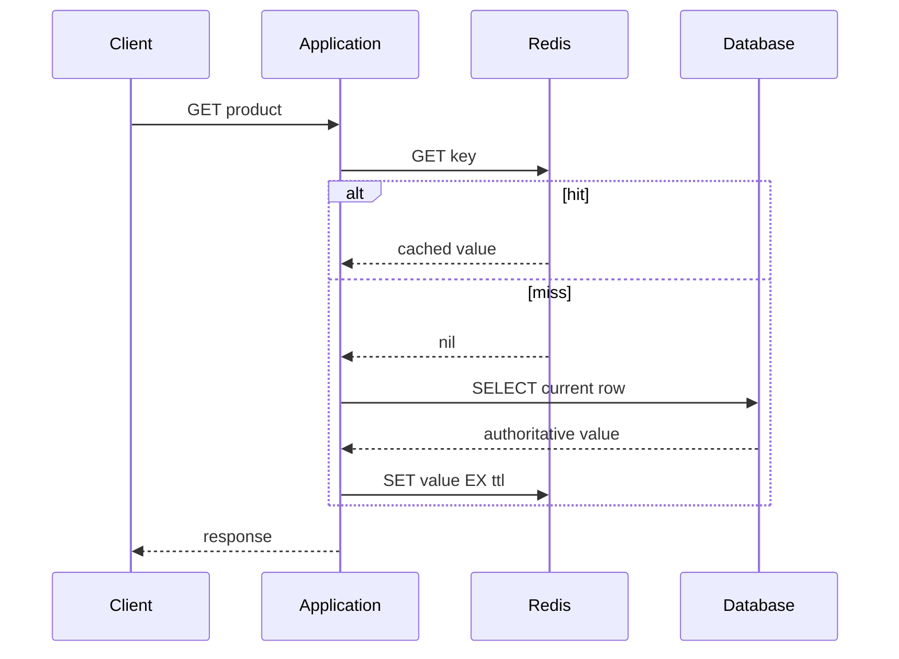
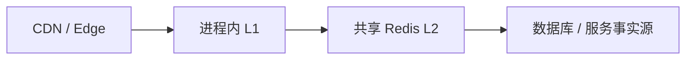

# Cache Aside、Read Through、Write Through 与多级缓存

缓存模式规定读取、写入、失效和故障时谁负责协调缓存与事实源。正确选择来自一致性要求、数据重建成本、访问分布和故障预算；缓存不能替代数据库约束和授权判断。

## 1. 缓存命中路径的代价模型

一次读取的期望延迟近似为：

```text
E(latency) = hit_rate × cache_latency
           + miss_rate × (cache_latency + source_latency + fill_cost)
```

这只是均值模型。生产决策还要看 p95/p99、缓存客户端排队、序列化、网络跨区、回源并发和缓存故障。命中率 95% 并不自动代表收益：剩余 5% 若集中同时 miss，可能击穿数据库。

缓存对象必须有事实来源和重建路径。用户余额、库存、授权和幂等唯一性可缓存用于读取，但最终判定仍在事务/受控策略系统。

## 2. Cache Aside（旁路缓存）

应用同时认识缓存和数据库。读取流程：先缓存，miss 后查数据库、序列化、写缓存、返回。



写入常用“先提交数据库，再删除缓存”：

1. 在数据库事务验证并提交新值。
2. 提交成功后删除缓存 key。
3. 下一次读取回源并填充新值。

先更新缓存再写数据库会在数据库失败时暴露不存在的事实。先删除缓存再更新数据库存在竞态：请求 A 删除，读请求 B 读旧数据库并回填，A 随后提交，新缓存继续旧值。

即使“提交后删除”也可能删除失败，或旧 miss 在提交前读旧值、却在提交后最后回填。需要 TTL、版本化 key、延迟二次删除、CDC/事件失效或 compare-version fill 来限制窗口。

### 适用与代价

优点：简单、只缓存真正读取的数据、应用能控制对象形态。缺点：每个调用方容易实现不同规则，miss 路径复杂，写/删竞态要显式治理。

## 3. Read Through

应用只向缓存/缓存库请求；缓存层 miss 时调用 loader 读取事实源并保存。形式可以是客户端库、本地代理或托管缓存能力。

```text
value, err := productCache.Get(ctx, key, func(ctx context.Context) (Product, error) {
    return repository.GetProduct(ctx, tenantID, productID)
})
```

loader 必须接受请求 deadline、限制同 key 并发、区分 not found 与暂时错误、控制序列化版本。缓存层若是独立服务，不应获得过宽数据库权限；跨服务 loader 也不能绕过租户授权。

Read Through 集中重复逻辑，但会隐藏回源延迟。调用方仍需知道缓存可能返回稍旧数据和 loader 错误。不是所有 Redis 产品原生替应用访问任意数据库；大多数工程中的 read-through 是应用库模式。

## 4. Write Through

应用写缓存接口，缓存层同步写事实源，只有两边按约定完成才返回。它让读缓存保持热，但普通 Redis 与 PostgreSQL 之间没有天然原子事务。

失败组合：

- 数据库成功、缓存失败：事实已提交，客户端看到失败并可能重试。
- 缓存成功、数据库失败：若先发布缓存，新值不具备事实。
- 响应丢失：客户端不知道是否提交。

实现应把数据库作为提交点：服务事务写事实与 outbox，缓存更新是可重试投影；若必须同步更新，失败时使缓存 entry 不可见/删除，而不是回滚不了的数据库写。所谓 write-through 不能掩盖跨系统双写问题。

## 5. Write Behind / Write Back

先接受缓存写，异步批量落事实源，能降低写延迟和合并热点计数，但缓存成为暂时事实来源。需要持久日志、序列号、幂等、重放、背压、对账、故障转移和数据损失预算。

适合可丢或可重建的遥测聚合，不适合余额、库存、订单提交。Redis 内存写加异步复制不能自动满足持久队列语义。

## 6. Refresh Ahead

在 TTL 到期前异步刷新热门 key，使用户不承担 miss 延迟。刷新条件可以基于剩余 TTL、访问频率和刷新成本。

风险：预测错误会刷新冷数据；大量 key 同时接近到期造成后台雪崩；刷新失败如果不断续旧值会长期陈旧。需要 jitter、并发限制、最大 stale 窗口和刷新错误指标。

## 7. 多级缓存结构

常见层级：



| 层 | 延迟 | 一致性范围 | 容量 | 典型失效 |
|---|---:|---|---:|---|
| 浏览器/客户端 | 最低 | 单用户设备 | 小 | Cache-Control/版本 URL |
| CDN/Edge | 低 | 多区域共享 | 大 | TTL、purge、surrogate key |
| 进程内 L1 | 微秒级 | 单进程 | 很小 | TTL、事件广播、版本 key |
| Redis L2 | 网络毫秒内 | 应用实例共享 | 中 | delete/TTL/event |
| 数据库 | 较高 | 权威事务 | 大 | 不作为缓存失效 |

L1 命中不会访问 Redis，因此只删 L2 不能让所有进程立即一致。可用短 L1 TTL、失效 pub/sub/stream 或版本 key。Pub/Sub 断线期间可能漏消息，重连后要通过版本/TTL 收敛。

## 8. 浏览器和 CDN 的 HTTP 缓存

HTTP 缓存与 Redis 不同。`Cache-Control: private` 限制共享缓存，`public` 允许；`max-age` 控制新鲜期，`s-maxage` 可覆盖共享缓存；`no-store` 禁止存储；验证器 `ETag`/`Last-Modified` 支持 304。

含 Cookie 或用户数据的响应不能因为路径相同就公开缓存。`Vary` 声明表示随哪些请求头变化，但把高基数头放 Vary 会碎片化缓存。CDN cache key 必须包含租户/语言/授权所需维度，或完全不缓存私人响应。

静态资源使用内容 hash 文件名和长 immutable TTL；发布新内容产生新 URL，比全网 purge 更可靠。

## 9. 缓存 key 与表示版本

```text
product:v3:tenant:t_7:id:p_9:locale:zh-CN
```

key 包含影响表示的所有稳定输入：schema version、tenant、资源 ID、locale、权限分组/价格区域等。不要把原始 bearer token 或敏感 PII 放 key。权限个性化维度太多时，缓存公共基础数据，在应用层做授权裁剪。

schema 变化用版本前缀隔离旧值，避免新代码解析旧 JSON。版本切换后旧 key 等 TTL 自然淘汰，防止 `KEYS product:*` 扫描删除生产集群。

## 10. 序列化、压缩与大值

JSON 易调试但字段名占空间、类型演进需规则；Protobuf 等二进制更紧凑但要求 schema 管理。压缩减少网络/内存，却增加 CPU 和尾延迟；小值压缩可能变大。以真实分布 benchmark，不用单样本。

缓存只返回完整大对象会造成网络放大。可按稳定访问边界拆分，但避免 N+1。单 key 大值使 Redis 单线程命令、复制和删除成本增加。

## 11. 空值与错误缓存

数据库确定不存在可缓存短期 sentinel，防止反复查询；sentinel 必须与“缓存 miss”和“查询失败”区分。创建对象后删除 negative cache。

不得把 500、timeout、权限拒绝当普通空值长缓存。错误缓存可能在依赖恢复后继续拒绝用户，或把一个主体的 403 泄漏给另一主体。若对过载错误做短期抑制，key 包含安全范围并有极短 TTL。

## 12. Singleflight 与请求合并

同进程可让同 key miss 只由一个 goroutine 回源，其他等待；跨实例用 Redis 短锁或后台刷新，但不能让锁失败阻止正确回源。

singleflight 共享结果和错误，要绑定合理 deadline：最早取消的请求不应取消所有等待者；最长请求也不能让回源无限运行。热点 key 可直接预热或 stale-while-revalidate。

## 13. Stale-while-revalidate 与 stale-if-error

缓存同时保存 fresh deadline 和 hard deadline：fresh 前直接返回；fresh 后一个 worker 刷新，其他请求暂时返回旧值；hard 后必须回源或失败。

适合商品描述、配置展示，不适合账户余额或撤权。每类数据声明最大陈旧时长。依赖故障时允许 stale-if-error 能提高可用性，但响应/指标应能区分 stale。

## 14. 应用案例一：商品详情

### 输入

读 QPS 2 万，写 QPS 20；95% 商品访问集中在 5%；价格允许最多陈旧 10 秒，库存只作展示提示，结算事务重新校验。

### 方案

1. CDN 缓存公开图片和静态描述，资源 URL 内容 hash。
2. Redis L2 用 Cache Aside，key 带 tenant、locale、schema v3，TTL 5 分钟 ±20% jitter。
3. 进程 L1 TTL 2 秒，失效事件含 product ID/version。
4. 数据库提交商品更新与 outbox；consumer 删除 L2 并广播 L1 失效。
5. 热点 miss 用 singleflight；数据库超时且旧值未超过 hard 10 秒时返回 stale。
6. 结算读取数据库/库存系统，不相信缓存 stock_hint。

### 输出与验证

记录 L1/L2 hit、回源 QPS、stale ratio、填充耗时和版本差。更新商品后 10 秒内所有层收敛；失效 consumer 停止时 TTL 仍最终收敛。

### 失败注入

关闭 Redis：L1 短期命中，其余经限流回源；超过数据库预算的请求快速降级，不无限重试。模拟热点 key 过期，singleflight 限制每实例一个回源，但全实例并发仍需数据库保护和预刷新。

## 15. 应用案例二：授权元数据

### 输入

权限决策 p99 < 30 ms；角色变更必须 5 秒内生效；管理员撤权风险高；多租户隔离。

### 方案

1. 事实权限保存在数据库/策略服务，缓存 key 包含 tenant、subject、policy version。
2. 普通读 Cache Aside，TTL 5 秒；策略发布提升全局 version，使旧 key 不再命中。
3. 高风险管理员动作强制读取当前策略或要求短期提权，不接受 stale。
4. 撤权事务写 outbox，消费者删除 L2 并广播 L1。
5. 缓存故障时默认拒绝高风险操作；普通只读可按业务定义降级。

### 输出与验证

跨租户 key 不重用；撤权事件丢失时 5 秒 TTL 收敛；策略 version 切换后旧缓存无法影响决策。审计记录实际使用的策略版本和缓存状态。

### 失败注入

暂停失效消费者并撤销管理员，验证高风险接口仍不会用陈旧缓存放行。若 L1 TTL 被误设 5 分钟，测试应直接失败。

## 16. 模式比较

| 模式 | 读 miss 谁处理 | 写路径 | 优点 | 主要风险 |
|---|---|---|---|---|
| Cache Aside | 应用 | DB 后删缓存 | 简单、按需缓存 | 竞态、重复实现 |
| Read Through | 缓存库/层 | 独立 | 集中 loader | 隐藏回源与授权边界 |
| Write Through | 缓存层同步 | 两边协调 | 写后缓存热 | 跨系统原子性 |
| Write Behind | 异步 | 缓存先接受 | 合并写、低延迟 | 数据损失、背压、对账 |
| Refresh Ahead | 后台 | 事实源不变 | 热 key 少 miss | 刷新冷数据、雪崩 |

## 17. 调试路径

1. 按层记录 hit/miss，不把 L1 hit 混入 Redis hit。
2. 对 miss 分为冷启动、TTL、主动失效、eviction、连接失败和解析失败。
3. 比较 cache latency、pool wait、source latency、fill cost 和端到端。
4. 采样缓存 version 与数据库 version；不记录敏感正文。
5. 查看 Redis evicted/expired、memory、hot key、network bytes。
6. 检查失效队列 lag、失败、重放和消费幂等。
7. 用负载测试验证 Redis 全失效、热点过期和数据库降级。

## 18. 生产边界

- 缓存实例不与不可淘汰会话/队列混用同一 eviction 策略。
- TTL 不是一致性的证明，只是陈旧上限的一部分。
- 缓存 key/日志不泄露 PII 和 token。
- 连接池、命令 timeout、重试预算和熔断明确。
- 预热受限速，不在发布时全量扫数据库。
- 缓存重建有容量估算和优先级。
- 删除/隐私请求覆盖缓存、CDN 和派生数据。

## 19. 综合练习与验收

为多租户商品详情实现 CDN + L1 + Redis L2 + PostgreSQL，支持商品更新、locale、负缓存、singleflight 和 stale-if-error。

验收：

1. 画出每种读写时序和事实来源。
2. 更新后陈旧上限有自动测试。
3. 关闭每一缓存层，核心正确性不变且回源不雪崩。
4. 跨租户和权限个性化数据不会串 key。
5. 观察 L1/L2 hit、fill、stale、eviction、失效 lag 和 DB QPS。
6. 能解释为何余额、库存扣减和最终授权不由缓存决定。

## 来源

- [Redis caching solutions](https://redis.io/solutions/caching/)（访问日期：2026-07-17）
- [Redis key eviction](https://redis.io/docs/latest/develop/reference/eviction/)（访问日期：2026-07-17）
- [RFC 9111: HTTP Caching](https://www.rfc-editor.org/rfc/rfc9111.html)（访问日期：2026-07-17）
- [Go singleflight package](https://pkg.go.dev/golang.org/x/sync/singleflight)（访问日期：2026-07-17）
- [PostgreSQL 18: Transaction Isolation](https://www.postgresql.org/docs/18/transaction-iso.html)（访问日期：2026-07-17）
