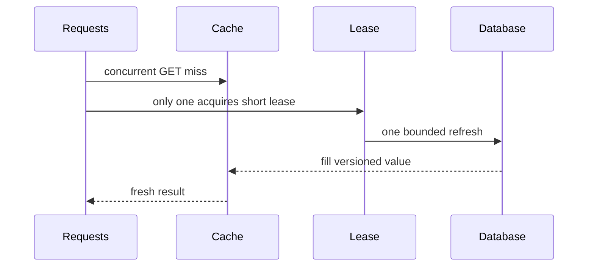

# 缓存穿透、击穿、雪崩与热点 Key 治理

缓存故障的共同结果是负载从快而有限的缓存层转移到更慢的事实源。治理目标不是让缓存永不 miss，而是限制回源并发、区分不存在与暂时失败、保留降级路径，并在缓存完全不可用时仍保护核心数据正确性。

## 1. 四类问题的区别

| 类型 | 触发 | 流量形态 | 主要受害者 | 核心治理 |
|---|---|---|---|---|
| 穿透 | 查询事实中不存在的 key | 大量不同无效 key | 数据库/下游 | 输入约束、负缓存、Bloom |
| 击穿 | 单个热 key 失效 | 同 key 高并发 | 单查询/单行/服务 | singleflight、预刷新、stale |
| 雪崩 | 大量 key/节点同时失效 | 大范围并发回源 | 整个事实源 | jitter、容量闸门、分批恢复 |
| 热点 key | 单 key 持续高读/写 | 长期集中 | Redis 单分片/网卡 | L1、拆分、复制读、重新建模 |

同一事故可叠加：Redis 主节点故障导致大量 key miss（雪崩），其中首页配置是热点（击穿/热 key），攻击者还在遍历不存在 ID（穿透）。

## 2. 穿透的机制

Cache Aside 对不存在对象的每次查询都 miss。如果 API 接受任意 ID，攻击者或爬虫可制造无限 key 空间，使数据库不断执行 negative lookup。

第一层是输入边界：格式、长度、租户、ID 类型、速率和认证。UUID 格式错误无需访问缓存/数据库；合法但不存在才进入负缓存。不能以 Bloom filter 替代授权。

### 负缓存

使用显式 sentinel：

```json
{"kind":"not_found","checked_at":"2026-07-17T08:00:00Z","schema":2}
```

TTL 通常短于正常对象，因为随后可能创建。创建事务提交后删除负缓存。暂时数据库 timeout/500 不能缓存成 not_found，否则依赖恢复后仍错误返回 404。

### Bloom filter

Bloom filter 用 bit array 和多个 hash 判断“肯定不存在”或“可能存在”。它有假阳性，没有假阴性（前提是集合只增加且结构正确）；标准 Bloom 不能删除。假阳性只增加一次回源，不影响正确性。

参数近似关系：

```text
m = -n × ln(p) / (ln 2)^2
k = (m / n) × ln 2
```

`n` 预期元素数、`p` 目标假阳性率、`m` bits、`k` hash 数。实际用 Redis Bloom 等实现时按产品 API 设置 capacity/error rate，并监控装载超预期后的误差。

删除频繁的对象可用 Cuckoo filter 或定期重建版本化 Bloom。过滤器丢失时回源应退化而非拒绝所有请求；新对象写事实后先/同步更新过滤器或让缺失窗口走数据库，绝不能因 filter 未更新返回假不存在。

## 3. 击穿与请求合并

热 key 到期瞬间，数千请求同时 miss。进程内 singleflight 只合并本实例；50 个实例仍可能有 50 次回源。跨实例租约能进一步合并，但租约失败不能破坏正确性。



等待者可：短等待后重读、返回仍在 hard deadline 内的 stale、或快速失败。不能全部无限阻塞等待锁。刷新者使用独立有界 context；租约 TTL 大于预期 fill p99 但有上限，必要时续期。

## 4. 雪崩来源

- 批量导入时给所有 key 相同 TTL。
- Redis Cluster/网络故障让整个 shard 不可访问。
- 发布切换 schema key，所有请求冷 miss。
- eviction 因内存压力快速删除 working set。
- 失效事件错误使用通配逻辑删除大范围 key。
- CDN purge 与 L2 清空同时发生。

随机 TTL 只治理“同时到期”，不能解决节点不可用或 schema 冷启动。系统需要事实源并发预算、优先级、熔断和受控预热。

## 5. 回源容量闸门

设数据库能承受额外 300 QPS，应用 30 实例，则不能每实例各放 300 并发。使用全局/分层预算：边缘限流、每实例 semaphore、小型全局令牌桶、数据库连接池上限。

当预算耗尽：

- 关键但允许 stale 的读返回旧值并标记 freshness。
- 非关键推荐/排行榜关闭或返回静态降级。
- 权限/余额等不允许 stale 的请求快速失败或走专用保留容量。
- 写请求继续走事实源，不能因缓存不可用绕过幂等/约束。

降级顺序按业务预先定义，不在事故中临时决定。

## 6. 热点 Key：读热点

读热点可使用：

1. 进程内 L1，极短 TTL 或版本失效。
2. Redis client-side caching/跟踪失效（验证客户端与部署支持）。
3. 只读副本分散读取，接受复制延迟和 failover 语义。
4. CDN/边缘缓存公开内容。
5. 将一个大对象按实际访问片段拆分。

复制读不能用于需要 read-after-write 的权限、库存确认。L1 会放大失效范围，必须有 TTL 收敛。

## 7. 热点 Key：写热点

单 key 原子计数的写最终在一个 shard 串行执行。常见缓解：

- 分片计数：`counter:{logical}:0..N-1`，写随机分片，读聚合；实时读成本增加。
- 本地批量/合并后写：降低精确实时性，进程崩溃需接受丢失或持久日志。
- 事件日志进入 Kafka，流处理聚合，Redis 只保存查询投影。
- 按自然维度拆 key，如 tenant/region/time bucket。

余额、库存等强不变量不能为吞吐随意分片缓存计数。数据库/专用一致性系统仍做最终提交。

## 8. 大 Key 与 Hot Key 的交互

热门大 Hash 的 `HGET` 单字段可能快，但迁移/备份/删除整个 key 很重；`HGETALL` 会返回全部。热门大 ZSet 范围查询若无 COUNT 会放大网络。治理要看命令和返回大小，不只 key 大小。

将大 key 拆分会改变多成员原子操作和分页。需要稳定 bucket、聚合策略和迁移双读，不能上线时直接改 hash 算法让旧数据找不到。

## 9. 热点检测

信号：

- 单 shard CPU/network/ops 明显高于其他节点。
- commandstats 某命令 p99/调用突增。
- 客户端按规范化 cache name 统计 top key hash（不记录敏感明文）。
- Redis `--hotkeys` 依赖 LFU policy/采样，生产运行受控。
- slowlog 显示大范围/大返回命令。
- Cluster slot stats（可用版本中）显示 slot 倾斜。

采样会漏短时热点，应用端滑动窗口 heavy-hitter 算法可补充。指标 label 不能直接用百万 key。

## 10. 限流与防滥用

无效 ID 访问按主体、IP、租户和路由限制；不能只按 IP 误伤 NAT 用户。不存在命中率异常、顺序遍历 ID、极高 cardinality 可触发更严格策略。

错误响应避免泄露“对象存在但无权限”与“不存在”的差异。负缓存 key 必须包含 tenant/可见性范围，否则一个主体的 404 会影响有权主体。

## 11. 失败隔离

缓存客户端必须有短连接/命令 timeout。Redis 变慢时无限排队比直接 miss 更糟：请求线程/goroutine 和连接池耗尽，事实源也收不到受控流量。

熔断器按错误率/延迟打开，短时跳过缓存，但必须与回源闸门配合。半开只允许少量探测。重试对 GET 可以有一次有预算重试；对 Lua/写命令响应丢失不能假定未执行。

不同用途拆实例/资源池：页面缓存故障不应淘汰 session、分布式锁或 Stream。共享 Redis 的 `maxmemory-policy` 无法同时满足可淘汰和不可淘汰数据。

## 12. 冷启动与预热

预热清单来自真实高频 key，不是全表扫描。按价值/成本排序，限制 DB QPS、Redis pipeline 大小、网络和内存。每批写 TTL jitter，记录成功/失败/版本。

蓝绿发布新 schema 时可先影子填充，再逐租户切读；旧版本保留回退窗口。若预热停止，在线 miss 仍通过同一容量闸门。

## 13. 应用案例一：爆款商品

### 输入

常态 500 QPS，活动瞬间 5 万 QPS；详情允许 stale 5 秒，价格允许 2 秒，结算库存不允许 stale；数据库只能承受额外 400 QPS。

### 处理

1. 详情分公开描述、价格提示、库存提示三个 key，避免更新库存使大描述失效。
2. CDN 缓存描述，L1 1 秒、L2 30 秒 ±20%，hard stale 5 秒。
3. 活动前预热热门商品；miss 进 singleflight，再受全局 400 QPS 闸门。
4. 价格更新 outbox 删除对应 key，并带 version；旧 fill 比较版本后不能覆盖新值。
5. 结算直接调用库存事务，缓存仅展示。

### 输出与验证

5 万 QPS 下 DB 回源不超过 400；stale ratio 可观测；价格 2 秒内收敛。Redis 故障时详情返回有限 stale/静态降级，结算正确性不变。

### 失败注入

活动开始时同时删除 L1/L2，验证闸门和降级。杀死持刷新租约实例，等待者在 hard deadline 内恢复，租约过期后新实例刷新。

## 14. 应用案例二：不存在订单枚举

### 输入

攻击者每秒请求 10 万个格式合法但不存在 UUID；订单读取需认证并按 tenant 隐藏存在性。

### 处理

1. 网关和 API 按账户/IP/tenant 组合限流。
2. key 使用 tenant + UUID hash；负缓存 30 秒，不含敏感明文。
3. 为已存在订单维护按 tenant 分区 Bloom，只用于减少不存在回源。
4. Bloom “可能存在”仍查询带 tenant 条件数据库并授权。
5. 新订单提交后更新 Bloom；过滤器不可用时走有界数据库，不返回假 404。

### 输出与验证

攻击流量被入口限制，negative/Bloom 大幅减少 DB 查询；真实订单读取不被假阴性拒绝。对无权和不存在返回外部一致策略。

### 失败注入

清空 Bloom 后系统性能下降但正确；故意延迟新订单 Bloom 更新，新订单仍通过数据库路径可读。若实现直接以 Bloom negative 返回 404，此测试会暴露竞态。

## 15. 应用案例三：Redis 全分片重启

### 输入

缓存可重建，重启后 working set 为空；10 个业务共享数据库，总潜在回源 8 万 QPS，数据库余量 1000 QPS。

### 恢复

1. 熔断缓存直到健康探测稳定，避免半可用反复切换。
2. 将 1000 QPS 按核心业务/租户优先级分配，保留写事务连接。
3. 先预热 top 1% key，再逐级扩大；所有在线 fill 合并。
4. 非核心推荐、历史报表临时降级；允许 stale 的从独立持久快照/边缘返回。
5. 监控 DB p99、pool wait、Redis fill、hit rate 和恢复曲线；超阈值暂停预热。

### 验证与失败分支

恢复演练不超过数据库连接/CPU预算。若预热任务和在线 miss 使用不同无协调连接池，两者可能相加压垮 DB；必须共享容量控制或明确分配。

## 16. 方案取舍

| 技术 | 解决 | 不解决 | 代价 |
|---|---|---|---|
| TTL jitter | 同时到期 | 节点故障、热点持续 | 陈旧期分散 |
| Negative cache | 重复不存在查询 | 无限不同 key | 创建后失效 |
| Bloom | 大量不存在成员 | 授权、事实判断 | 假阳性、重建 |
| Singleflight | 同实例同 key miss | 跨实例雪崩 | 等待/错误共享 |
| 分布式租约 | 跨实例刷新合并 | 事实源不变量 | 超时、锁故障 |
| Stale | 依赖短暂故障 | 强实时数据 | 用户看到旧值 |
| L1/副本 | 读热点 | 单点写热点 | 一致性更复杂 |
| 分片计数 | 写热点 | 精确瞬时总量 | 聚合与恢复 |

## 17. 调试与告警

故障定位顺序：确认是 cache latency 还是 miss；拆 miss 原因；看热点分布和 Redis shard；看回源闸门、DB pool wait；确认失效/发布事件；比对版本。

关键告警：miss 突增、fill 并发、stale ratio、负缓存比例、Bloom 拒绝/假阳性抽样、单 shard CPU/network、eviction、Redis timeout、DB fallback QPS、熔断状态和预热队列。

## 18. 生产检查与综合练习

生产检查：所有 miss 受容量控制；缓存错误 timeout 短；negative 不混淆 error；jitter 不突破安全截止；热点/大 key 有检测；缓存与不可淘汰数据隔离；清空缓存演练通过。

综合练习：构造爆款、UUID 枚举和 Redis 全失效三个负载，完成故障注入报告。

验收标准：事实源 QPS 不越界；真实对象无假阴性；结算/授权正确性不依赖 stale；热点 key 被定位到 shard/命令；恢复按优先级且可暂停；每类降级有用户可见行为和指标。

## 来源

- [Redis key eviction](https://redis.io/docs/latest/develop/reference/eviction/)（访问日期：2026-07-17）
- [Redis latency monitoring](https://redis.io/docs/latest/operate/oss_and_stack/management/optimization/latency-monitor/)（访问日期：2026-07-17）
- [Redis Bloom filter](https://redis.io/docs/latest/develop/data-types/probabilistic/bloom-filter/)（访问日期：2026-07-17）
- [Redis Cluster specification](https://redis.io/docs/latest/operate/oss_and_stack/reference/cluster-spec/)（访问日期：2026-07-17）
- [Go singleflight package](https://pkg.go.dev/golang.org/x/sync/singleflight)（访问日期：2026-07-17）
