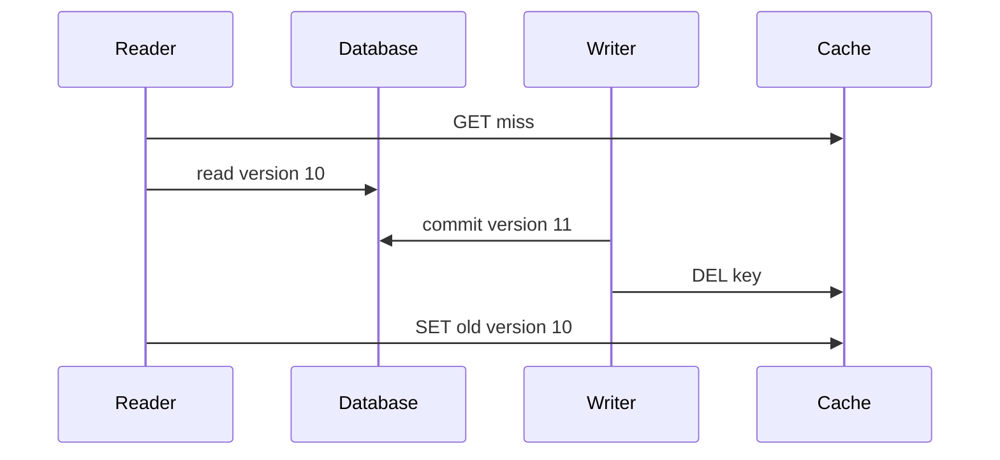

# 缓存更新、删除、最终一致性与事件驱动失效

缓存一致性的核心是定义事实提交点、允许的陈旧窗口和所有竞争顺序。数据库与 Redis 没有普通原子事务；“更新数据库后删除缓存”只是基础策略，还必须处理删除失败、并发回填、事件重复乱序和冷启动。

## 1. 先定义一致性目标

不同数据需要不同目标：

- 强制实时判定：余额扣减、库存提交、授权撤销。缓存可加速读取，但提交时重新验证事实。
- Read-your-writes：用户保存后自己立即看到新值，可直接返回提交结果、读主库或使用版本 token。
- 有界陈旧：商品描述 30 秒内收敛。
- 最终一致：搜索、推荐、分析投影可延迟，但必须有重建和 lag 指标。

不要用“最终一致”掩盖无限延迟。每条缓存契约给出正常 p99 收敛和最大陈旧上限。

## 2. 双写不可能由调用顺序完全解决

### 先缓存、后数据库

数据库失败时缓存发布无事实的新值；其他读者看到错误。不可取。

### 先数据库、后更新缓存

数据库提交成功而缓存写失败，旧值残留。两个并发写可能按 DB 顺序 v2、v3 提交，却按缓存网络完成顺序 v3、v2，最终缓存倒退。

### 先数据库、后删除缓存

删除失败仍残留旧值；但不写具体新值，减少乱序覆盖。下一次 miss 从事实源填充。配合 TTL、可靠事件和版本检查是常见基线。

## 3. 并发回填竞态



即使写者提交后删缓存，旧读者仍可能最后回填。解决方案：

1. 短 TTL 限制窗口，但不消除。
2. value 带 version，填充 Lua 只在当前缓存 version 更旧/不存在时写；仍需知道数据库版本。
3. versioned key：`product:v11:id`，指针/响应直接使用事实版本；旧 fill 写 v10 不覆盖 v11。
4. 延迟二次删除，在覆盖竞态窗口后再次删；只能降低概率，延迟需基于 p99 回填，不是正确性证明。
5. 变更事件让 consumer 再次删除/更新，并能重放。

## 4. 更新缓存还是删除缓存

### 删除

优点：下一读从事实计算，避免复制业务投影逻辑；无访问对象不再缓存。缺点：首次读承担 miss，热点同时回源。

### 更新

优点：写后保持热，可直接携带已提交的新表示。缺点：投影可能需要关联多表/locale/权限，易遗漏多个 variant；事件乱序会倒退。

选择：简单单行、写后高读且有版本条件可更新；复杂派生表示优先删除/重建。无论哪种，事件处理要幂等且拒绝旧版本覆盖新版本。

## 5. Transactional Outbox

事实事务同时写业务数据和失效事件：

```sql
BEGIN;
UPDATE products
SET name = $1, version = version + 1
WHERE tenant_id = $2 AND product_id = $3
RETURNING version;

INSERT INTO outbox_events(event_id, aggregate_id, aggregate_version, event_type, payload)
VALUES ($4, $3, $5, 'product.changed', $6);
COMMIT;
```

publisher 稍后投递到 Kafka/Redis Stream。数据库提交与 outbox 原子，避免“提交后进程崩溃未发事件”。broker 投递和标记 published 仍可能重复，因此 consumer 以 event ID/aggregate version 幂等。

outbox 表需要索引未发布状态、批量领取、重试/租约、保留与归档。oldest unpublished age 是比总行数更重要的 lag 指标。

## 6. 事件契约

```json
{
  "event_id":"01JZ...",
  "event_type":"product.changed",
  "schema_version":2,
  "occurred_at":"2026-07-17T08:00:00Z",
  "tenant_id":"t_7",
  "aggregate_id":"p_9",
  "aggregate_version":11,
  "changed_fields":["name","price_cents"]
}
```

事件必须包含稳定 ID、类型、schema version、对象和对象版本。`occurred_at` 不能可靠排序并发提交；使用数据库递增 aggregate version 或变更位置。changed_fields 可优化失效范围，但 consumer 对未知字段应安全处理。

不要把完整敏感对象放事件；最小化 payload、加密传输/存储、控制保留。tenant 来自事实记录，不信任外部请求字段。

## 7. 重复、乱序与幂等 Consumer

消费者收到 v11 后又收到 v10，必须忽略旧事件。缓存 value 保存 version，Lua 比较：

```text
if cached_version < event_version:
    delete key or replace projection
else:
    no-op
```

删除本身幂等，但“v10 删除了已由 v11 填充的新值”会造成额外 miss；通常不破坏事实正确，却增加抖动。若代价高，记录 per-aggregate last processed version 或 value version。

事件 ID 去重表无限增长会成为新问题。按业务最大重放窗口保留，或使用对象版本条件天然幂等。

## 8. 多 Variant 失效

一个商品可能有 20 locale、10价格区、两个 schema。不能生产用 `KEYS product:*p9*`。可选：

- 版本命名空间：key 中使用 product version，旧 variants 自然过期。
- 索引 Set：维护对象→cache keys 集合；集合本身要 TTL/清理且可能大 key。
- 可预测 variant 枚举：数量有限时逐个删除，pipeline 限制批量。
- surrogate key/CDN tag：由 CDN 提供按标签 purge，核对语义和速率限制。

版本命名空间最易避免全局扫描，但需要客户端先知道 version；可从轻量元数据缓存/响应中取得。

## 9. 多级缓存失效

数据库变更 → outbox → broker → L2 consumer → L1 广播/CDN purge。每一跳有独立 lag 和失败。

Pub/Sub 广播 L1 断线会漏，因此 L1 TTL 是收敛上界。L1 value 带 version，重新连接后可接收全局 epoch 提升或周期校验。不能仅依赖 best-effort Pub/Sub 满足撤权。

CDN purge 完成可能有传播延迟和 API 失败；用户私有数据不应放公共 CDN。静态内容优先版本 URL，不依赖 purge。

## 10. CDC 驱动失效

CDC 从数据库 WAL/binlog 捕获提交变化，能覆盖绕过应用的写者。优势是靠近事实提交；代价是 schema 变化、位置管理、事务顺序、快照衔接和运维复杂。

CDC 事件通常是表行变化，不直接知道哪些业务 cache variants 受影响。需要映射层把表变更转领域失效；多表事务应按提交边界处理，避免投影看到半个事务。

Outbox 表由应用显式写领域事件，语义清楚；CDC 可负责传输 outbox。直接 CDC 所有表适合通用同步，但耦合物理 schema。两者不是互斥。

## 11. Read-your-writes

用户更新后立即 GET 可能命中旧缓存。解决：

1. 写响应返回完整提交结果，前端直接更新本地状态。
2. 返回 version，后续读携带 `min_version`；缓存低于它则回源/等待投影。
3. 短期 session stickiness 读主库/绕过缓存。
4. 同请求提交后同步删 L1/L2，但仍以版本验证兜底。

不要全局关闭缓存只为一个用户的 read-your-writes；把因果要求绑定到该客户端/对象/version。

## 12. 删除与隐私

软删除、硬删除和隐私删除都要覆盖缓存、搜索、CDN、导出和对象存储。删除事件优先级高，consumer 不应让旧 upsert 在 tombstone 后复活对象。

使用 tombstone version：删除 v20；任何 `version <= 20` 更新忽略。缓存 negative sentinel 可携带 tombstone version。事件/日志中不继续复制已删除 PII。

TTL 不是隐私删除的即时执行保证，尤其 CDN/备份有独立保留策略。

## 13. 事件积压和重建

consumer lag 超过 cache TTL 时，很多 entry 已自然过期；逐条删除可能浪费。恢复策略可按 schema/tenant bump epoch，使旧命名空间整体不再读取，再受控预热。

缓存应能从事实源重建。重建读取固定快照水位，再消费水位后的变更，避免快照期间更新丢失：

```text
capture change position P
build snapshot representing data at/around P
start applying changes after P
verify projection and switch
```

具体 CDC 工具决定一致快照方法，不能凭墙上时钟拼接。

## 14. 应用案例一：商品价格更新

### 输入

价格在 PostgreSQL 是事实；Redis 有 locale/region variants；允许展示陈旧 2 秒，结算必须当前；写 QPS 100、读 5 万。

### 处理

1. 价格事务更新 `version=42` 并写 outbox。
2. API 写成功后 best-effort 删除当前常用 variants，降低 read-your-writes 延迟。
3. outbox consumer 按 aggregate version 删除所有已登记 variants，并广播 L1。
4. miss 回源得到 v42，Lua fill 只在缓存 version <42 时写。
5. TTL 2 秒 ±有限 jitter 作为漏事件上界；结算直接事务校验。

### 输出与验证

指标记录 commit→L2 delete、commit→L1 delete、首次 v42 hit 的延迟。并发 v41/v42 事件乱序不会让缓存倒退。

### 失败注入

暂停 consumer、让同步删除失败，2 秒内 TTL 收敛；与此同时结算价格仍正确。制造旧 miss 在 v42 提交后回填 v41，版本脚本拒绝覆盖。

## 15. 应用案例二：角色撤销

### 输入

普通页面权限缓存 5 秒；管理员操作要求即时撤销；策略分 L1/L2；broker 可能积压。

### 处理

1. 撤权事务更新 policy_version 和 outbox。
2. 管理员敏感接口每次验证当前 policy epoch/短期提权，不依赖 5 秒缓存。
3. 普通接口 cache key 含 policy_version；全局/tenant epoch 提升后旧 key 不命中。
4. consumer 广播 L1 且删除 L2，重复安全。
5. broker lag 超阈值时敏感操作默认拒绝，不返回 stale allow。

### 验证与失败注入

停 consumer 后撤权，敏感接口立即拒绝；普通展示最多 5 秒收敛。伪造旧授权事件不能降低 policy version。

## 16. 应用案例三：搜索投影删除

### 输入

订单删除 v20 后，延迟的 v19 update 事件到达；搜索只做派生读取。

### 处理

1. 搜索文档保存 aggregate_version 和 deleted/tombstone 状态。
2. delete v20 使用外部版本控制/条件脚本写 tombstone 或删除并记录 last version。
3. v19 upsert 比较版本并忽略。
4. 定期数据库↔搜索抽样/分片 count/hash 对账。
5. 索引损坏时按固定水位全量重建，再接 CDC。

### 输出与失败分支

被删订单不复活。若物理删除文档却不保留版本水位，旧事件可能重新创建；修正为版本化 tombstone 或外部状态。

## 17. 方案比较

| 方案 | 收敛 | 故障 | 成本 | 适用 |
|---|---|---|---|---|
| 仅 TTL | 有界但慢 | 简单 | 低 | 可长时间陈旧 |
| 同步 delete | 通常快 | 删除失败 | 低 | 基线优化 |
| 双删 | 降低竞态概率 | 时间窗口猜测 | 中 | 过渡，不作强保证 |
| Outbox 事件 | 可重放、领域语义 | consumer lag | 中 | 关键派生缓存 |
| CDC | 覆盖全部 DB 写 | schema/运维复杂 | 高 | 多写者/多投影 |
| Versioned key | 旧写不覆盖 | key 增长/需版本 | 中 | 多 variant/乱序 |

## 18. 调试与观测

- commit 到事件发布时间、consumer lag、失败/重试。
- invalidation 成功/失败、删除 key 数、CDN purge 状态。
- cache value version 与 DB version 差异抽样。
- stale/read-your-writes 失败率。
- outbox oldest age、未发布数、重复投递。
- 旧 schema/version key 占比和内存。
- tombstone 后旧 upsert 拒绝数。

排障先找事实提交版本，再沿 outbox、broker、consumer、L2、L1/CDN 逐跳对齐，不只手工 DEL 后宣告修复。

## 19. 综合练习与验收

实现商品价格与权限两类缓存：前者允许 2 秒陈旧，后者敏感操作不允许 stale。加入 outbox、乱序版本、L1 广播和重建。

验收：同步删除失败仍最终收敛；旧 fill/旧事件不覆盖新版本；read-your-writes 有 min_version；撤权不因 broker lag 放行；删除后不被旧事件复活；缓存可在固定水位重建；所有收敛时间和 lag 可观测。

## 来源

- [PostgreSQL 18: Transactions](https://www.postgresql.org/docs/18/tutorial-transactions.html)（访问日期：2026-07-17）
- [Redis transactions](https://redis.io/docs/latest/develop/using-commands/transactions/)（访问日期：2026-07-17）
- [Redis keyspace notifications](https://redis.io/docs/latest/develop/pubsub/keyspace-notifications/)（访问日期：2026-07-17）
- [Debezium documentation](https://debezium.io/documentation/reference/stable/)（访问日期：2026-07-17）
- [Apache Kafka design](https://kafka.apache.org/documentation/#design)（访问日期：2026-07-17）
