# Redis 分布式锁：唯一值、原子释放、租约续期与 Fencing Token

分布式锁只能协调参与同一协议的客户端。租约过期、进程暂停、网络分区和故障转移会让旧持有者在失去锁后继续执行；保护关键资源还需要下游验证单调 fencing token 或使用数据库条件写。

## 1. 先问是否真的需要锁

优先考虑更直接的不变量机制：

- 唯一约束防重复创建。
- `UPDATE ... WHERE state='pending'` 原子状态迁移。
- 乐观 version/ETag 防覆盖。
- 幂等 key 让重复请求收敛。
- 队列分区让同一 key 顺序消费。
- PostgreSQL advisory/row lock 在单数据库事务内协调。

只有操作跨进程、无法用单事实系统约束且互斥能降低冲突时再用 Redis 锁。锁不能让数据库与外部 API 原子。

## 2. 单实例租约的最小获取

```text
SET lock:report:t_7 9f86d081... NX PX 30000
```

- `NX`：key 不存在才成功。
- `PX 30000`：30 秒租约，持有者崩溃后最终释放。
- value：每次获取生成的高熵唯一 token，用于所有权校验。

不能用 `SETNX` 后单独 `EXPIRE`：客户端可能在两条命令间崩溃形成无 TTL 锁。不能把固定进程名当 value：旧请求可能删除新一轮同进程的锁。

## 3. 原子释放

错误释放：

```text
GET lock:key
DEL lock:key
```

GET 后租约可能到期，另一个客户端取得新锁，旧客户端随后 DEL 删除新锁。使用 Lua/Function 原子比较唯一值并删除：

```lua
if redis.call('GET', KEYS[1]) == ARGV[1] then
    return redis.call('DEL', KEYS[1])
else
    return 0
end
```

客户端用 `EVALSHA`/Function 并声明 key。返回 1 表示自己释放，0 表示已失去所有权。释放失败不能重试成无条件 DEL。

## 4. 租约时间如何选择

租约必须覆盖临界区正常 p99、调度暂停、GC、网络和释放余量，但越长故障后可用性恢复越慢。

```text
lease > operation_p99 + max_expected_pause + network_margin
```

这不是安全证明，因为暂停可能无界。临界区要拆短：锁内只做必要的确定性协调，不等待用户、不调用长外部 API、不执行大表查询。

客户端记录获取开始/完成时间和剩余有效期。获得锁耗时已消耗租约；不能从响应到达时重新计算完整 30 秒。

## 5. 续期 watchdog

长任务可定期续期，但只能“value 仍等于自己的 token”时原子 `PEXPIRE`。续期间隔显著短于租约，例如 30 秒租约每 10 秒；失败/timeout 后立即认为不再安全，停止可取消工作。

```lua
if redis.call('GET', KEYS[1]) == ARGV[1] then
    return redis.call('PEXPIRE', KEYS[1], ARGV[2])
else
    return 0
end
```

续期让失控任务长期占锁，因此设置最大总持有期和任务 deadline。续期 goroutine 必须在释放/取消时停止，避免 goroutine leak 或释放后继续续新锁。

## 6. 失效持有者问题

```mermaid
sequenceDiagram
    participant A as Client A
    participant R as Redis
    participant B as Client B
    participant S as Storage
    A->>R: acquire lease token A
    A->>A: pause longer than TTL
    R->>R: lease expires
    B->>R: acquire token B
    B->>S: write new result
    A->>A: resumes
    A->>S: stale write after losing lease
```



Redis 无法撤回 A 已获得的执行能力。A 在暂停期间不知道租约已失效；恢复后若直接写对象存储/数据库，会覆盖 B。

## 7. Fencing Token

每次成功获取锁同时获得单调递增 token：41、42、43。下游记录已接受最大 token，只接受更大的写：

```sql
UPDATE report_jobs
SET output_uri = $1, fencing_token = $2
WHERE job_id = $3
  AND fencing_token < $2;
```

A 的 token 41 在 B 的 42 已提交后影响 0 行。fencing token 必须由线性一致/原子序列源产生，并与锁获取语义正确绑定；仅随机 token 能校验所有权，不能表示新旧顺序。

对象存储若不能条件比较 token，可让数据库先登记版本/状态，再用版本化 object key 发布，最终指针更新受 fencing 条件保护。不能只把 token 写 metadata 而存储端不检查。

## 8. Redis 计数器与锁的原子绑定

单 Redis 实例可在 Lua/Function 中：确认锁不存在、`INCR fencing:resource`、设置锁 value 包含 owner/token+TTL，并返回 token。脚本内所有 key 在 Cluster 必须同 slot：

```text
lock:{report:t7}
fence:{report:t7}
```

但 Redis 异步复制/failover 可能丢已确认的 INCR/锁状态，使 token 回退或重复。若 fencing 保护强正确性，下游数据库 sequence/version 更适合作权威 token，或使用提供所需一致性保证的协调系统。必须把 Redis 部署故障语义写入设计。

## 9. 故障转移与锁安全

主节点接受 lock，尚未复制就故障；副本提升后看不到 lock，B 又获取。A、B 同时认为持有。`WAIT` 可请求写传播到一定副本，但不把 Redis failover 变成线性一致锁，也不能防止所有分区和副本选择情形。

因此：

- 只用单实例锁处理“偶尔重复可由幂等吸收”的效率协调。
- 关键互斥在下游用 fencing/数据库约束保护。
- 明确故障窗口内允许重复执行，但不允许错误最终状态。

## 10. Redlock 的模型边界

Redis 官方描述 Redlock：在多个独立主节点上用相同唯一值尝试获取，多数成功且总耗时小于租约才认为获得；失败时尽快释放已获取实例。

无论使用何种多节点算法，客户端暂停后继续操作的 stale-owner 问题仍需要资源侧 fencing。工程选择要基于所需安全模型、时钟/暂停假设、独立故障域、实现库和故障演练，而不是把算法名称当作证明。

如果业务无法接受两个持有者在任何故障下并发，应评估具有明确一致性模型的协调服务，并仍以资源版本/幂等保护副作用。

## 11. 可重入、公平与读写锁

Redis 简单租约默认不可重入。实现可重入需要 owner 身份、重入计数和线程/goroutine 作用域；跨请求复用 owner 会导致其他工作误释放。通常让临界区函数显式接收 lease，避免隐式嵌套。

简单 `SET NX` 不保证公平，抢占者可能饥饿。公平队列需额外有序队列、通知、超时和清理，复杂度接近协调系统。读写锁、多资源锁更容易死锁；按稳定资源顺序获取，并限制一次锁数量。

## 12. 获取重试与惊群

获取失败采用带随机抖动的有界退避，受请求总 deadline；不要 1ms 紧循环打满 Redis。等待者多时锁释放会引发惊群；可以用通知优化，但通知丢失后仍靠重试/超时。

返回给调用方的错误区分：资源忙（可稍后重试）、协调服务不可用（系统故障）、操作 deadline 到期。HTTP 可返回 409/423/429/503 取决于业务语义，不统一伪装 500。

## 13. 锁键和作用域

锁住最小不变量对象：`lock:invoice:{tenant}:{invoice}`，而不是全局 `lock:invoice`。tenant 来自认证上下文。锁 key 不含敏感 PII。

过细锁无法保护跨对象规则，过粗锁降低吞吐。多个资源转账应在数据库事务锁行，而不是尝试跨 Redis keys 获得资金正确性。

## 14. Go 客户端生命周期

一个 lease 对象至少保存 key、owner token、fencing token、acquiredAt、validUntil、cancel、lost channel。业务定期检查 lost/cancellation，并在写下游时携带 fencing。

伪接口：

```go
type Lease struct {
    Key          string
    OwnerToken   string
    FencingToken int64
    ValidUntil   time.Time
    Lost         <-chan struct{}
}

type Locker interface {
    Acquire(ctx context.Context, key string, ttl time.Duration) (*Lease, error)
    Release(ctx context.Context, lease *Lease) error
}
```

释放使用独立短 cleanup context，不能因请求已取消完全不尝试；但所有权检查仍必须原子。进程退出先停止接新任务、取消临界区、停止续期并有界释放。

## 15. 应用案例一：定时报表单次生成

### 输入

20 个实例每分钟调度同一 tenant/date 报表；重复计算浪费但可接受，旧任务不得覆盖新数据生成的结果；生成最长 4 分钟。

### 处理

1. 事实数据库创建 `report_generation`，唯一键 tenant/date/source_version。
2. 条件 INSERT 让同一版本只存在一个 job；这是最终去重。
3. Redis 锁仅减少多个 worker 同时计算，租约 30 秒并续期，最大总期限 5 分钟。
4. 数据库为 job 分配递增 generation/fencing token。
5. 输出写 `reports/<job>/<token>.tmp`，完成后数据库条件 UPDATE 只接受更大 token，再发布版本化对象。
6. 失去 lease 的 worker取消，若未及时停止，其旧 token 也不能切换最终指针。

### 输出与验证

最终只有数据库选定的新 generation 可见。重复对象可由生命周期清理，不影响正确结果。

### 失败注入

让 worker A stop-the-world 超过 TTL，B 完成并发布，A 恢复尝试发布；A 的条件 UPDATE 影响 0 行。若没有 fencing，测试会复现旧结果覆盖。

## 16. 应用案例二：第三方同步任务

### 输入

同一账户一次只运行一个全量同步；第三方调用可持续 30 分钟、不能撤销，API 有幂等 request ID。

### 方案

长 Redis 锁不是完整答案。数据库状态机：idle→running(request_id, generation)→succeeded/failed；条件更新抢占，唯一活动约束保护。Redis 短锁只减少争抢。

1. 条件 UPDATE/INSERT 取得 generation。
2. 每批第三方请求携带业务 idempotency key/generation。
3. worker heartbeat 更新数据库 lease；接管者只接管超时 generation。
4. 写入结果按 source version/generation 条件 upsert。
5. 旧 worker 回来不能提交更低 generation。

### 验证与失败分支

Redis 清空或 failover 仍不产生两个可提交 generation。第三方超时后通过 request ID 对账，不盲目重复创建。

## 17. 应用案例三：库存扣减反例

### 输入

最后一件库存，两个请求各扣 1。有人提出先拿 Redis lock 再 `SELECT`/`UPDATE` PostgreSQL。

### 正确方案

直接使用数据库原子条件 UPDATE 和 CHECK：

```sql
UPDATE inventory
SET available = available - 1
WHERE tenant_id = $1 AND sku = $2 AND available >= 1
RETURNING available;
```

Redis 锁故障、TTL 或绕过客户端都不影响数据库不变量。锁只增加依赖和延迟，不能替代事务。高争用通过短事务、排队/预留模型处理。

### 验证

100 并发下只有一个成功，Redis 完全关闭结果仍正确。此场景验收是“不使用分布式锁”。

## 18. 观测与调试

指标：acquire success/failure/timeout、等待 p95、hold duration、renew success/failure、lost lease、release mismatch、fencing reject、并发持有探测、Redis failover 时错误。

日志记录 lock scope hash、owner request ID、fencing、状态转移，不记录随机 secret token。trace span 包含 acquire wait 和临界区，但避免每次续期生成大量 span。

故障排查：检查服务时间/暂停、Redis key PTTL/value hash、续期日志、failover timeline、下游最大 fencing。不要手工 DEL 不确认 owner；紧急解锁走审计工具并确认业务状态。

## 19. 生产检查

1. 锁保护的是效率还是正确性，文档明确。
2. 获取是 `SET NX PX` 原子，value 每次唯一。
3. release/renew 比较 owner 并原子执行。
4. 临界区有 deadline，续期有最大总时长。
5. 失去 lease 能取消工作，最终写有 fencing/版本/约束。
6. failover、暂停、网络分区做过演练。
7. 获取失败不紧循环，等待有 jitter 和预算。
8. 管理解锁有权限、审计和所有权检查。

## 20. 综合练习与验收

实现报表生成 lease：唯一 owner、Lua 释放/续期、数据库 generation fencing、版本化对象发布。编写两个进程的故障测试。

验收：A 暂停超过 TTL 后 B 能接管；A 恢复不能覆盖 B；release 不删除新 owner；续期失败触发取消；Redis failover 产生重复执行时数据库只接受最新 generation；所有操作有 deadline；能说明库存为何使用数据库条件更新而非该锁。

## 来源

- [Redis distributed locks](https://redis.io/docs/latest/develop/clients/patterns/distributed-locks/)（访问日期：2026-07-17）
- [Redis SET command](https://redis.io/docs/latest/commands/set/)（访问日期：2026-07-17）
- [Redis scripting with Lua](https://redis.io/docs/latest/develop/programmability/eval-intro/)（访问日期：2026-07-17）
- [Redis replication](https://redis.io/docs/latest/operate/oss_and_stack/management/replication/)（访问日期：2026-07-17）
- [PostgreSQL 18: Explicit locking](https://www.postgresql.org/docs/18/explicit-locking.html)（访问日期：2026-07-17）
