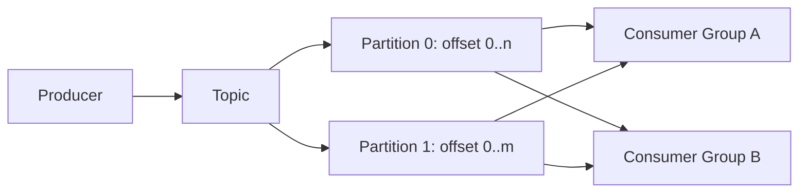

# 消息系统模型：Producer、Consumer、Topic、Queue、Partition、Offset、Ack 与 Consumer Group

消息系统在生产者和消费者之间持久传递记录，但“队列”不是统一语义。Kafka 4.3.1 的分区日志、RabbitMQ 的 queue/exchange、Redis Stream 的 stream/group 在存储、确认、重放和扩展上不同；接口名相似不能互换保证。

## 1. 两类核心模型

### 工作队列

消息进入 queue，多个 consumer 竞争处理，成功 ack 后从可投递状态移除。适合任务分发、邮件和缩略图处理。常见系统支持 visibility timeout、requeue 或 broker ack。

### 持久日志

记录追加到分区日志，消费者维护位置。记录不会因一个组消费就立即删除，多个组可独立重放。Kafka 属于此模型，适合事件流、CDC、审计投影。



## 2. Producer

Producer 决定目标 topic、key、headers、value 和发送确认策略。Kafka key 经 partitioner 选择 partition；相同 key 在分区数不变且使用一致 partitioner 时通常进入同一分区，从而共享分区顺序。

关键参数语义：

- `acks=0`：不等待 broker 确认，低延迟但错误/丢失不可见。
- `acks=1`：leader 写入后确认，leader 故障且未复制可能丢。
- `acks=all`：等待所有 in-sync replicas 要求，配合 `min.insync.replicas` 才形成预期耐久边界。
- idempotent producer：使用 producer ID、epoch 和 sequence 抑制重试产生的分区内重复；不是业务消费者 exactly-once。
- `delivery.timeout.ms`：发送从入队到成功/失败的总时间预算。
- batching/compression：提高吞吐但增加排队延迟和 CPU。

消息成功回调只证明 broker 在配置边界内接受，不证明业务消费者已处理。

## 3. Topic 与 Queue 命名

topic 是记录类别和保留/权限/容量边界。命名应表达领域事实，如 `orders.v1.events`，不把临时服务名固化。一个 topic 混入完全不同 schema、保留和权限需求会难以治理。

queue 在 RabbitMQ 等 broker 中是实际消息驻留和投递对象；exchange/routing key 决定路由。同一 queue 的竞争消费者与 Kafka 同一 group 分工相似，但 RabbitMQ ack 后消息通常从 queue 移除，Kafka offset 提交不会删除日志。

## 4. Partition

Kafka partition 是有序追加日志和并行单位。单 partition 内记录按 offset 有序；topic 跨 partition 没有全局顺序。consumer group 中一个 partition 同时由一个 consumer member 处理（一个 member 可持多个 partition）。

分区数影响：最大消费并行度、文件/元数据、leader 分布、rebalance 和 key 顺序。增加分区会改变默认 key→partition 映射，可能破坏同 key 顺序假设；迁移需显式策略或新 topic。

热点 key 会让一个 partition 过载。拆 key 提升并行会失去单实体总顺序；先确认业务只需按订单/账户有序，而非所有事件全局有序。

## 5. Offset

Kafka offset 是 partition 内记录位置，不是时间戳或全局 ID。消费者读取位置与已提交 group offset 分离：poll 可拿到数据，处理成功后才应提交对应下一位置。

```text
partition 2:
offset 41 processed
offset 42 processed
offset 43 in progress
committed offset = 43   # 下一条从 43 开始
```

如果处理前提交 44，崩溃会跳过 43；处理后未提交，重启会重复。异步提交可能回调乱序，旧 offset 覆盖新进度；需跟踪最高安全连续位置。

retention 删除旧 segment 后，落后 consumer 可能遇到 offset 超出范围；重置 earliest/latest 是业务决策，不能自动 latest 掩盖数据丢失。

## 6. Ack 的不同含义

- Producer ack：broker 对写入的确认。
- RabbitMQ consumer ack：消费者通知 queue 可删除/确认消息；connection 断开前未 ack 通常重投。
- Kafka offset commit：保存 group 下次恢复位置，不逐条删除日志。
- Redis Stream XACK：把 entry 从该 group 的 pending list 移除，stream entry 仍存在直到 trim/delete。

文章和代码必须明确是哪一种 ack。`auto-ack`/auto-commit 常在业务处理前推进位置，只有允许丢处理时才合适。

## 7. Consumer

consumer 循环包含：poll、解析 schema、验证、幂等处理、提交结果、ack/commit。每步都可能失败。

处理时间超过 broker/session 配置会触发 rebalance 或 visibility timeout，消息转给另一 consumer，同时旧 consumer 可能仍执行。不要靠延长 timeout 掩盖无界任务；长任务拆状态机或任务服务，消费端只持久接受。

消费者应设置最大批量、每条/批次 deadline、内存上限、下游并发和优雅停止。停止时停止 poll/领取、等待有界在途、提交安全位置、释放资源。

## 8. Consumer Group 与 Rebalance

Kafka group 协调 partition assignment。成员加入/离开、订阅变化或超时会 rebalance。Eager 协议可能先撤销全部，再分配；cooperative 策略可渐进迁移，具体客户端/版本支持需验证。

rebalance 回调必须在 partition revoke 前完成安全提交/停止处理。并发 worker 若 poll 线程已提交但 worker 未完成会丢；需要按 partition 跟踪完成水位，或 pause partition 控制在途。

静态成员能减少短暂重启造成的 rebalance，但成员 identity 管理错误会产生冲突。group lag 是 `log end offset - committed offset`，不能单独表示处理耗时或业务健康。

## 9. 顺序语义

只承诺 partition 内 broker 记录顺序。以下会改变观察顺序：

- 不同 partition 并发。
- consumer 内 worker pool 并行完成。
- 失败消息重试到独立 topic 后晚到。
- 生产者未启用合适幂等配置且重试/多 in-flight。
- 多 producer 对同 key 没有共同业务版本。

需要实体顺序时：稳定 key→partition、每 partition 串行应用、事件携带 aggregate version、消费者拒绝旧版本。顺序仍不能替代幂等。

## 10. 保留与压缩

Kafka delete retention 按时间/大小删除 segment；log compaction 为每个 key 保留较新值的目标，但清理异步，旧记录不会立即消失。tombstone 表示删除并有保留窗口。

compacted topic 适合状态 changelog，不是永久保存每次变更的审计日志。key 为空的记录无法按业务 key 压缩。schema、key 稳定性和 tombstone 语义必须定义。

## 11. 副本与耐久性

partition 有 leader 和 followers，ISR 是同步副本集合。`acks=all` + 合理 replication factor + `min.insync.replicas` 在副本不足时宁可拒绝写，换取确认写的耐久目标。

unclean leader election 等设置会在可用性和数据损失间取舍。跨区域延迟、broker 磁盘、controller/KRaft quorum 和 rack awareness 都影响恢复。不要把三个副本等同三个独立备份；误删/坏事件会复制。

## 12. 消息大小与批量

大消息占 broker page cache、网络、consumer memory，并受 producer/broker/topic/consumer 多处大小配置。优先把大文件放对象存储，消息传 object ID、checksum、版本和授权范围。

批量提高吞吐，但一批内一个 poison message 不能无限阻塞整 partition。明确逐条/批次提交和失败隔离。压缩比依赖同批相似数据，batch 等待受端到端 latency SLO 限制。

## 13. Schema 与 Envelope

事件至少含 event ID、type、schema version、occurred_at、producer、aggregate ID/version、trace context 和 payload。headers 用于追踪/内容类型等非业务主体字段，但跨系统支持要验证。

事件表示已发生事实，用过去式或明确状态变化；命令表示请求执行，失败处理不同。不要把数据库行快照无筛选地作为公共事件，避免敏感字段和物理 schema 耦合。

## 14. 应用案例一：订单投影

### 输入

订单事件 2 万/s；搜索、风控、通知三个独立消费者；同订单必须按版本应用，搜索允许 30 秒 lag，通知不能重复。

### 处理

1. topic `orders.v1.events` 以 order ID 为 key，24 partitions。
2. producer `acks=all`、idempotence，数据库 outbox 发布。
3. 三个独立 groups 获取同一日志；组内 partition 分工。
4. 搜索按 aggregate version upsert，旧事件忽略。
5. 通知先以 event ID 唯一约束创建发送意图，再调用供应商。
6. 处理成功后提交 offset；重启可重复但结果幂等。

### 输出与验证

同订单版本单调，三个投影进度独立。扩容 search consumer 到 30 个时最多 24 个获得 partition；这是分区上限，不是故障。

### 失败注入

在搜索提交后、offset commit 前杀进程，消息重复但版本条件不重复副作用。让一个 partition 的订单处理变慢，观察该 partition lag，而不是仅看 group 总 lag。

## 15. 应用案例二：缩略图任务

### 输入

上传后生成 4 个尺寸，任务平均 5 秒、最长 2 分钟；需要失败重试和取消，不需要多年重放。

### 选择

工作队列/任务系统比长期 Kafka 日志更直接：每个任务有 visibility/lease、ack、attempt、DLQ。payload 只含 object key/version/checksum，不放文件。

1. API 事务创建 job/outbox。
2. publisher 送 queue，worker 领取后续租。
3. 输出以 job ID + transform version 幂等写对象存储。
4. 取消更新数据库状态，worker 在安全点检查；ack 前记录终态。
5. timeout 后其他 worker 接管，旧 worker 的 generation 不能发布。

### 验证与失败分支

worker 崩溃后任务重投；同任务输出不重复发布。若任务耗时超过 visibility 且不续期，会并发执行；最终发布需要 fencing/version。

## 16. 应用案例三：事件回放

### 输入

计费投影 bug 持续两天，需要从 7 天保留日志重建；线上 group 不能受影响。

### 处理

1. 建新 group/离线 consumer，从目标 timestamp 查 partition offsets。
2. 在隔离表按 event ID/version 重建，不直接覆盖生产。
3. 比较金额守恒、行数和抽样；记录每 partition 水位。
4. 追到当前后短暂停切，原子切换投影版本。
5. 旧表保留回退窗口。

### 失败注入

若 retention 已删除两天前 segment，不能从 latest 假装成功；从数据库快照/对象归档恢复基线，再接剩余日志。

## 17. 方案取舍

| 需求 | Kafka 分区日志 | 工作队列 | Redis Stream |
|---|---|---|---|
| 多组独立重放 | 强 | 需复制/路由 | 支持多 group，耐久需评估 |
| 单任务竞争分发 | 可实现 | 自然 | consumer group |
| 长保留大吞吐 | 核心能力 | 通常非重点 | 内存/持久化成本 |
| 按 key 顺序 | partition 内 | queue/分组依实现 | stream ID + consumer 并行需控制 |
| 运维复杂度 | 高 | 中 | 中 |

## 18. 调试与生产指标

Producer：send/error/retry rate、record queue time、batch size、compression、request latency、outbox lag。Broker：under-replicated partitions、ISR changes、disk/network、request queue、controller health。Consumer：poll latency、records lag/max、commit failure、rebalance、processing p95、in-flight、DLQ。

排障按 partition 和 consumer member 查看，避免总平均掩盖单 partition 热点。trace context 跨异步边界用 span link/新 trace 策略，不能把无限消息都挂在一个长 trace。

## 19. 生产边界

1. topic/queue 有 owner、schema、retention、权限和容量。
2. producer 成功不等于消费成功。
3. ack/commit 在业务提交后，consumer 幂等。
4. key/partition 顺序范围有明确说明。
5. retention 大于最大恢复/回放需求，并有归档/备份策略。
6. 大消息转对象存储；敏感 payload 最小化。
7. 过载通过背压和容量限制，不无限堆积。

## 20. 综合练习与验收

实现订单事件到搜索和通知两个 group，另实现缩略图工作队列。进行进程崩溃、rebalance、单 partition 热点和 retention 缺口故障测试。

验收：能解释每种 ack/offset；同订单版本不倒退；重复消息不重复通知；消费者数量超过 partitions 时行为正确；group lag 可按 partition 定位；回放不影响线上 group；任务取消和长处理有 lease/fencing。

## 来源

- [Apache Kafka 4.3 documentation](https://kafka.apache.org/documentation/)（访问日期：2026-07-17）
- [Apache Kafka 4.3.1 release announcement](https://kafka.apache.org/blog/)（访问日期：2026-07-17）
- [Apache Kafka producer configuration](https://kafka.apache.org/documentation/#producerconfigs)（访问日期：2026-07-17）
- [Apache Kafka consumer configuration](https://kafka.apache.org/documentation/#consumerconfigs)（访问日期：2026-07-17）
- [Redis Streams](https://redis.io/docs/latest/develop/data-types/streams/)（访问日期：2026-07-17）
