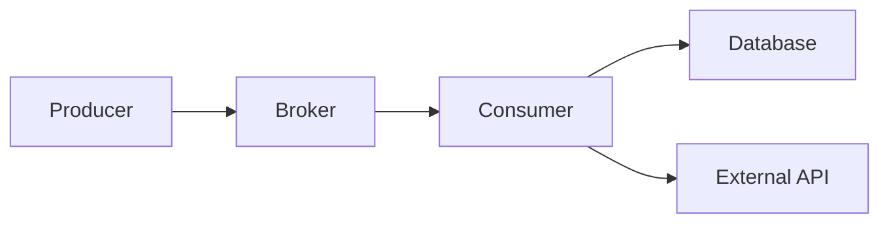

# At-most-once、At-least-once、重复、乱序与幂等 Consumer

投递语义描述消息在特定故障模型下可能被处理几次，不直接保证业务结果。生产系统通常采用 at-least-once 投递，再通过业务幂等、版本约束和事务边界使最终结果正确。

## 1. 语义必须绑定边界

“exactly once”可能只指 broker 内写入、Kafka 读写事务、某个 sink connector，不能自动覆盖邮件、支付、HTTP API 和数据库。先列出链路：producer→broker→consumer→数据库→外部副作用，并为每条边声明失败后状态。



## 2. At-most-once

消息在处理前 ack/提交位置，故障时可能零次或一次，不重复但会丢处理：

```text
receive -> commit offset -> process -> crash
```

适合可丢遥测、重复代价远大于漏失且有其他校正源的场景。不能把“没有重复”误写为“每条成功一次”。

## 3. At-least-once

处理成功后 ack/提交，崩溃窗口会重复：

```text
receive -> commit business result -> crash -> redelivery
```

这是多数可靠任务/事件消费的基础。重复是正常恢复路径，不只异常。consumer 必须在生产流量中持续可重放。

## 4. Exactly-once 的限定语义

Kafka producer idempotence 抑制同 producer session 对 partition 重试的重复。Kafka transactions 可原子提交多个 Kafka partition 写和 consumed offsets，使 read-process-write Kafka pipeline 的未提交结果对 `read_committed` consumer 不可见。

它不让 PostgreSQL、S3 或第三方 API 自动加入 Kafka transaction。数据库 sink 仍需 idempotent upsert/connector 的专属保证。业务文档应写“Kafka→Kafka 事务性处理”而不是无条件“exactly once”。

## 5. 重复来源

- consumer 业务提交后、ack 前崩溃。
- ack/commit 响应丢失。
- visibility timeout/lease 到期，旧 worker 仍执行。
- rebalance 撤销 partition 时在途未安全收敛。
- producer timeout 重试且未启用幂等。
- outbox publisher 发布成功但未标记 published。
- 运维回放、DLQ re-drive、CDC snapshot 重叠。

只在测试重复发送同一 JSON 不足，要在每个故障窗口杀进程/断网。

## 6. 幂等的业务定义

相同业务意图执行多次，最终业务状态与一次相同。HTTP/event ID 相同只是识别工具。幂等策略：

1. 自然幂等：`SET status='active'`，但审计/通知仍可能重复。
2. 唯一约束：`UNIQUE(consumer, event_id)`。
3. 条件状态迁移：`WHERE state='pending'`。
4. 对象版本：只接受更高 aggregate version。
5. 幂等 key 传递给外部供应商。
6. 可交换/增量操作改为以事件 ID 去重后应用。

`balance = balance + amount` 不是天然幂等；必须先登记 event ID 或使用唯一 ledger entry 后汇总。

## 7. Inbox 表模式

consumer 数据库事务内插入处理标记和业务结果：

```sql
BEGIN;
INSERT INTO consumer_inbox(consumer_name, event_id, received_at)
VALUES ($1, $2, now())
ON CONFLICT DO NOTHING;
-- 只有插入成功才应用业务更新
COMMIT;
```

需要判断受影响行数；无条件继续处理会失去去重。inbox 与业务写必须同一数据库事务，否则标记成功、业务失败会永久跳过。

表按时间/consumer 分区，保留期至少覆盖 broker retention、最大 DLQ replay 和人工重放窗口。过早删除会让旧消息再次生效；永久保留则容量增长。

## 8. 条件 Upsert 与版本

搜索/读模型适合版本条件：

```sql
INSERT INTO order_projection(order_id, version, status)
VALUES ($1, $2, $3)
ON CONFLICT (order_id) DO UPDATE
SET version = EXCLUDED.version,
    status = EXCLUDED.status
WHERE order_projection.version < EXCLUDED.version;
```

重复相同 version 或乱序旧 version 都不改变状态。仍要定义同 version 不同 payload：这是生产者违反契约，应告警/隔离，而不是任意覆盖。

## 9. 乱序来源与治理

跨 partition 无全局顺序；consumer 并行、重试 topic 和多 producer 会乱序。事件时间不能可靠判新旧，机器时钟和业务发生时间不同。

每个 aggregate 在事实事务中分配单调 version。consumer：

- `event.version == current+1`：正常应用。
- `<= current`：重复/旧事件，幂等忽略。
- `> current+1`：出现 gap，暂停该 aggregate、补读事实/重放，不能直接跳过。

若只需要最终快照，可接受跳到更高 version；若每步影响计费，gap 必须补齐。

## 10. Partition 内并行

一个 consumer poll 批次后交 worker pool 会导致完成乱序。安全提交 offset 只能推进到“连续已完成前缀”，不是最大完成 offset。

```text
received: 100 101 102 103
done:     yes no  yes yes
safe committed next offset = 101
```

也可按 partition 串行处理，在不同 partitions 间并行。长任务应 pause 该 partition 或转任务系统，持续 poll 保持 group membership需按客户端设计。

## 11. 外部 API 副作用

数据库 inbox 无法和邮件/支付原子提交。可靠流程：

1. consumer 事务写 inbox + external_intent/outbox。
2. intent worker 调供应商，携带稳定 idempotency key。
3. 记录 request ID、未知结果状态和对账信息。
4. 成功/确定失败更新状态；timeout 查询供应商结果，不盲目重试。

供应商不支持幂等时只能降低重复概率或建立唯一业务操作/人工对账，不能承诺 exactly-once。

## 12. Ack 与批次事务

逐条事务隔离失败但吞吐低；整批事务吞吐高但一条失败回滚全部、重试放大。折中按 partition/小批处理，并能定位 poison message。

Kafka 手动 commit offset 是外部操作；数据库提交成功、offset commit 失败会重放，inbox 吸收。不要先 commit offset 再提交数据库。

## 13. 幂等与并发

两个重复消息可能同时到达不同 worker。`SELECT inbox` 后 `INSERT` 有竞态；依赖唯一约束并在事务中处理冲突。幂等不能只用进程内 map/Redis TTL，因为进程重启、过期或 failover 后重复会穿过。

Redis 可做快速去重提示，但最终财务/通知 intent 用持久唯一约束。

## 14. 消息身份

event ID 每次领域事实唯一，重试保持同 ID；不能每次发送重试生成新 ID。aggregate ID/version 表示对象顺序，correlation/causation ID 表示链路关系，不替代 event ID。

批量消息需要每项 ID；只给 batch 一个 ID 无法安全部分重试。消息经过转换产生新事实时生成新 event ID，并保存 causation ID。

## 15. 应用案例一：积分入账

### 输入

订单完成事件给用户增加 100 积分；broker at-least-once，可能重复并乱序；积分必须精确可审计。

### 处理

1. producer 事件含 event ID、order ID、user ID、points、order version。
2. consumer 事务向 points_ledger 插入 `UNIQUE(event_id, entry_type)` 的 +100 entry。
3. 若冲突，读取已有 entry 验证 payload hash 一致，视为重复。
4. 余额从 ledger 聚合或同事务增量更新，只有新 entry 才增加。
5. 事务提交后提交 offset。

### 输出与验证

同事件并发 100 次，ledger 一条、余额 +100。相同 event ID 不同 points 触发契约告警，不静默忽略。

### 失败注入

在 DB commit 后杀 consumer，重放命中唯一约束。删除 inbox/ledger 去重保留前重放旧 topic，验证保留策略不会允许二次入账。

## 16. 应用案例二：订单搜索投影

### 输入

事件 v7 shipped、v8 delivered；重试 topic 使 v7 晚于 v8；搜索只需最新状态。

### 处理

1. order ID 为 partition key，正常路径有序。
2. 搜索文档保存 source_version。
3. 条件 upsert 只接受更高版本；v7 晚到影响 0。
4. v10 直接到达且当前 v8：若投影是完整快照可应用 v10并记录 gap；若 delta 事件则查询数据库/回放 v9。
5. 定期对账数据库版本与索引版本。

### 验证与失败分支

随机打乱 1–100 事件最终版本仍 100。若事件是 `quantity_delta`，不能只按最高版本跳跃，否则丢增量；改用 ledger/inbox 或状态快照事件。

## 17. 应用案例三：邮件发送

### 输入

欢迎邮件不能因重投发送多次；邮件供应商无可靠幂等 API；发送响应可能丢失。

### 处理

1. consumer 事务创建 `email_intent`，唯一键 template/business_recipient/business_event。
2. 单 worker 条件领取 intent，设置 generation/lease。
3. 发送前生成 Message-ID 并持久化；供应商响应/回执按 Message-ID 对账。
4. timeout 状态标 unknown，先查回执/等待窗口，不立即重复。
5. 仍无法确定时按业务选择人工处理或接受重复风险。

### 输出

系统不虚假承诺 exactly-once，而把不可判定状态显式建模。重复 broker 消息只创建一个 intent。

## 18. Kafka 事务案例

消费 `raw-orders`、生成 `validated-orders`，两者都在 Kafka：transactional producer 在事务中发送输出并 `sendOffsetsToTransaction`；失败 abort，`read_committed` 下游不看 aborted 输出。

若事务内还写 PostgreSQL，该写不随 Kafka abort 回滚。应改为 Kafka→Kafka 后由幂等 sink 写数据库，或使用数据库 outbox/inbox。

## 19. 方案取舍

| 方法 | 状态位置 | 能处理 | 代价 |
|---|---|---|---|
| 自然幂等 SET | 业务表 | 重复最终状态 | 附带副作用仍重复 |
| Inbox unique | 数据库 | 任意 event 去重 | 存储/保留 |
| Aggregate version | 投影 | 重复和乱序 | 需 gap 语义 |
| Kafka transaction | Kafka 内 | read-process-write | 不覆盖外部系统 |
| 外部 idempotency key | 供应商 | API 重试 | 依赖供应商保留/语义 |

## 20. 调试与指标

记录 duplicate detected、payload conflict、out-of-order、version gap、inbox conflict、processing/commit latency、redelivery count、unknown external outcome。指标 label 用 consumer/topic/problem type，不用 event ID；event ID 进日志/trace。

验证包括正常重复、并发重复、commit 后崩溃、ack 响应丢失、rebalance、旧事件晚到、DLQ 重放和去重记录过期。

### 故障窗口检查表

| 故障点 | 重启后的消息状态 | 业务要求 |
|---|---|---|
| poll 后、业务前 | 重新投递 | 无业务变化 |
| 业务事务中 | 数据库回滚后重投 | 不存在半条 ledger |
| 业务 commit 后、offset 前 | 重投 | inbox/版本吸收重复 |
| offset commit 后 | 不重投 | 业务结果已持久 |
| 外部请求 timeout | 未知 | 对账后决定，不盲重试 |

测试应在真实 broker 和数据库连接上逐点终止进程，不只 mock 返回错误。对于批次处理，还要分别在第一个、中间和最后一条提交处注入，确认连续 offset 水位不会跳过未完成项。

去重存储本身也要纳入恢复：从备份恢复数据库到较早时间，却从较新 broker offset 开始会漏；恢复 broker 到较早 offset、inbox 仍较新会安全跳过重复，但要确认保留和跨系统恢复水位。

## 21. 生产检查与综合练习

生产检查：ack 在业务提交后；event retry 保持 ID；唯一约束是最终去重；乱序用版本不是时间；gap 有策略；外部未知结果可对账；去重保留覆盖最大重放。

综合练习：实现积分 ledger、搜索投影和邮件 intent 三类 consumer，分别使用唯一 ledger、版本条件和外部对账。

验收：并发重复不多记积分；v7 晚于 v8 不倒退；Kafka transaction 边界说明准确；邮件 timeout 不盲重发；offset 只推进连续完成前缀；故障测试结果可从日志和指标定位。

## 来源

- [Apache Kafka design: delivery semantics](https://kafka.apache.org/documentation/#semantics)（访问日期：2026-07-17）
- [Apache Kafka producer configuration](https://kafka.apache.org/documentation/#producerconfigs)（访问日期：2026-07-17）
- [Apache Kafka consumer configuration](https://kafka.apache.org/documentation/#consumerconfigs)（访问日期：2026-07-17）
- [Apache Kafka transactions](https://kafka.apache.org/documentation/#transactions)（访问日期：2026-07-17）
- [PostgreSQL 18: Constraints](https://www.postgresql.org/docs/18/ddl-constraints.html)（访问日期：2026-07-17）
