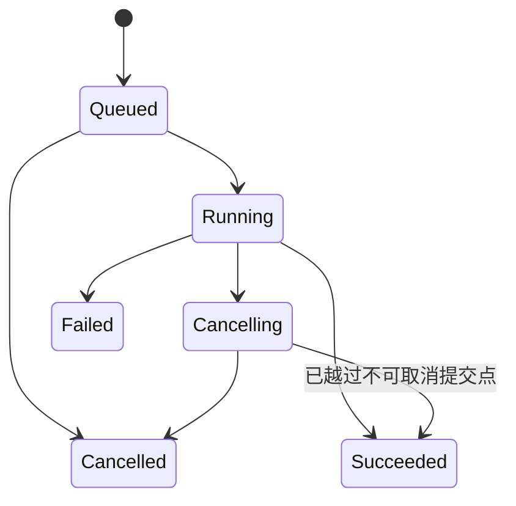

# 消息 Schema 演进、积压、优先级与任务取消

消息一旦进入 broker，会跨越多个应用版本和保留周期。Schema 必须兼容旧消费者；积压需要容量和追赶计划；优先级要防饥饿；取消必须建模为状态竞争，而不是从日志中“删除一条消息”。

## 1. Schema 是跨时间契约

生产者今天写入的消息可能几天后被旧 consumer、回放任务或新投影读取。契约包括 key、envelope、payload、默认值、枚举、单位、时区和语义，不只是 JSON 能解析。

```json
{
  "event_id":"evt_9",
  "event_type":"order.shipped",
  "schema_version":3,
  "occurred_at":"2026-07-17T08:00:00Z",
  "aggregate":{"type":"order","id":"o_7","version":12},
  "data":{"carrier":"acme","tracking_number":"..."}
}
```

## 2. 兼容方向

- Backward compatibility：新消费者能读旧消息。
- Forward compatibility：旧消费者能容忍新消息。
- Full compatibility：同时满足二者。

字段新增只有在消费者能处理缺失默认值、旧消费者能忽略未知字段时才兼容。删除字段前必须确保所有保留消息和消费者不需要它。改变类型、单位、含义或枚举通常破坏语义。

## 3. Avro、Protobuf 与 JSON Schema

Avro 常用 writer/reader schema 解析并与 registry 集成；Protobuf 用字段编号保持 wire identity，删除后应 reserved；JSON 易调试但仍需 JSON Schema/契约测试。

不要把序列化格式能力当业务兼容保证：把 `amount_cents` 的含义从含税改不含税，即使类型仍 int64 也是破坏性变化。语义变化使用新字段/事件类型或明确版本。

## 4. Schema Registry 工作流

1. schema 进入版本控制并有 owner。
2. CI 检查兼容规则和样例 corpus。
3. producer 只发布已注册 schema ID/version。
4. consumer 对支持版本做显式分支，对未知版本隔离。
5. 监控每版本流量，确认旧版本归零后再 contract。

registry 不应成为每条消息同步单点：客户端缓存 schema，有界刷新；未知 schema 时不能猜测解析。

## 5. Envelope 与 Payload 演进

envelope 字段用于路由、身份、版本和追踪，应极稳定。payload 随领域事件演进。把所有业务字段塞 headers 会失去 schema；把 trace/token/PII 无筛选塞 envelope 会扩大泄露。

事件类型代表稳定事实。重大语义变化可发布 `order.fulfilled.v2` 或新增字段并双写，消费者迁移后停止旧事件。双发会使同时订阅两者的 consumer 重复，必须明确 identity/迁移策略。

## 6. 积压的量化

Kafka records lag 是 log end offset 与 committed offset 差；真正恢复时间还依赖平均处理速率和消息成本：

```text
time_to_catch_up ≈ backlog_work / (consumer_capacity - incoming_rate)
```

若消费能力 ≤ 新流量，增加时间只会继续增长。消息条数不能代表工作量：一条大批导入比普通更新昂贵。记录 bytes lag、event-time lag、oldest age 和预计处理成本。

## 7. 积压原因

- 下游 503/限流。
- poison message 阻塞 partition。
- partition 热点/消费者不足。
- rebalance 频繁或 poll 超时。
- schema 发布失败。
- consumer DB 索引/锁慢。
- broker 网络/磁盘瓶颈。
- 新版本处理成本回归。

先定位瓶颈再扩容 consumer。partition 数、下游连接和热点可能让扩容无效。

## 8. 追赶策略

1. 确认 retention 足够，防 offset 被删除。
2. 修复根因并测单实例稳定吞吐。
3. 在 partition/下游容量内增加 consumer。
4. 批量/压缩/数据库 bulk upsert，但保持幂等和错误隔离。
5. 对完整快照投影可合并同 key 旧版本，增量 ledger 不可跳。
6. 分配新流量与 backlog 的公平容量。
7. 逐步恢复，避免压垮下游。

积压超过业务 freshness SLO 时，产品应显示数据更新时间或关闭依赖功能。

## 9. 优先级模型

Kafka partition 日志本身不提供消息插队优先级。常用不同 topics/queues：high、normal、bulk；消费者按权重读取并保留正常/低优先容量。

工作队列可能支持 priority queue，但优先级数量和实现成本因 broker 而异。严格最高优先会饿死低优先，使用 weighted fair scheduling：例如每处理 10 high 至少处理 3 normal、1 bulk。

优先级由服务端受控业务规则决定，不能让客户端任意标 high 绕过配额。每 tenant 也需公平，防大租户占满高优队列。

## 10. 优先级反转

高优任务依赖被低优任务占用的有限资源（数据库锁、对象处理 slot），仍会等待。仅给 queue 加 priority 无法解决。资源池可为高优保留容量，事务短小，避免低优长任务持全局锁。

优先级随重试不应无限提升；否则 poison message最终成为最高优先。按截止时间/业务价值和尝试成本调度。

## 11. 取消是状态竞争

消息已经投递给 worker 后无法保证“撤回”。取消请求与完成可能并发：



API 接受取消只表示请求已登记；最终状态可能 succeeded。状态迁移用数据库条件更新，不能前端直接改。

## 12. Cooperative Cancellation

worker 在安全点检查 cancel flag/context：批次之间、外部调用前、发布结果前。CPU 循环和大文件处理要主动检查。不可逆外部调用发出后，取消可能只能停止后续步骤或执行补偿。

Broker tombstone/删除消息不能取消已被 consumer 取得的工作。Kafka compacted topic 的 tombstone 是 key 状态删除语义，不是立即移除所有历史记录。

## 13. Job 状态与 Generation

数据库 job 保存 state、attempt、generation、lease_until、cancel_requested_at、result。worker 领取 generation；最终提交：

```sql
UPDATE jobs
SET state='succeeded', result_uri=$1
WHERE job_id=$2 AND generation=$3 AND state='running';
```

取消/接管提升 generation 或改变 state，旧 worker 提交影响 0。输出使用版本化 key，避免旧 worker覆盖。

## 14. Schema 发布案例

### 输入

订单金额从浮点元迁移到 `amount_cents int64`；Kafka 保留 14 天，consumer 30 个，滚动升级 3 天。

### 处理

1. schema v2 新增 optional amount_cents，生产者双写并保持旧 amount。
2. 新消费者优先 cents，缺失时按明确舍入转换旧字段。
3. 用历史消息 corpus 测新消费者；旧消费者忽略新字段。
4. 监控 v1 producer 归零和 v2 consumer 覆盖。
5. 至少超过 14 天保留/回放窗口后，新事件 v3 才停止旧字段；必要时新 topic。

### 验证

边界金额、负数、最大值和舍入一致；相同 event ID 双版本不会重复入账。

### 失败注入

回放 10 天前 v1，新 consumer 能解析；旧 consumer 收 v2 不崩溃。若直接改原字段类型，registry compatibility/契约测试失败。

## 15. 积压恢复案例

### 输入

搜索 consumer 停 4 小时，积压 7200 万；新流量 5000/s，单 consumer 1000/s，24 partitions，OpenSearch 最大安全 bulk 2 万/s。

### 处理

1. 修复后先 5 consumers 测稳定吞吐/错误。
2. 最大总消费保持 1.8 万/s，为搜索在线查询保留资源。
3. 净追赶 1.3 万/s，估算约 92 分钟；展示 freshness。
4. 24 partitions 上扩到 18 consumers，观察热点 partition。
5. 完整状态事件按 order version 可合并部分旧更新，但删除/tombstone保留。

### 验证与失败分支

追赶不超过 bulk reject 阈值；估算与实际每10分钟修正。直接扩到 100 consumer 不会超过 24 partition并行，反而增加 rebalance。

## 16. 优先级任务案例

### 输入

交易回执截止 1 分钟；用户导出可 30 分钟；同一 worker 集群，导出大任务可能占满。

### 处理

1. high receipt、normal notification、bulk export 三队列。
2. 独立 worker pool：高优保留 30%，其余可借用；导出有最大并发。
3. 调度使用 weighted fair，不让 bulk 永久饿死。
4. 所有任务有 deadline，过期不再无意义执行。
5. priority 由服务端任务类型映射，用户不能提交任意数值。

### 验证

满载导出时回执 p99 < 60 秒；持续 high 流量时 bulk 仍有最低吞吐；tenant 配额公平。

## 17. 取消导出案例

### 输入

导出 1 亿行，分 1000 批写 multipart object；用户在第 600 批取消。

### 处理

1. API 条件更新 running→cancelling。
2. worker 每批检查 job state/context，停止读取。
3. abort multipart upload，记录清理结果；生命周期兜底删除未完成 parts。
4. 条件提交 cancelled；若最后一批/complete 已成功，则记录 succeeded 而非伪取消。
5. 重复取消幂等返回当前状态。

### 失败注入

取消后杀 worker，接管者看到 cancelling 并继续清理；旧 generation 不能完成发布。对象存储 abort 失败进入 cleanup retry，不把主 job 永久 running。

## 18. 调试和指标

Schema：版本分布、未知版本、兼容失败。积压：records/bytes/event-time lag、oldest age、catch-up ETA、partition skew。优先级：每级等待/完成/过期、借用容量、tenant fairness。取消：request→observed latency、cancelling age、late success、cleanup failure。

### Schema 数据测试

为每个版本保存 golden messages：最小字段、全部字段、边界数字、未知枚举、Unicode、空数组和最大允许 payload。CI 用新 consumer 读取全部历史样例，用旧 consumer 读取新 producer 的兼容样例。只编译生成代码不能发现单位和默认值语义变化。

消费者遇到未知枚举应按契约选择 `UNKNOWN`、隔离或拒绝；不得把未知值映射成某个现有业务状态。生产者删除枚举值并不让保留日志中的旧值消失。

### 积压期间发布控制

consumer 已积压时发布更慢的新版本会扩大事故。部署门禁比较 canary 单条成本、rebalance 和 sink 压力；若 backlog age 超阈值，冻结非必要 schema/consumer 发布。扩 partition 前确认 key 顺序和消费者并行，扩容不是紧急无风险按钮。

取消消息本身也可能排在长积压之后，因此关键取消使用可查询数据库状态作为事实源；worker 在每个安全点直接查/订阅状态，不依赖取消事件必然先到。

对事件时间和处理时间分别观测：event-time lag 表示用户看到的数据新鲜度，processing latency 表示单条执行成本。只看 offset lag 会在消息大小变化、合并事件或 partition 不均衡时误判恢复进度。

## 19. 生产检查与综合练习

生产检查：schema 兼容在 CI；retention 覆盖迁移；积压有 ETA/停止阈值；优先级防饥饿；取消有状态机、generation 和清理；旧 worker 不能发布。

综合练习：演进订单金额 schema，制造四小时积压，并实现可取消 multipart 导出。

验收：旧新 consumer 共存；未知 schema 隔离不热循环；追赶不压垮 sink；高优 SLO 在 bulk 满载下满足；持续 high 不饿死 bulk；取消/完成竞争结果准确；所有状态和 lag 可查询。

## 来源

- [Apache Kafka 4.3 documentation](https://kafka.apache.org/documentation/)（访问日期：2026-07-17）
- [Apache Kafka operations and monitoring](https://kafka.apache.org/documentation/#operations)（访问日期：2026-07-17）
- [Protocol Buffers: Updating a message type](https://protobuf.dev/programming-guides/proto3/#updating)（访问日期：2026-07-17）
- [Apache Avro specification](https://avro.apache.org/docs/current/specification/)（访问日期：2026-07-17）
- [Amazon S3 multipart upload overview](https://docs.aws.amazon.com/AmazonS3/latest/userguide/mpuoverview.html)（访问日期：2026-07-17）
