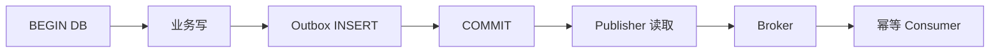
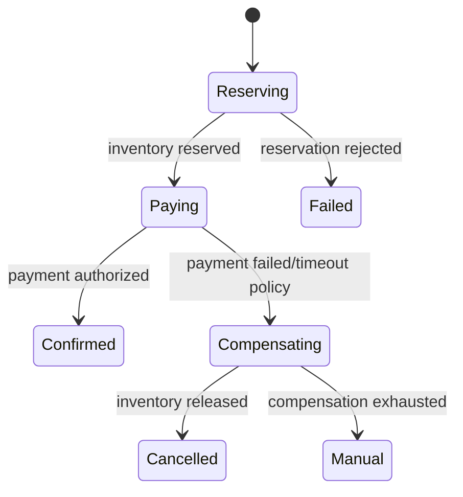

# Transactional Outbox、最终一致性与补偿

Transactional Outbox 用同一数据库事务提交业务状态和待发布事件，解决“数据库成功但消息未发”的双写缺口。它提供可靠至少一次发布基础，不提供跨数据库、broker 和外部 API 的全局原子事务；消费者仍需幂等，长流程仍需状态机和补偿。

## 1. 双写失败矩阵

直接“更新数据库，再发消息”：数据库提交后进程崩溃会漏事件。直接“先发消息，再提交”：消费者可能看到最终回滚的数据。



业务行和 outbox 要么同时存在、要么都不存在。publish 成功与标记 published 之间仍有崩溃窗口，消息可能重复。

## 2. Outbox Schema

```sql
CREATE TABLE outbox_events (
    event_id uuid PRIMARY KEY,
    aggregate_type text NOT NULL,
    aggregate_id uuid NOT NULL,
    aggregate_version bigint NOT NULL,
    event_type text NOT NULL,
    schema_version integer NOT NULL,
    payload jsonb NOT NULL,
    occurred_at timestamptz NOT NULL,
    available_at timestamptz NOT NULL DEFAULT now(),
    published_at timestamptz,
    attempts integer NOT NULL DEFAULT 0,
    lease_owner text,
    lease_until timestamptz,
    last_error_code text
);
```

payload 最小化敏感字段；event ID 和 aggregate version 在事务中稳定生成。索引未发布/available_at，避免 publisher 全表扫描。表按时间分区/归档，但保留覆盖排障和重放。

## 3. 事务写入

```text
BEGIN;
UPDATE orders
SET status='paid', version=version+1
WHERE order_id=$1 AND status='pending'
RETURNING version;

INSERT INTO outbox_events(...)
VALUES (..., 'order.paid', ...);
COMMIT;
```

只有状态迁移实际成功才插事件。应用不得在事务 closure 内直接调用 broker。事务重试时 event ID 要稳定或由唯一业务键防重复。

## 4. Publisher 领取

多个 publisher 可短事务 `FOR UPDATE SKIP LOCKED` 领取批次、设置 lease 后提交，再调用 broker。不能持数据库事务跨网络发送，否则长期占锁/连接。

```sql
WITH picked AS (
  SELECT event_id
  FROM outbox_events
  WHERE published_at IS NULL
    AND available_at <= now()
    AND (lease_until IS NULL OR lease_until < now())
  ORDER BY occurred_at, event_id
  FOR UPDATE SKIP LOCKED
  LIMIT 100
)
UPDATE outbox_events o
SET lease_owner=$1, lease_until=now()+interval '30 seconds'
FROM picked
WHERE o.event_id=picked.event_id
RETURNING o.*;
```

发送成功后条件更新 `WHERE lease_owner=$publisher`。lease 过期可接管，旧 publisher 仍可能发送，所以 broker/consumer 幂等。

## 5. 发布顺序

多个 publisher 不能保证全表顺序。业务通常只需要同 aggregate version 顺序：Kafka 用 aggregate ID key 进入同 partition；publisher 查询顺序不是最终证明。

同一 aggregate 事件若并行发送 v11、v10 可能乱序，消费者按 version 防倒退。若每个 delta 必须按序，publisher/partition和 gap恢复需更严格。

## 6. 标记与删除

保留 `published_at` 便于审计/重发；定期归档后删除。若发送成功但标记失败，会重复，预期由 consumer 吸收。若先标记再发送，标记后崩溃会漏，禁止。

“删除行即标记”降低表大小但减少排障证据；可以归档到历史表/对象存储。清理任务同样分批、监控 WAL/锁。

## 7. CDC 发布 Outbox

Debezium 等可从 PostgreSQL WAL 捕获 outbox INSERT，避免轮询；Outbox Event Router 可转换事件。优点是低延迟和不轮询，代价是连接器、schema、WAL/slot、snapshot和 offset 运维。

复制槽消费停滞会保留 WAL 并占满磁盘。监控 slot lag、connector 状态、最后事件水位。CDC 恢复仍可能重复，consumer 幂等不变。

## 8. Inbox 与端到端

下游数据库使用 inbox unique(event_id, consumer) 并与业务投影同事务。链路变成：source business+outbox 原子；broker at-least-once；consumer inbox+projection 原子。

这实现最终一致且可重试，不是瞬时全局事务。对用户展示 processing/pending，设置 freshness SLO 和 lag告警。

## 9. Saga 与补偿

跨服务长流程分为多个本地事务：订单创建→库存预留→支付→确认。每步有正向命令和可行补偿：释放库存、取消支付授权、取消订单。

补偿不是回滚：邮件无法收回，汇率/库存可能变化，退款是新业务交易。补偿必须幂等、可失败、可重试并审计。

## 10. Orchestration 与 Choreography

Orchestration 由 coordinator 持久状态机并命令各服务，易观察和处理超时，但 coordinator 与领域流程耦合。Choreography 由服务对事件反应，松耦合但流程隐含、循环/追踪复杂。

复杂资金/订单流程常用显式 orchestrator；简单派生投影用 choreography。不能为了“无中心”让关键补偿没人负责。

## 11. Saga 状态机



每个 transition 用条件 update + version；消息携带 saga ID、step ID、attempt。重复 step 返回已有结果。timeout 是状态事件，不凭本地 sleep 丢失。

## 12. 未知结果与补偿危险

支付 timeout 后直接“释放库存并取消订单”可能支付实际上成功。先通过 provider idempotency key/webhook/reconciliation 确认。状态 `payment_unknown` 阻止矛盾动作。

补偿顺序通常逆向，但按业务依赖决定。已经捕获支付可能需要退款而非 void；外部系统的状态机必须映射。

## 13. Outbox 过载

broker 停机时 outbox 增长，数据库表/索引/WAL膨胀。设置容量、oldest age告警、publisher退避和业务策略。不能在表过大后 `DELETE` 全量。

高吞吐可分区 outbox、批量发送、压缩，但事务内 payload 不宜巨大。大数据放对象存储，event只传引用/checksum。

## 14. 可观测性

核心指标：outbox pending、oldest unpublished age、publish rate/error/retry、lease timeout、duplicate publish、consumer duplicate、saga state count/age、compensation rate/failure/manual。

trace 用 event ID/causation链接异步步骤；日志不打印敏感 payload。业务看板显示“订单 pending 过久”，不能只看技术队列 lag。

## 15. 应用案例一：订单与搜索

### 输入

订单事务提交后搜索 30 秒内可见；broker会重复；索引可重建。

### 处理

1. 订单事务写 order v12 + outbox `order.changed`。
2. publisher 至少一次发 Kafka，以 order ID 为 key。
3. 搜索 consumer 按 external version upsert；旧版本忽略。
4. offset 在索引请求成功后提交；失败重试/DLQ。
5. 定期 DB↔index 版本对账，可全量重建。

### 验证与失败注入

在 commit 后杀API，outbox仍存在；发 broker 后杀 publisher，重复但投影正确；停 consumer 30秒，freshness告警。

## 16. 应用案例二：库存与支付 Saga

### 输入

订单服务、库存、支付各自数据库；库存预留15分钟；支付可能 unknown。

### 处理

1. coordinator 创建 saga/reserve command outbox。
2. 库存 inbox幂等预留并发结果事件。
3. 成功后支付 intent 用 saga ID作幂等key。
4. payment succeeded→确认订单/库存；failed→释放。
5. unknown→对账，不先释放；超时转人工策略。
6. 每步条件状态迁移，重复消息返回原结果。

### 输出

用户看到 pending/confirmed/cancelled/manual，不虚构全局瞬时事务。

### 失败注入

乱序发送 payment.succeeded 和 timeout，version/state condition只允许合法 transition；释放库存重复三次只生效一次。

## 17. 应用案例三：邮件 Outbox

### 输入

用户注册和欢迎邮件不能因 broker 故障丢；邮件不是注册事务的一部分，失败不回滚账户。

### 处理

1. 注册事务写 user + `welcome-email.requested` outbox。
2. consumer 创建唯一 email_intent(event_id/template/recipient)。
3. worker 发送并记录 provider message ID；unknown对账。
4. 失败达到预算标 failed，支持运营重发新意图。

### 验证

注册成功时事件必存在；重复发布只一个 intent；邮件失败账户仍可用且用户可重新触发验证邮件。

## 18. 方案取舍

| 方案 | 优点 | 风险/边界 |
|---|---|---|
| 轮询 Outbox | 简单、无CDC平台 | DB轮询、延迟 |
| CDC Outbox | 低延迟、覆盖提交日志 | connector/slot运维 |
| 2PC | 支持资源内原子协议 | 阻塞、参与者限制、复杂恢复 |
| Saga | 适合长流程/外部API | 中间状态、补偿不完美 |
| 直接双写 | 代码少 | 存在不可消除丢失窗口 |

## 19. 数据恢复与发布演进

数据库 PITR 与 broker 恢复点可能不同。数据库恢复到较早时间会丢掉部分 outbox 行，即使 broker 仍有事件；恢复后必须依据业务事实、broker 水位和外部系统对账，不能只重启 publisher。为关键事件维护可从业务表/审计日志重新生成的规则，并标记 regeneration batch，避免与原 event ID 冲突。

Outbox schema 演进遵循 expand-contract：新增可空字段，publisher 同时支持旧新行，历史未发布行仍能读取；不能在发布新应用时立刻把旧 payload 解释器删除。事件公共 schema 与 outbox 物理表分开，publisher 做稳定转换。

跨区域灾备时，两个区域不能同时发布同一 outbox 范围而无幂等/ownership。使用数据库主写区域、publisher lease/epoch，并让 consumer 按 event ID吸收重复。区域切换后的旧 publisher 恢复也必须因 epoch 过期失去发布权。

### 审计与隐私

outbox 不是永久审计日志。若 payload 含 PII，按数据分类控制列/表访问、加密和保留；已发布事件可转最小审计记录后删除 payload。隐私删除还需处理 broker retention、DLQ、搜索和对象存储，不能只删源表。

### 权限边界

业务应用只需 INSERT outbox，不应能任意把行标为 published；publisher 只读取/更新投递字段，不应修改订单、余额等业务事实。运维 re-drive 使用单独受审计角色和批次审批。这样单个服务凭据泄露不会同时改事实、删除待发事件并伪造投递状态。

publisher 日志记录 event ID、类型、attempt 和 broker metadata，不记录完整 payload。对同一 event ID 出现不同 payload hash 立即告警，这是生产者幂等契约被破坏。

## 20. 生产检查与综合练习

检查：业务+outbox同事务；publisher不先标记；event ID稳定；consumer inbox幂等；payload最小；oldest age告警；CDC slot有磁盘保护；Saga unknown/manual建模；补偿幂等并审计。

练习：实现订单→库存→支付 Saga，以及订单搜索投影。注入 API commit后崩溃、publisher标记前崩溃、consumer提交后崩溃、支付unknown和补偿失败。

验收：无漏事件；重复不重复副作用；旧版本不覆盖；outbox积压可恢复且不撑满数据库；unknown不误补偿；manual有owner；重建/对账路径实际可执行。

## 来源

- [Debezium Outbox Event Router](https://debezium.io/documentation/reference/stable/transformations/outbox-event-router.html)（访问日期：2026-07-17）
- [Debezium PostgreSQL connector](https://debezium.io/documentation/reference/stable/connectors/postgresql.html)（访问日期：2026-07-17）
- [Apache Kafka delivery semantics](https://kafka.apache.org/documentation/#semantics)（访问日期：2026-07-17）
- [PostgreSQL 18 transactions](https://www.postgresql.org/docs/18/tutorial-transactions.html)（访问日期：2026-07-17）
- [Microsoft Azure Architecture: Compensating Transaction](https://learn.microsoft.com/azure/architecture/patterns/compensating-transaction)（访问日期：2026-07-17）
