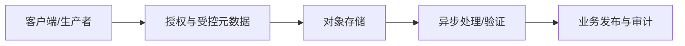

# S3、Bucket、Object、Key 与 Presigned URL

对象存储以 bucket 和 object key 组织不可随机修改的对象。Presigned URL 是使用签名者权限生成的限时请求能力，不是一次性链接；服务端必须先授权业务对象，再限制 key、方法、过期、大小和校验和。

## 1. 数据流与责任边界

Presigned URL 只授权一次受约束的对象存储请求，不授予业务对象所有权。签名必须绑定服务端生成的 key、方法、必要请求头和短有效期；上传完成后仍由 upload 记录、对象版本与校验结果决定是否发布，下载前仍要重新检查业务权限。

## 2. Bucket

机制：对象命名空间、策略、版本和生命周期边界。

使用：按环境/数据分类而非每用户建桶。

失败：公开策略或跨环境混用。

验证：策略模拟和匿名访问测试。

取舍：桶少易治理但隔离需prefix/策略。

围绕 Bucket 的接口必须保存受控 object ID、tenant、版本和状态；客户端提供的 bucket、key、类型或结果只能作为待验证输入。

## 3. Object

机制：正文、系统metadata、用户metadata和可选version组成。

使用：保存文件、导出、备份。

失败：把对象当可局部事务更新的行。

验证：HEAD/GET校验长度、checksum、version。

取舍：高耐久但小对象请求成本。

围绕 Object 的接口必须保存受控 object ID、tenant、版本和状态；客户端提供的 bucket、key、类型或结果只能作为待验证输入。

## 4. Key

机制：UTF-8对象标识，斜杠只是prefix惯例。

使用：使用随机ID/内容hash，原文件名放metadata。

失败：直接采用用户路径导致覆盖/遍历语义混乱。

验证：规范化生成并做tenant授权。

取舍：稳定key便于引用但改名是copy+delete。

围绕 Key 的接口必须保存受控 object ID、tenant、版本和状态；客户端提供的 bucket、key、类型或结果只能作为待验证输入。

## 5. Prefix

机制：列举和策略常用逻辑分组。

使用：tenant/date/type分区。

失败：把prefix当真正目录/权限继承。

验证：ListObjects分页与策略测试。

取舍：层次清楚但热点规则依实现。

围绕 Prefix 的接口必须保存受控 object ID、tenant、版本和状态；客户端提供的 bucket、key、类型或结果只能作为待验证输入。

## 6. PutObject

机制：整体写一个对象，成功后产生新对象/版本。

使用：小中等文件上传。

失败：同key会覆盖当前版本。

验证：使用条件写、versioning和checksum。

取舍：简单但大文件重试成本高。

围绕 PutObject 的接口必须保存受控 object ID、tenant、版本和状态；客户端提供的 bucket、key、类型或结果只能作为待验证输入。

## 7. GetObject/HeadObject

机制：GET取正文，HEAD取metadata。

使用：下载和存在/版本检查。

失败：用LIST确认权限或存在性。

验证：按精确key授权并检查状态。

取舍：HEAD省带宽但仍计请求。

围绕 GetObject/HeadObject 的接口必须保存受控 object ID、tenant、版本和状态；客户端提供的 bucket、key、类型或结果只能作为待验证输入。

## 8. Presigned URL

机制：SigV4把method、bucket/key、过期和签名头绑定。

使用：浏览器直传/限时下载。

失败：认为URL只能使用一次或签名即业务授权。

验证：重复使用、过期、篡改header测试。

取舍：减轻应用带宽但URL泄露即能力泄露。

围绕 Presigned URL 的接口必须保存受控 object ID、tenant、版本和状态；客户端提供的 bucket、key、类型或结果只能作为待验证输入。

## 9. IAM/Policy

机制：身份策略、bucket policy、access point等共同决定。

使用：最小权限和环境隔离。

失败：允许任意key后仅靠应用隐藏。

验证：Access Analyzer/策略测试和审计。

取舍：精细但显式deny/条件复杂。

围绕 IAM/Policy 的接口必须保存受控 object ID、tenant、版本和状态；客户端提供的 bucket、key、类型或结果只能作为待验证输入。

## 10. Checksum

机制：上传时校验传输完整性，S3支持多种算法。

使用：客户端与服务端确认正文未损坏。

失败：把ETag普遍当MD5。

验证：使用ChecksumSHA256/CRC等官方字段。

取舍：增加计算但提供明确完整性。

围绕 Checksum 的接口必须保存受控 object ID、tenant、版本和状态；客户端提供的 bucket、key、类型或结果只能作为待验证输入。

## 11. Metadata

机制：Content-Type/Disposition和自定义metadata描述对象。

使用：下载表现、hash、业务版本。

失败：信任客户端Content-Type或在metadata放secret。

验证：服务端重判类型并最小化metadata。

取舍：便于HEAD但metadata修改通常需copy。

围绕 Metadata 的接口必须保存受控 object ID、tenant、版本和状态；客户端提供的 bucket、key、类型或结果只能作为待验证输入。

## 12. 方案比较

|方案|收益|边界|
|---|---|---|
|服务端代理上传|集中校验|占应用带宽|
|Presigned PUT|客户端直传|单对象与header约束|
|Presigned POST|表单policy条件|客户端实现复杂|
|公开URL|简单分发|无法按用户撤权|
|短期下载URL|最小暴露|URL泄露窗口|

## 13. 完整案例：头像直传

### 输入与约束

最大10MiB，只允许JPEG/PNG；用户不能覆盖他人对象；上传后扫描才可见。

### 处理步骤

1. API认证后生成随机object ID和quarantine key。
2. 创建upload记录并签固定key、短过期、checksum与允许headers。
3. 客户端直传后回调object ID而非任意key。
4. worker HEAD/GET验证大小、magic bytes、checksum并扫描。
5. 通过后copy/标记到clean版本，数据库事务发布引用。

### 输出

未扫描对象不可下载，业务引用由数据库授权。

### 验证

篡改key/header/过期失败；伪Content-Type被magic检测拒绝；跨tenant不可签。

### 失败分支

只凭客户端回调URL入库会引用攻击者对象；服务端必须根据受控upload记录验证。

### 恢复要求

回调超时后，worker 对 upload 记录中的精确 key 执行 `HeadObject`，核对长度、checksum 和 version，再用状态条件更新完成发布。重复回调以 upload ID 幂等处理；清理任务只删除记录为该 upload 生成且仍处于 quarantine 的孤儿版本，不能根据客户端文件名猜测 key。

## 14. 完整案例：私有报表下载

### 输入与约束

报表含PII，下载权限可撤销，URL有效5分钟，CDN不得公开缓存。

### 处理步骤

1. API每次检查tenant、owner和报表状态。
2. 对精确version key签GET，Content-Disposition使用安全文件名。
3. 响应不写URL到普通日志，页面避免第三方Referer泄露。
4. 下载审计记录主体、object ID、version，不记录签名query。
5. 撤权后停止签新URL，必要时轮换/删除对象版本。

### 输出

持有短期URL者在窗口内可下载，过期后需重新授权。

### 验证

无权不能取得URL；URL参数篡改失败；缓存头不公开。

### 失败分支

Presigned URL不是一次性，撤权后已签URL仍可用到过期；高风险场景缩短过期或经授权代理。

### 恢复要求

签名服务失败不改变报表状态，客户端重新请求时再次鉴权并生成新 URL。已签 URL 通常不能逐条撤销，因此撤权后先停止签发；高风险下载使用更短 TTL 或授权代理。删除或轮换时按报表记录中的 object ID 与 version 操作，避免误删同 key 的其他版本。

## 15. 故障注入矩阵

|注入|预期|禁止|
|---|---|---|
|签名后撤权|`put_errors` 可观察且状态可恢复|越权发布、静默损坏或无限重试|
|上传中断|`get_p95` 可观察且状态可恢复|越权发布、静默损坏或无限重试|
|同key并发写|`signature_denied` 可观察且状态可恢复|越权发布、静默损坏或无限重试|
|checksum错误|`checksum_mismatch` 可观察且状态可恢复|越权发布、静默损坏或无限重试|
|扫描器崩溃|`quarantine_age` 可观察且状态可恢复|越权发布、静默损坏或无限重试|
|生命周期延迟|`anonymous_access_findings` 可观察且状态可恢复|越权发布、静默损坏或无限重试|
|对象存储429/503|`bytes_uploaded` 可观察且状态可恢复|越权发布、静默损坏或无限重试|
|数据库提交后断线|`orphan_objects` 可观察且状态可恢复|越权发布、静默损坏或无限重试|

## 16. 调试与观测

1. `put_errors`：按环境、操作和低基数结果分类，定义单位、采样点、SLO与告警窗口。
2. `get_p95`：按环境、操作和低基数结果分类，定义单位、采样点、SLO与告警窗口。
3. `signature_denied`：按环境、操作和低基数结果分类，定义单位、采样点、SLO与告警窗口。
4. `checksum_mismatch`：按环境、操作和低基数结果分类，定义单位、采样点、SLO与告警窗口。
5. `quarantine_age`：按环境、操作和低基数结果分类，定义单位、采样点、SLO与告警窗口。
6. `anonymous_access_findings`：按环境、操作和低基数结果分类，定义单位、采样点、SLO与告警窗口。
7. `bytes_uploaded`：按环境、操作和低基数结果分类，定义单位、采样点、SLO与告警窗口。
8. `orphan_objects`：按环境、操作和低基数结果分类，定义单位、采样点、SLO与告警窗口。
9. `presign_ttl`：按环境、操作和低基数结果分类，定义单位、采样点、SLO与告警窗口。
10. `audit_downloads`：按环境、操作和低基数结果分类，定义单位、采样点、SLO与告警窗口。

上传故障按 upload ID 依次核对 owner/state、已签 method/key/headers/TTL、`HeadObject` 返回的 metadata/version/checksum 和发布条件；下载故障按 object ID 核对当前授权与签名时钟。日志只记录签名请求的结构化摘要和错误码，不记录签名 query、临时凭据或敏感正文。

## 17. S3兼容实现边界

1. 确认签名算法、canonical request、region 与 endpoint 规则；path-style 和 virtual-hosted-style 不能想当然互换。
2. 验证被签入的 `Content-Type`、checksum、SSE 等请求头是否必须由客户端原样发送，以及代理是否会改写。
3. 测试 URL 过期边界、服务端时钟偏差和长上传开始后跨过过期时间的行为。
4. 明确支持哪些 checksum 算法、校验发生在传输还是对象落盘阶段，以及失败时返回的错误码。
5. 若业务依赖 version ID 或 `If-Match`，必须验证条件请求、并发覆盖和 delete marker 的实际语义。
6. 区分签名 URL 的过期时间与底层临时凭据的过期时间；任一先到都可能使请求失败。
7. 验证 bucket policy 中 prefix、来源网络、TLS、对象标签等条件键是否受支持且作用于目标 API。
8. 使用 SSE-KMS 时，签名者、上传者和读取者需要的 KMS 权限不同，需分别做拒绝测试。
9. 检查 301/307 重定向、反向代理 Host 改写和自定义域名是否破坏签名。
10. 只对业务实际使用的 `HEAD`、`LIST` 分页与读后可见性建立集成测试，不用“S3兼容”替代行为验证。

## 18. 生产检查

1. API 只接受 object ID，bucket 与随机 key 均从服务端 upload 记录取得。
2. PUT 签名固定 method、key、checksum、必要 headers 和最大 TTL，篡改测试必须返回拒绝。
3. 客户端回调后通过 `HeadObject` 核对 size、checksum 和 version，不信任回传 URL。
4. GET 签名前重新检查 tenant、owner、对象状态与当前权限，不把 URL 当长期授权。
5. 下载 URL、签名 query、临时凭据和敏感 metadata 均经过日志脱敏测试。
6. 临时凭据权限只覆盖指定 prefix/API，轮换与过期时的失败路径已经演练。
7. 并发上传、重复回调与数据库断线通过 upload ID 和状态条件更新保持幂等。
8. 对象版本与业务引用一一记录，删除操作显式指定 version，避免误删覆盖版本。
9. 孤儿对象报告能从 upload 状态反查，并在保留窗口后按精确 key/version 回收。
10. 集成测试覆盖时钟偏差、过期、跨租户、错误 checksum、429/503 与权限撤销。

## 19. 综合练习与验收

实现“头像直传”并用“私有报表下载”验证不同约束。提交状态机、策略、对象清单、失败注入和观测面板。

- [ ] Bucket 的正常、边界、权限和失败路径均通过。
- [ ] Object 的正常、边界、权限和失败路径均通过。
- [ ] Key 的正常、边界、权限和失败路径均通过。
- [ ] Prefix 的正常、边界、权限和失败路径均通过。
- [ ] PutObject 的正常、边界、权限和失败路径均通过。
- [ ] GetObject/HeadObject 的正常、边界、权限和失败路径均通过。
- [ ] Presigned URL 的正常、边界、权限和失败路径均通过。
- [ ] IAM/Policy 的正常、边界、权限和失败路径均通过。
- [ ] 两个完整案例都可在隔离环境重复运行。
- [ ] 对象存储故障不改变数据库业务不变量。
- [ ] 所有孤儿、版本、parts和审计记录有保留/清理策略。

## 来源

- [AWS S3 presigned URLs](https://docs.aws.amazon.com/AmazonS3/latest/userguide/using-presigned-url.html)（访问日期：2026-07-17）
- [AWS S3 object keys](https://docs.aws.amazon.com/AmazonS3/latest/userguide/object-keys.html)（访问日期：2026-07-17）
- [AWS S3 integrity checking](https://docs.aws.amazon.com/AmazonS3/latest/userguide/checking-object-integrity.html)（访问日期：2026-07-17）
- [AWS S3 policy actions](https://docs.aws.amazon.com/AmazonS3/latest/userguide/using-with-s3-policy-actions.html)（访问日期：2026-07-17）
- [Amazon S3 consistency model](https://docs.aws.amazon.com/AmazonS3/latest/userguide/Welcome.html)（访问日期：2026-07-17）
