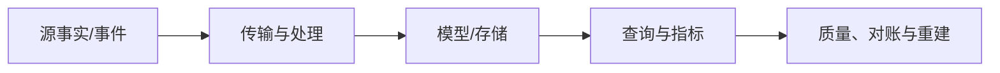

# 漏斗、留存、错误率、性能与 AI 成本分析

指标只有在事件定义、主体、时间窗、去重、分母和版本一致时才可比较。产品漏斗与留存描述行为队列，错误率和性能描述服务质量，AI成本连接请求、token、缓存、重试和业务结果。

## 1. 数据流与决策边界

产品指标是事件契约、主体、时间窗、分母、去重和归因规则的可执行定义。漏斗、留存、错误率、延迟与 AI 成本必须保存 metric version 和适用时间；同名数字若口径不同就不是同一指标，刷新看板不能无说明地改写历史。

## 2. 事件契约

机制：event name、ID、subject、occurred/ingested time、properties和schema。

实际用途：可重放一致计算。

失败方式：客户端任意字段/重复发送。

验证：schema测试、重复率、版本分布。

取舍：治理增加埋点成本。

事件契约 的生产契约还要定义输入schema、业务/事件时间、幂等键、水位、迟到/删除和重跑行为；成功状态必须对应已发布且通过质量门禁的数据。

## 3. Identity

机制：anonymous/device/user/account映射和合并规则。

实际用途：跨登录旅程。

失败方式：把设备数当用户数或错误合并共享设备。

验证：identity merge审计和敏感最小化。

取舍：完整旅程与隐私风险。

Identity 的生产契约还要定义输入schema、业务/事件时间、幂等键、水位、迟到/删除和重跑行为；成功状态必须对应已发布且通过质量门禁的数据。

## 4. Funnel

机制：有序步骤、窗口、主体和去重定义。

实际用途：注册/购买转化。

失败方式：分母/顺序/跨设备定义变化。

验证：SQL样例与手工cohort。

取舍：直观但易受选择偏差。

Funnel 的生产契约还要定义输入schema、业务/事件时间、幂等键、水位、迟到/删除和重跑行为；成功状态必须对应已发布且通过质量门禁的数据。

## 5. Retention

机制：cohort起点后第N日/周返回行为。

实际用途：激活和长期价值。

失败方式：rolling/classic混用。

验证：固定cohort/timezone/return event。

取舍：衡量粘性但窗口选择影响。

Retention 的生产契约还要定义输入schema、业务/事件时间、幂等键、水位、迟到/删除和重跑行为；成功状态必须对应已发布且通过质量门禁的数据。

## 6. Error rate

机制：失败请求/有效尝试，按route/status/problem分类。

实际用途：SLO和发布质量。

失败方式：把重试请求重复计分母或200业务失败漏掉。

验证：服务端结果和trace抽样。

取舍：可告警但需业务错误分层。

Error rate 的生产契约还要定义输入schema、业务/事件时间、幂等键、水位、迟到/删除和重跑行为；成功状态必须对应已发布且通过质量门禁的数据。

## 7. Latency

机制：p50/p95/p99和分布，端到端与组件分别测。

实际用途：性能SLO与尾延迟。

失败方式：平均值掩盖长尾。

验证：histogram桶、单位和采样点验证。

取舍：高分位需足够样本。

Latency 的生产契约还要定义输入schema、业务/事件时间、幂等键、水位、迟到/删除和重跑行为；成功状态必须对应已发布且通过质量门禁的数据。

## 8. AI tokens

机制：输入、缓存输入、输出和推理等按供应商计费字段。

实际用途：请求/功能/tenant成本。

失败方式：用字符估token或忽略重试。

验证：账单/usage字段对账。

取舍：精确成本依API和价格版本。

AI tokens 的生产契约还要定义输入schema、业务/事件时间、幂等键、水位、迟到/删除和重跑行为；成功状态必须对应已发布且通过质量门禁的数据。

## 9. AI quality/cost

机制：单位成功任务成本而非单请求成本。

实际用途：模型路由与优化。

失败方式：只降token却降低成功率导致重试。

验证：固定评估集+线上结果+总成本。

取舍：需要质量、延迟、成本联合。

AI quality/cost 的生产契约还要定义输入schema、业务/事件时间、幂等键、水位、迟到/删除和重跑行为；成功状态必须对应已发布且通过质量门禁的数据。

## 10. Attribution

机制：实验/渠道归因窗口和规则。

实际用途：产品决策。

失败方式：观察相关性宣称因果。

验证：随机实验/混杂分析。

取舍：可行动但规则敏感。

Attribution 的生产契约还要定义输入schema、业务/事件时间、幂等键、水位、迟到/删除和重跑行为；成功状态必须对应已发布且通过质量门禁的数据。

## 11. Metric version

机制：定义、SQL、时区、数据源和生效时间版本化。

实际用途：可复现历史看板。

失败方式：同名指标悄然改定义。

验证：semantic tests和版本对比。

取舍：维护成本换可信度。

Metric version 的生产契约还要定义输入schema、业务/事件时间、幂等键、水位、迟到/删除和重跑行为；成功状态必须对应已发布且通过质量门禁的数据。

## 12. 方案比较

|方案|主要能力|边界|
|---|---|---|
|事件数|简单|受重复影响|
|用户数|主体去重|identity复杂|
|classic retention|固定周期返回|严格|
|rolling retention|某日后任意返回|更高不可混比|
|每请求AI成本|工程优化|不代表业务价值|
|每成功任务成本|连接质量|定义更复杂|

## 13. 完整案例：新用户激活漏斗与留存

### 输入与约束

步骤signup→create_project→invite_member，7天窗口；跨时区；匿名后登录合并。

### 处理步骤

1. 定义主体为account_id，signup为cohort起点，事件ID去重。
2. occurred_at统一UTC，按产品业务时区分日。
3. 每步骤要求前一步后且7天内，重复只取首次。
4. D1/D7 classic retention以active_project事件定义。
5. 按schema/客户端版本监控缺失和迟到，SQL版本化。

### 输出

漏斗和留存可按cohort/版本复现，不因看板刷新改历史。

### 验证

手工20账户golden set；跨午夜、重复、晚到和identity merge样例。

### 失败分支

用任意顺序存在步骤会把先邀请后建项目的脏事件计转化；必须实现顺序/窗口。

### 恢复与重跑

事件修复按 event ID 幂等写入原始层，identity merge 使用可版本化映射，不直接覆盖历史主体。候选 metric version 在固定 cohort 和截止水位重算，与 golden accounts 逐步对比；确认变化来自明确的事件或口径修订后再发布，并在看板标注版本生效日。

## 14. 完整案例：AI客服成本与质量

### 输入与约束

模型多版本、工具调用和重试；需要每解决工单成本、p95、解决率，不能泄露正文。

### 处理步骤

1. 每turn记录request ID、model/version、token分类、latency、status和价格表版本。
2. 以ticket ID聚合所有重试/工具/降级总成本。
3. 成功由受控resolution/评估规则定义，不以模型自报。
4. 离线固定集比较质量，线上按工单类型/tenant观察。
5. 成本报表用账单usage对账，正文脱敏/不入指标。

### 输出

能比较每成功工单总成本、质量和延迟，而非单次便宜。

### 验证

重试成本被计入；缓存token按供应商usage；价格变更不改旧历史。

### 失败分支

仅比较每请求token会奖励失败后多次重试的便宜模型；使用unit successful outcome。

### 恢复与重跑

usage 回填以 provider request ID、账单行 ID 和价格表版本去重，重新聚合 ticket 的全部重试与工具调用。质量规则或价格修订生成新的计算版本，先对账供应商账单总额和固定评估集；发布后保留旧版本，避免用今天的价格重写历史成本却不留痕。

## 15. 失败注入矩阵

|注入|预期信号与恢复|禁止结果|
|---|---|---|
|重复输入|`event_duplicate` 变化可解释，按水位/版本恢复|静默丢行、重复计量、越权或覆盖已发布版本|
|乱序和迟到|`schema_version` 变化可解释，按水位/版本恢复|静默丢行、重复计量、越权或覆盖已发布版本|
|源schema变化|`identity_merge` 变化可解释，按水位/版本恢复|静默丢行、重复计量、越权或覆盖已发布版本|
|任务中途崩溃|`funnel_conversion` 变化可解释，按水位/版本恢复|静默丢行、重复计量、越权或覆盖已发布版本|
|下游429/503|`retention_d7` 变化可解释，按水位/版本恢复|静默丢行、重复计量、越权或覆盖已发布版本|
|checkpoint损坏|`error_rate` 变化可解释，按水位/版本恢复|静默丢行、重复计量、越权或覆盖已发布版本|
|质量规则失败|`latency_p99` 变化可解释，按水位/版本恢复|静默丢行、重复计量、越权或覆盖已发布版本|
|回填与实时并发|`ai_cost_total` 变化可解释，按水位/版本恢复|静默丢行、重复计量、越权或覆盖已发布版本|
|权限撤销|`cost_per_success` 变化可解释，按水位/版本恢复|静默丢行、重复计量、越权或覆盖已发布版本|
|成本超预算|`metric_diff` 变化可解释，按水位/版本恢复|静默丢行、重复计量、越权或覆盖已发布版本|

## 16. 数据质量与对账

1. 事件 ID 在定义的保留窗口内唯一，重复率按事件名、客户端和 schema version 拆分，不能在指标 SQL 中无声去重。
2. 必填主体、occurred_at、event name 和关键属性缺失时进入隔离；匿名事件允许的主体规则单独声明。
3. 客户端时间与接收时间的偏差、迟到分布和未来时间戳分别监控，超出窗口的修正策略写入口径。
4. identity merge 检查一对多冲突与循环，发布前用已知账户验证匿名到登录后的事件归属。
5. 漏斗 golden set 覆盖顺序、重复步骤、窗口边界和跨时区，逐账户结果与人工预期一致。
6. 留存的 cohort 起点、活跃事件、周期边界和观察完整性明确；尚未走完整窗口的 cohort 不进最终分母。
7. 错误率分母使用实际尝试请求，timeout、取消、重试和降级分别编码，禁止只统计有响应的请求。
8. 延迟分位数基于原始请求样本或可合并分布计算，不能平均各分片 p95；采样率变化需可见。
9. AI usage 按 request、turn、ticket 三层对账，token 分类与供应商账单总量差异超过预算阈值时阻断成本发布。
10. metric version 发布前运行旧新口径双算，输出变化最大的 cohort/tenant 和原因，审核后标注生效范围。

## 17. 调试与观测

1. `event_duplicate`：明确单位、采样点、聚合窗口和低基数维度，并与run ID、水位和代码版本关联。
2. `schema_version`：明确单位、采样点、聚合窗口和低基数维度，并与run ID、水位和代码版本关联。
3. `identity_merge`：明确单位、采样点、聚合窗口和低基数维度，并与run ID、水位和代码版本关联。
4. `funnel_conversion`：明确单位、采样点、聚合窗口和低基数维度，并与run ID、水位和代码版本关联。
5. `retention_d7`：明确单位、采样点、聚合窗口和低基数维度，并与run ID、水位和代码版本关联。
6. `error_rate`：明确单位、采样点、聚合窗口和低基数维度，并与run ID、水位和代码版本关联。
7. `latency_p99`：明确单位、采样点、聚合窗口和低基数维度，并与run ID、水位和代码版本关联。
8. `ai_cost_total`：明确单位、采样点、聚合窗口和低基数维度，并与run ID、水位和代码版本关联。
9. `cost_per_success`：明确单位、采样点、聚合窗口和低基数维度，并与run ID、水位和代码版本关联。
10. `metric_diff`：明确单位、采样点、聚合窗口和低基数维度，并与run ID、水位和代码版本关联。

指标异常先固定 metric version、cohort 和截止水位，再选 account/ticket 逐条核对原始事件、去重、identity mapping、时间窗、分母与聚合 SQL。AI 成本还要追 request ID 到 usage 和价格表；总看板波动不能告诉你是埋点缺失、口径变化还是产品行为变化。

## 18. 安全、成本与运维边界

1. 源凭据最小权限；漏斗、留存、错误率、性能与 AI 成本分析 的实现要提供owner、runbook、停止阈值和审计记录。
2. PII分层访问和脱敏；漏斗、留存、错误率、性能与 AI 成本分析 的实现要提供owner、runbook、停止阈值和审计记录。
3. 原始层不可被普通BI任意下载；漏斗、留存、错误率、性能与 AI 成本分析 的实现要提供owner、runbook、停止阈值和审计记录。
4. 重跑/回填有资源配额；漏斗、留存、错误率、性能与 AI 成本分析 的实现要提供owner、runbook、停止阈值和审计记录。
5. 流批共享sink有容量仲裁；漏斗、留存、错误率、性能与 AI 成本分析 的实现要提供owner、runbook、停止阈值和审计记录。
6. 删除请求传播到派生层；漏斗、留存、错误率、性能与 AI 成本分析 的实现要提供owner、runbook、停止阈值和审计记录。
7. schema发布兼容门禁；漏斗、留存、错误率、性能与 AI 成本分析 的实现要提供owner、runbook、停止阈值和审计记录。
8. checkpoint/manifest备份；漏斗、留存、错误率、性能与 AI 成本分析 的实现要提供owner、runbook、停止阈值和审计记录。
9. 灾备恢复演练；漏斗、留存、错误率、性能与 AI 成本分析 的实现要提供owner、runbook、停止阈值和审计记录。
10. 成本按pipeline/dataset/tenant归集；漏斗、留存、错误率、性能与 AI 成本分析 的实现要提供owner、runbook、停止阈值和审计记录。

## 19. 综合练习与验收

实现“新用户激活漏斗与留存”，再以“AI客服成本与质量”验证另一类时效/治理约束。提交数据样例、模型、质量测试、故障注入、lineage和成本面板。

- [ ] 事件契约 的定义、应用、失败和验证均能用真实数据复现。
- [ ] Identity 的定义、应用、失败和验证均能用真实数据复现。
- [ ] Funnel 的定义、应用、失败和验证均能用真实数据复现。
- [ ] Retention 的定义、应用、失败和验证均能用真实数据复现。
- [ ] Error rate 的定义、应用、失败和验证均能用真实数据复现。
- [ ] Latency 的定义、应用、失败和验证均能用真实数据复现。
- [ ] AI tokens 的定义、应用、失败和验证均能用真实数据复现。
- [ ] AI quality/cost 的定义、应用、失败和验证均能用真实数据复现。
- [ ] 两个案例包含输入、步骤、输出、验证、失败与重跑。
- [ ] 源与目标按业务分片完成count/sum/version/hash对账。
- [ ] 历史发布版本可回退，回填不压垮在线事实系统。

## 来源

- [OpenTelemetry Metrics specification](https://opentelemetry.io/docs/specs/otel/metrics/)（访问日期：2026-07-17）
- [OpenTelemetry semantic conventions HTTP](https://opentelemetry.io/docs/specs/semconv/http/)（访问日期：2026-07-17）
- [Apache Flink event time docs](https://nightlies.apache.org/flink/flink-docs-stable/docs/concepts/time/)（访问日期：2026-07-17）
- [dbt Semantic Layer](https://docs.getdbt.com/docs/use-dbt-semantic-layer/dbt-sl)（访问日期：2026-07-17）
- [OpenLineage specification](https://openlineage.io/docs/spec/)（访问日期：2026-07-17）
