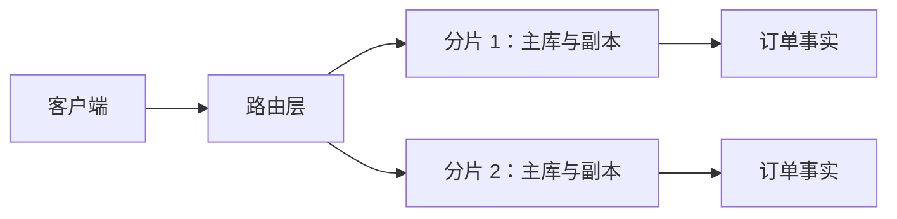
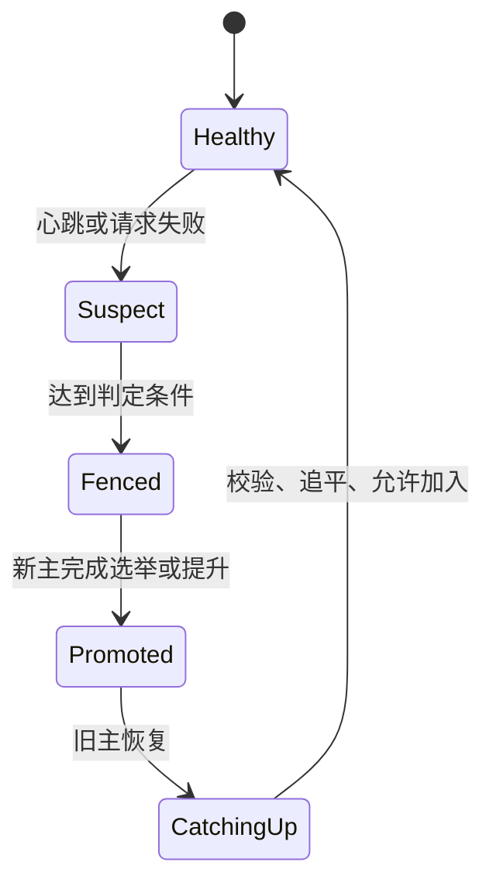

# 复制、故障切换与分片路由

复制解决“同一事实在节点失效后是否还可读取或继续写入”，分片解决“哪一个节点负责某条事实”。两者都会改变读写语义、恢复过程和运维成本；它们不是单机数据库变慢时默认应加的组件。

## 前置知识与目标

本文以订单、租户和用户资料为例，覆盖 Leader-Follower、Multi-Leader、Leaderless、同步/异步复制、复制延迟、Read-after-write、Failover、Range/Hash/Directory Sharding、热点、扩容、跨分片与全局 ID。

前置：已理解事务、唯一约束、索引、请求超时和幂等键。本文不实现数据库复制协议；生产系统应使用数据库或托管服务提供的复制与故障切换能力。

## 先区分两个问题

一条订单记录的事实来源必须先确定。复制是在多个节点保存同一逻辑记录；分片是把不同记录分配给不同节点。一个系统可以只复制、不分片；可以先分片、再为每个分片复制；也可以暂时都不做。



路由层根据分片键选择分片；分片内部的复制协议选择写入节点和可读副本。不要把“读副本存在”误解为任意读取都能立即看到刚写入的数据。

## 复制模型

### Leader-Follower

一个 leader 接收写入并决定写入顺序，follower 按日志或变更流重放。普通读取可以在 leader 或 follower 上执行，但两者的可见版本可能不同。

它适合单写入地点、写冲突需要序列化、读多写少的业务。典型例子是订单主库配多个读取副本。

leader 崩溃后，系统必须选出或提升新的 leader，并阻止旧 leader 在恢复网络后继续接收写入。这一步叫 fencing；只有“健康检查失败就改 DNS”并不能防止双写。

### Multi-Leader

多个 leader 都能接受写入，之后互相复制。它可以降低跨地域写入延迟，但同一对象被两个地点并发修改时，冲突是正常状态，不是实现漏洞。

冲突解决应由领域定义。例如个人草稿可保留多个版本让用户选择；库存扣减、支付状态和唯一用户名通常不适合静默合并。

“最后写入胜出”依赖时间戳。机器时钟偏差、离线编辑和重试都会让它覆盖更有价值的修改，因此它只适合明确接受覆盖语义的字段。

### Leaderless

leaderless 模型把读写发送给多个副本。写入在满足规定确认数后成功，读取从多个副本收集版本并选择或合并结果。

若有 `N` 个副本、写确认数为 `W`、读数为 `R`，`R + W > N` 使读集合与已确认写集合至少有一个共同副本；这仍不自动解决并发写冲突、失效节点身份或副本修复。

它适合可合并、可容忍短暂陈旧的资料或事件数据；不应把它直接用于要求严格顺序的余额和库存。

## 复制确认与延迟

### 同步复制

leader 在返回成功前等待至少一个或多个 follower 确认。它降低确认写在 leader 故障后丢失的概率，但慢副本、网络分区或副本不足会直接推高写延迟或降低可用性。

同步不等于永久不丢数据。进程确认后磁盘、机房、备份和人为操作仍可能造成损失；恢复目标要由备份、地域和演练共同保证。

### 异步复制

leader 本地提交后立即返回，稍后把变化发给 follower。正常情况下写延迟低，但 leader 在复制完成前丢失时，已经返回成功的记录可能在新 leader 上不存在。

异步副本的延迟应以日志位点、时间差和落后字节数监控。只看“副本连接正常”无法证明它追上了业务写入。

### Read-after-write

用户提交订单后立刻打开详情页，读到旧副本并收到 404 是会话一致性问题。常用实现有三种：

1. 写成功后的短窗口内把该用户读取路由到 leader。
2. 响应返回提交版本，后续读取携带 `min_version`；副本未追上时等待有限时间或转 leader。
3. 只把强一致读取用于刚创建、刚支付等少数路径，其余读取仍走副本。

无论采用哪种，等待必须受 deadline 限制。副本一直落后时返回“处理中”比伪造“不存在”更诚实，也比无限等待更安全。

## 故障切换的状态机



检测失败与确认失败不同。短暂 GC、网络抖动或局部 DNS 故障可能让监控看不到 leader，而 leader 仍在处理写入。提升新主之前需要足够的仲裁、租约或外部 fencing，保证旧主不能继续取得写权限。

恢复节点不能把本地旧日志直接覆盖当前事实。它应先从当前权威日志追平，再作为 follower 加入；恢复过程需要限速，避免抢占前台 I/O。

## 分片策略

### Range Sharding

按连续键区间分配，例如 `tenant_id 1..10000` 在分片 A。范围扫描、按时间归档和局部排序效率高，但单调递增 ID、热门租户或当前日期可能把流量集中到最后一个范围。

范围分片扩容常通过 split：先把一个范围复制到新节点，按边界校验并切换路由。边界变化必须版本化，旧请求不能依据过期路由写到两个位置。

### Hash Sharding

通过稳定哈希把键映射到桶或虚拟节点，分布更均匀。它适合按用户或订单 ID 的点查询。

缺点是范围查询要访问多个分片，增加节点也可能搬迁大量键。虚拟桶让“桶到节点”的映射可逐步调整，但不消除迁移、双写和校验的工程成本。

### Directory Sharding

目录服务保存 `tenant_id -> shard_id`。它让一个大客户独占分片、让迁移只改变一条映射，并支持按合规或地域路由。

目录是控制面：它要缓存、版本、回退和高可用。业务请求必须携带或获取可验证的路由版本，不能只依赖进程内永不过期的 map。

## 全局 ID 与跨分片查询

全局 ID 至少要唯一；是否可排序、是否暴露创建量、是否依赖时钟、长度和索引局部性是额外选择。数据库序列在单分片内简单；雪花类 ID 需要处理时钟回拨和节点号；随机 UUID 分布好但会改变索引局部性与可读性。

跨分片查询应先问能否改为“先定位租户或订单，再查询一个分片”。如果必须聚合，使用受限 fan-out、异步索引或数仓，不把无界广播查询放进高 QPS 在线路径。

跨分片事务成本高。优先把必须原子维护的不变量放在同一 aggregate 或分片内；跨边界的流程使用 outbox、幂等消费者和可观察补偿，而非假设网络调用可回滚。

## 案例一：订单创建后立即查看

订单写入 leader 后返回：

```json
{
  "order_id": "ord_01JQ6R8K2N",
  "version": 42,
  "status": "PENDING"
}
```

详情接口接收 `min_version=42`。路由器先检查本地副本已应用的版本；达到 42 则读取副本，未达到则把本次请求转 leader。转 leader 也不可用时返回可重试的 `202` 状态和订单 ID，而不是将陈旧副本的 404 暴露给用户。

验证步骤：暂停副本复制；创建订单；立即读详情；确认响应来自 leader 或返回处理中；恢复复制后确认副本版本追到 42，读取切回副本。日志记录路由选择、目标版本和副本延迟，不记录支付或个人数据。

失败分支：把所有订单读取永久固定 leader 的确避免陈旧读，却可能耗尽 leader 的连接和 CPU。只对需要会话一致性的读取使用版本屏障，其余历史列表可接受受控陈旧。

## 案例二：把大租户迁移到新分片

目录中旧映射为 `tenant-9 -> shard-a`。迁移创建状态记录：`COPYING`、源分片位点、新分片位点和目标路由版本。后台先复制快照，再持续应用源端变更；校验订单数、每个主键的版本摘要和最近变更位点。

切换窗口内短暂冻结该租户的写入，确认目标追平后把目录原子更新到 `tenant-9 -> shard-c, route_version=8`，随后释放写入。请求带的旧版本路由被重新解析，不允许旧客户端绕过目录继续写 shard-a。

验证步骤：在复制期间持续创建与修改订单；对源和目标做分批校验；切换后重放一组幂等写入；观察旧分片不再产生新版本。保留旧副本到回滚窗口结束后再清理。

失败分支：直接按 `hash(tenant_id) % 节点数` 从 4 节点改为 5 节点会让大量租户的归属改变。没有目录、虚拟桶或迁移计划时，缓存与写入会同时抖动。

## 热点与容量治理

热点可能来自热门商品、超级租户、单调时间键、全局计数器或一个被反复读取的目录项。先用每键 QPS、缓存命中率、分片 CPU、连接池等待和复制延迟确认热点，而不是凭感觉拆分。

读取热点可以用短 TTL 缓存、请求合并和 CDN；写入热点必须保留唯一事实来源，可通过分桶计数、队列、配额或按业务拆分来降低单键争用。缓存不能替代库存、权限和支付的数据库约束。

扩容前定义迁移速率、前台资源上限、暂停条件和回滚点。迁移任务与在线请求共享数据库和网络，若不限速会让“为了扩容”变成用户可见故障。

## 选择与成本

| 选择 | 适合条件 | 主要收益 | 主要代价 |
| --- | --- | --- | --- |
| 单库加备份 | 数据量与可用性目标仍可满足 | 查询和事务简单 | 单点容量与故障域较大 |
| Leader-Follower | 单写入、读多、可处理副本陈旧 | 读扩展与恢复副本 | failover、延迟和读路由复杂 |
| 分片加目录 | 租户隔离或容量瓶颈明确 | 可逐租户迁移和隔离 | 控制面、跨分片查询与迁移成本 |
| Multi-Leader/Leaderless | 确有多地点写入或离线合并需求 | 低地域写延迟 | 冲突语义、修复与测试成本 |

先量化瓶颈：存储、写吞吐、读延迟、地域连续性或租户隔离。若单库加索引、缓存、读副本或垂直扩容仍满足目标，分片只会提前引入故障组合。

## 排障顺序

当用户报告“刚保存的数据不见了”，先记录写入返回的版本、目标 leader、读取副本位点和 request ID。

若写入未确认，按请求的幂等键查询事实来源，而不是立即再次创建记录。

若写入已确认但副本落后，检查复制位点、网络与副本磁盘，不要删除业务记录来“修复”展示。

若目录路由错误，冻结该租户迁移，重新解析权威目录并比对源、目标的版本摘要。

若出现双主迹象，优先 fencing 一个写入方，保全日志和审计证据，再依据领域规则处理冲突。

## 生产检查与安全边界

1. 对每个分片记录事实来源、leader 身份、复制位点、RPO/RTO、备份位置和负责人。
2. 为复制延迟、leader 变更、quorum 不足、目录版本不一致、迁移校验失败和热点饱和建立告警。
3. 故障切换命令需要最小权限、双人或受控审批、审计记录和清晰的 fencing 条件。
4. 路由、备份和迁移数据遵守租户隔离；管理接口不能因“内部工具”跳过授权。
5. 迁移前演练恢复与回滚，迁移后验证业务不变量、而不只验证行数。

## 练习

为一个多租户 Todo 服务设计目录分片迁移。写出路由表结构、迁移状态机、写入幂等键、切换条件和三条监控指标。

验收：模拟复制延迟、重复切换命令和旧路由请求时，任一 Todo 不会同时产生两个互相矛盾的最新版本；迁移暂停后可以安全恢复或回退。

## 来源

- [Raft：可理解的共识算法（原始论文）](https://raft.github.io/raft.pdf?file=raft.pdf)（访问日期：2026-07-23）
- [Amazon Builders’ Library：分布式系统中的领导者选举](https://aws.amazon.com/builders-library/leader-election-in-distributed-systems/)（访问日期：2026-07-23）
- [Google SRE：管理关键状态](https://sre.google/sre-book/managing-critical-state/)（访问日期：2026-07-23）
