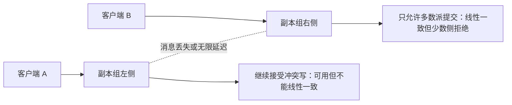
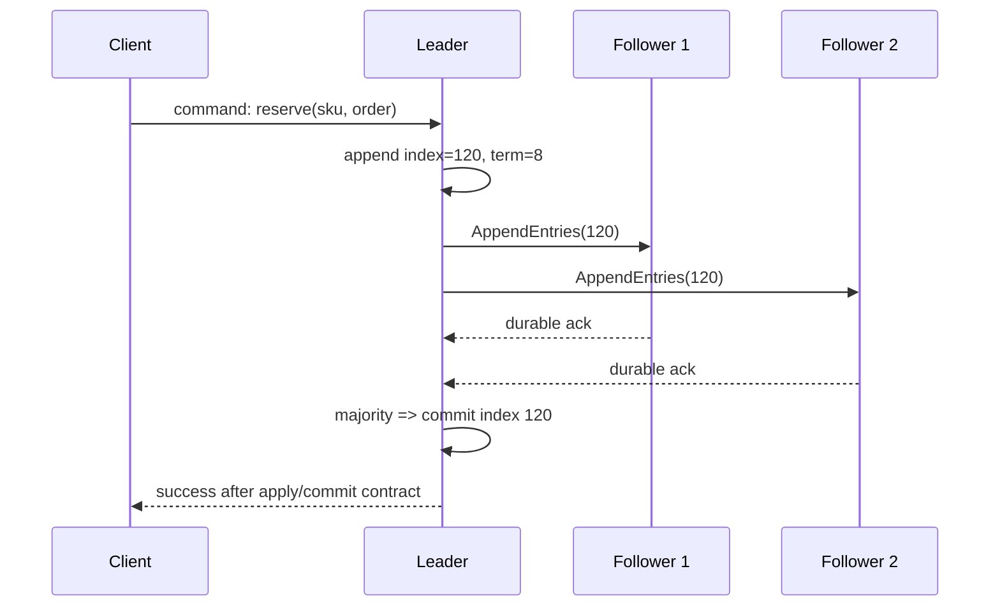

# 一致性、仲裁与 Raft：在网络分区中定义正确写入

分布式系统的难点不是把同一份数据复制到多台机器，而是在消息延迟、丢失、节点暂停和网络分区时，明确哪些请求可以成功、成功后读到什么，以及谁有权决定下一条状态变化。本篇覆盖 CAP、线性一致性、最终一致性、读己之写、仲裁读写和 Raft；它们描述的层次不同，不能互相替代。

## 前置知识与边界

前置：已学习[复制、故障切换与分片路由](01-replication-sharding.md)，理解副本、leader、超时和幂等键。

本文的“一致性”默认指副本对操作结果的可观察语义，不是 ACID 中“数据库约束始终成立”的 `Consistency`。Raft 处理崩溃停止、消息丢失、重复和延迟，不处理节点恶意伪造消息的 Byzantine 故障；需要抗恶意节点时必须选择带认证和 Byzantine 容错假设的协议。

## 先把问题分层

一个写请求从客户端到副本集，至少有四个独立问题：

| 问题 | 需要回答的内容 | 典型机制 |
| --- | --- | --- |
| 事实 | 谁能写、写入是否满足业务不变量 | 主库事务、唯一约束、授权 |
| 可见性 | 成功写何时对哪个读请求可见 | 线性一致读、版本屏障、会话路由 |
| 副本收敛 | 失联副本恢复后如何追上 | 日志复制、反熵、read repair |
| 决策权 | 故障期间谁可以继续提交下一条日志 | 多数派仲裁、Raft |

“三个副本”只说明有三份存储副本，不说明读写一定线性一致，也不说明网络分区时两边都能写。先写下业务操作要求，再选择协议：支付扣款、租约持有者和唯一用户名需要明确的排他结果；商品浏览量、搜索索引和推荐画像通常可以允许受控陈旧。

## CAP 的准确含义

CAP 的三个词有严格语义：

- `C` 是 linearizability：每个完成操作看起来在调用与返回之间的某一瞬间生效，且尊重真实时间顺序。
- `A` 是每个发到未故障节点的请求都必须得到非错误响应；响应可以是旧值，但不能因分区无限等待或返回错误。
- `P` 是节点间消息可被任意延迟或丢失的网络分区仍在模型内。

分区存在时，跨分区的两个副本无法既保证所有请求成功，又保证它们像同一个实时对象那样返回结果。为了保持线性一致，某一侧必须拒绝或阻塞冲突操作；为了保持 CAP 的可用性，两侧都返回结果，就可能返回彼此尚未看到的版本。

CAP 不是“平时在 C、A、P 三者中任选两个”。真实网络可能分区，因此系统设计的关键是：分区发生时，这个操作选择拒绝、降级、排队，还是接受陈旧或冲突结果。延迟很高但尚未被判定为分区时，同样会触发 timeout 和这项选择。



图中并非系统永久选择一个阵营。多数派恢复后，少数派可通过日志追平恢复服务；读缓存、搜索和写路径也可以有不同目标。不要把 CAP 当成产品标签，而应写进接口的成功、错误和恢复语义。

## 线性一致性：单一实时对象的语义

线性一致操作满足两件事：如果写 `W` 的响应先于读 `R` 的调用结束，`R` 必须看到 `W` 或更新的值；并发操作可在它们重叠区间内任选一个合法顺序。它不要求所有历史读都返回最新值，也不要求多键事务自动原子。

一个可线性化的 `CompareAndSet(key, expected, next)` 是构建租约、leader fencing、库存预留和唯一分配的基础。它必须把比较和写入放在同一个权威存储操作中；先 `GET` 再在应用内判断再 `SET` 会被并发请求穿透。

```sql
-- PostgreSQL：条件更新的影响行数就是 CAS 结果。
UPDATE inventory
SET available = available - 1,
    version = version + 1
WHERE sku_id = $1
  AND available > 0
  AND version = $2;
```

当受影响行数为 `1`，本次预留成功；为 `0` 时不能猜测原因，应重新读取当前版本并区分缺货、版本过期和不存在。数据库单行原子性只覆盖该数据库的事务边界；跨服务缓存、消息和外部支付仍需各自协议。

### 线性一致读的实现选择

| 方式 | 读流程 | 优点 | 边界 |
| --- | --- | --- | --- |
| leader 读 | 所有关键读发给当前 leader | 容易推理 | leader 负载与故障切换敏感 |
| quorum 读 | 从相交副本读取并比较版本 | 可分散读取 | 版本、冲突与延迟处理复杂 |
| lease read | leader 证明自己仍持有有效租约 | 低延迟 | 依赖时间假设与实现保证 |
| read index | leader 先确认自己仍被多数派承认 | 不依赖本地时钟假设 | 多一次协调延迟 |

使用副本读时，不能只因“读到了某个值”就称其线性一致。要检查读是否被路由到当前权威 leader、是否证明 leader 未失去多数派，或者是否满足实现提供的 quorum/read-index 条件。

## 最终一致性与会话保证

最终一致性表示：若没有新写入，副本会在某个未来时刻收敛到同一状态。它没有承诺收敛延迟上界，也没有承诺一个读会看到刚刚成功的写。因此“最终一致”必须补上业务可接受的陈旧窗口、冲突规则、修复机制和用户呈现。

Read-your-writes（RYW）是会话保证：同一主体在写成功后，后续读取不会回到早于该写的版本。它比全局线性一致弱，但对“保存后立即查看”的体验通常足够。

常用 RYW 实现是响应返回单调版本，后续读携带 `min_version`：

```http
POST /profiles/u-42
Idempotency-Key: 6fd6c6b4

HTTP/1.1 200 OK
ETag: "profile-87"

GET /profiles/u-42
If-None-Match: "profile-87"
X-Min-Version: 87
```

副本应用位点小于 87 时，服务在剩余 deadline 内等待、转发 leader，或返回 `202` 加状态查询地址。不要把请求无限挂起；也不要从旧副本返回“资料不存在”。`ETag` 的缓存验证语义和内部日志位点不是同一件事，API 是否暴露版本需要明确契约和权限边界。

### 冲突不是复制 bug

两个离线客户端都修改个人签名，在 multi-leader 或异步同步里会产生并发版本。可选策略如下：

| 策略 | 适用数据 | 需要保存的证据 | 不适用场景 |
| --- | --- | --- | --- |
| 拒绝过期版本 | 配置、权限、订单状态 | version / ETag | 离线编辑必须自动合并 |
| 领域合并 | 标签集合、草稿段落 | 操作类型、因果或版本 | 金额、库存、不可逆状态 |
| 人工解决 | 文档冲突、重要资料 | 两个候选值与操作者 | 高 QPS 自动路径 |
| 最后写入胜出 | 明确允许覆盖的偏好项 | 时钟来源与审计 | 时钟不可信或不能丢修改 |

不要用“最后写入胜出”掩盖订单状态冲突。两个扣款请求的正确结果应由幂等键、账户事务和状态机决定，而不是由客户端时钟决定。

## Quorum：集合相交的算术，不是魔法开关

在固定的 `N` 副本集合中，写等待 `W` 个确认，读询问 `R` 个副本；`W + R > N` 保证读集合与已确认写集合至少有一个交集。若 `W > N / 2`，两个成功写集合也相交。这些不等式是构造协议的必要工具，不是自动得到线性一致性的充分条件。

例如 `N=3, W=2, R=2`：一次成功写至少在两个副本持久化，读至少问两个副本，集合必相交。读实现仍必须识别版本、处理副本响应不一致、避免从已被替换的 leader 读取，并定义并发写的冲突规则。若成员关系可变，还需联合配置或等价的安全转换。

```text
副本：A B C
写 v=9：A、B 确认（W=2）
读：B、C 返回（R=2）
交集：B；读路径必须识别 v=9 比 C 的旧版本更新
```

Quorum 还改变延迟：请求完成时间取决于第 `W` 快副本，而不是最快副本。跨地域、磁盘尾延迟和副本健康都会影响它。把每次读取都提升为 quorum read 可能消耗连接、增加尾延迟；对不需要强读的列表、分析和搜索索引应保持较弱语义。

## Raft：用多数派复制一条命令日志

Raft 是复制状态机的共识算法。每个节点保存日志，日志项是确定性状态机的命令；集群只要多数节点可通信就能继续提交。五节点集群最多容忍两个崩溃停止节点，但不是“任何两台失联仍可继续”：剩余节点必须构成三台多数派。



Raft 的安全依赖于持久化的 current term、vote、日志和已应用状态；进程重启后不能把它们当作普通缓存丢弃。实际库还要实现快照、日志压缩、成员变更、流控、WAL 损坏处理和客户端重试，不能只复制一段选举伪代码上线。

### Term、角色与选举

term 是单调递增的逻辑时代。节点角色是 follower、candidate、leader：

1. follower 在随机 election timeout 内收到有效 leader 心跳或 AppendEntries 时保持 follower；
2. 超时后递增 term，投票给自己并向其他节点发送 RequestVote；
3. 得到多数票的 candidate 成为 leader；同一 term 只能给一个候选人投票；
4. 收到更大 term 的消息立即更新 term 并退回 follower；
5. 没有候选人拿到多数票时，随机 timeout 让下一轮错开。

投票请求包含候选人的最后日志 term 和 index。选民只给日志至少同样新的候选人投票，避免已提交记录被缺失该记录的新 leader 覆盖。随机 timeout 只是降低选票平分概率，不是正确性的来源。

### 日志复制、提交与应用

leader 为客户端命令追加 `(index, term, command)`，在 AppendEntries 中附带前一项 index/term。follower 仅在前缀匹配时追加；不匹配就拒绝，leader 回退 nextIndex 并重试，使日志最终拥有共同前缀。leader 知道一条当前 term 的日志被多数副本保存后推进 commit index，并通知 followers；各节点按 index 顺序应用到状态机。

“写入 leader 本地日志”不是提交；“多数副本收到了 TCP 包”也不是提交。实现的成功响应位置必须在契约中定义：若 API 承诺成功后读到结果，通常应在命令已提交并被状态机应用后返回，或返回可查询的操作 ID。

### 成员变更与 split brain

直接把三节点配置改成五节点配置可能让旧多数与新多数同时做决定。Raft 的联合共识阶段要求旧配置与新配置都形成多数，之后才切到新配置。成员变更是控制面操作，应限速、审计，并先确认磁盘、网络和时钟健康。

split brain 是两个节点或两个分区都自认为可写。Raft 的多数派规则阻止少数派提交新日志，但客户端、负载均衡和外部资源仍可能把请求送到旧 leader。生产系统应让 leader 身份与单调 term/fencing token 一起传播；外部资源只接受更高 token，旧 leader 即使恢复也不能覆盖新状态。

## 案例一：库存预留的强不变量

目标：同一 `sku` 的可售数不能低于零，订单创建的重复请求不能重复预留。单库场景优先把库存和预留记录放入同一事务；跨可用区由数据库自己的复制与故障切换提供一致写，不要先在应用层实现 Raft。

输入是 `order_id=ord-7`、`sku=keyboard`、`quantity=1`、幂等键 `reserve:ord-7`。事务内先插入唯一 reservation，再用条件更新扣减库存；任一条件不满足就回滚。提交后发布的库存事件通过 outbox 交给异步系统。

验证：并发发出 100 个不同订单、库存设为 30，最终成功预留恰为 30；再重复发送 `ord-7`，返回同一预留结果；暂停一个读取副本后，订单详情走 leader 或版本屏障，不能显示“未预留”。

失败分支：把库存放在三个服务各自的内存计数器，并在每个服务扣减后异步广播，会使网络分区两侧都接受最后一个库存。此处选择少数侧拒绝写或排队，是比超卖更符合不变量的 CAP 决策。

## 案例二：配置中心的 Raft 提交与故障切换

配置键 `payment.limit=10000` 必须让所有支付节点按同一版本读取。配置服务把 `set(payment.limit,10000)` 作为 Raft 命令；leader 在多数派提交后把版本 216 应用到状态机，响应携带 revision 216。支付节点 watch revision，未收到新 revision 前继续使用旧的已验证值，不自行猜测新值。

故障注入：隔离当前 leader 与其他四台中的三台。leader 只剩一个 follower，无法取得多数，任何修改请求应在短 deadline 后返回明确的暂不可提交错误；另一侧三台选出新 leader，继续提交 revision 217。解除隔离后旧 leader 退为 follower，回退冲突未提交条目并追平。

观测：记录 leader changes、current term、commit index、applied index、每 follower 的 match index、election timeout、proposal latency 和 quorum unavailable。告警以“无 leader 且多数节点健康”“apply lag 超过业务阈值”为条件；频繁 leader 变更通常是网络、GC、磁盘或 timeout 配置问题，不是靠更快重试解决。

## 选择语义与排障

| 需求 | 首选语义 | 不应误用 |
| --- | --- | --- |
| 余额、租约、唯一分配 | 线性化条件写或共识服务 | 异步副本读后再写 |
| 保存后立即查看 | RYW + 版本屏障 | 永久将所有读固定 leader |
| 搜索、统计、推荐 | 最终一致 + 延迟监控与重建 | 伪称“实时精确” |
| 配置、服务发现、分布式锁协调 | Raft 或成熟共识产品 | 自写心跳 + DNS 切换 |

排障从语义证据开始：记录 request ID、写入的版本/term/index、响应时 leader、读的副本位点和 deadline。若读到旧值，先判断它是否允许陈旧；若不允许，检查路由与最小版本条件。若多数派不可用，不要通过把少数副本强制提升为 leader 来“恢复可用”，那会制造两套事实。

## 练习

为一个三节点配置服务写出 `PUT /flags/{key}` 和 `GET /flags/{key}` 的契约：分别标记哪些操作需要线性一致，返回 revision 的位置，watch 断线后的恢复点，以及多数派不可用时的状态码与客户端行为。

验收：模拟 leader 崩溃、单节点网络隔离和 follower 落后。任一已成功返回的 revision 不会被后续强读回退；少数分区不能提交新 revision；watch 重连后从 revision 继续且不会跳过已提交事件。

## 来源

- [Gilbert 与 Lynch：CAP 可行性证明](https://groups.csail.mit.edu/tds/papers/Lynch/cap.pdf)（访问日期：2026-07-23）
- [Raft 原始论文：In Search of an Understandable Consensus Algorithm](https://raft.github.io/raft.pdf)（访问日期：2026-07-23）
- [Raft 官方说明与可视化](https://raft.github.io/)（访问日期：2026-07-23）
- [Google SRE：管理关键状态](https://sre.google/sre-book/managing-critical-state/)（访问日期：2026-07-23）
