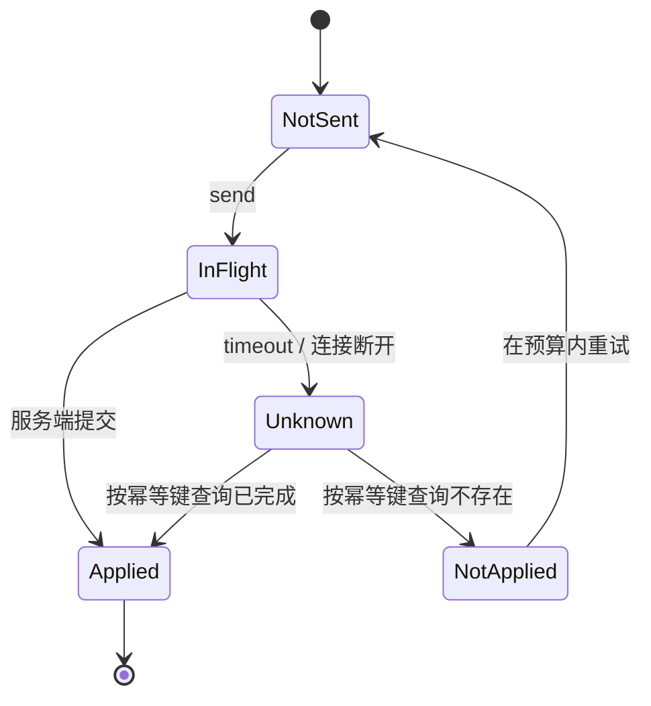
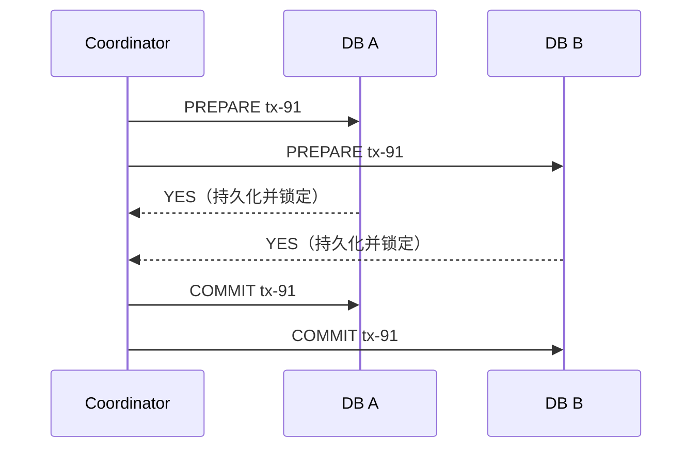
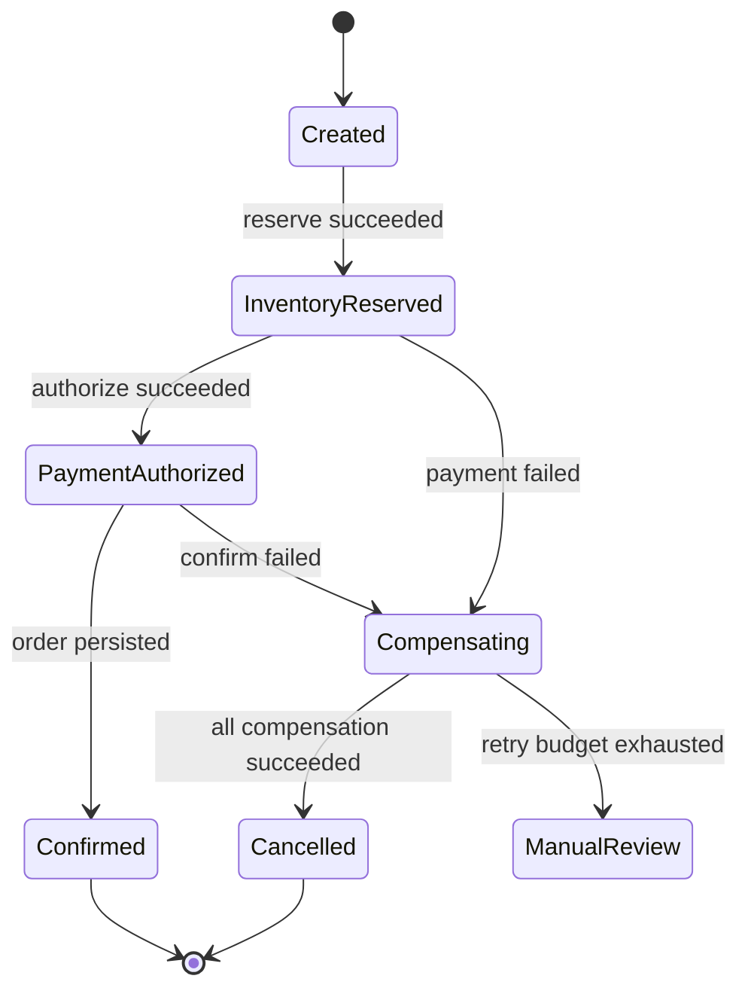

# 分布式事务与韧性：把不确定结果变成可恢复流程

跨数据库、消息系统和第三方 API 的一次业务操作，无法通过“请求失败就重试”得到原子性。网络可能在对方执行后丢失响应，进程可能在本地提交后崩溃，依赖可能慢而非死。可靠设计的目标不是假装这些情况不存在，而是保存可恢复事实、限制故障放大，并把每一步的重复与补偿语义写清楚。

## 前置知识与设计顺序

前置：已学习[事务、隔离与 MVCC](../06-api-database/16-acid-isolation-mvcc-locks.md)、[幂等 API 与异步处理](../06-api-database/07-idempotency-async-openapi.md)、[消息投递与幂等 Consumer](../07-cache-messaging-storage/08-delivery-semantics-idempotent-consumer.md)和[一致性与 Raft](02-consistency-consensus-cap-raft.md)。

先问能否把不变量缩到一个本地事务：订单、库存预留和 outbox 常可同库提交；支付、物流、邮件等外部副作用不能回滚，只能用状态机协调。不要因服务被拆分就自动选择 2PC 或 Saga；边界应由事实所有权、失败语义和恢复责任决定。

## 远程调用没有“成功或失败”两种结果

客户端看到 timeout 时，服务端可能尚未收到请求、正在执行、已经提交但响应丢失，或已经执行两次。这个“不确定结果”是分布式设计的基本状态。



任何会改变事实的请求都要有由调用方稳定生成的幂等键。服务器把键、请求摘要、业务结果和处理状态持久化在与业务写相同的事务中；同一键再次到达时返回原结果或进行中的操作状态。只把键保存在进程内 map，重启、扩容和负载均衡后都会失效。

## 分布式事务模式的比较

| 模式 | 原子范围 | 失败后动作 | 主要成本 | 常见适用场景 |
| --- | --- | --- | --- | --- |
| 本地 ACID 事务 | 一个资源管理器 | rollback | 锁与事务时长 | 订单与 outbox 同库 |
| 2PC | 支持 prepare 的多个资源 | coordinator commit / rollback | 阻塞、运维和可用性 | 少量受控数据库资源 |
| Saga | 多个本地事务 | 业务补偿 | 中间状态与补偿设计 | 订单、旅行、开户流程 |
| TCC | 资源先 Try 再 Confirm/Cancel | confirm/cancel 重试 | 预留容量与接口复杂度 | 库存、额度、座位 |
| Outbox | 本地事实与待发事件 | relay 重发、consumer 去重 | 至少一次投递 | 数据库到消息系统 |

这些模式可以组合：订单本地事务写入 outbox；outbox 事件启动 Saga；Saga 的库存步骤采用 TCC；每个 API 和消费者仍需要幂等键。模式名称不是正确性的证明，关键是每步的持久状态、重试边界和终态判定。

## 2PC：prepare 锁住资源，不能消除协调者故障

两阶段提交有 coordinator 和 participants。第一阶段 coordinator 发送 prepare，participant 把可提交的变更写入稳定存储并持有必要锁，然后回答 yes/no；第二阶段若全体 yes 则发送 commit，否则发送 rollback。participant 收到最终决定后完成并释放资源。



2PC 的正确性前提包括：参与者支持 prepare 与恢复日志、协调决定可持久化并可查询、网络身份可信、协调者和参与者能恢复。它不适合 HTTP 支付、邮件、物流等不支持 prepare 的外部系统。若 participant 已 prepared 而 coordinator 在决定前故障，participant 可能不能安全地自行提交或回滚，资源锁会拖长；这就是阻塞成本。

### 何时使用与何时拒绝 2PC

少量同一管理域内的数据库资源、短事务、明确的恢复和监控能力，可能使用数据库/XA 或托管事务协调器。高延迟跨地域、大量并发、长时间人工流程和外部 API 不应塞进 2PC：锁会扩大尾延迟，协调器与网络问题会把局部故障变成全局等待。

即使使用 2PC，业务幂等仍不可省略。客户端可能在 commit 成功后超时；协调器的查询与最终结果也必须能被调用方重新取得。

## Saga：本地提交后用反向动作恢复业务语义

Saga 将长流程拆成 `T1, T2, ... Tn` 本地事务。某一步失败后，执行已完成步骤对应的补偿 `C(i)`；补偿不是数据库 rollback，而是新的、可失败、可重试的业务操作。比如“释放库存预留”补偿的是预留，不是把已经发出的快递从物理世界撤回。

Saga 可以编排：中央 orchestrator 持久化状态并按顺序调用步骤；也可以编舞：服务消费事件并发布后续事件。编排便于看到全流程、统一 timeout 和人工介入；编舞降低中央依赖，却容易形成隐式事件链和循环。流程复杂、需要条件分支与可视化恢复时，优先显式编排。

### Saga 状态机



每次状态迁移必须与本地事实同事务持久化，包含 saga ID、步骤、尝试次数、幂等键、外部引用、deadline、补偿状态和最后错误分类。没有持久化状态的“后台 goroutine 串行调用”一旦进程崩溃，就无法知道该从哪个步骤恢复。

### 案例一：下单、库存与支付授权

输入：`order_id=ord-501`，总价 199 元，库存服务和支付服务都是独立系统。订单服务创建 `PENDING` 订单和 Saga 记录；库存步骤以 `reserve:ord-501` 预留一件；支付步骤以 `authorize:ord-501` 创建可撤销授权；最后订单服务将订单变为 `CONFIRMED`。

若支付返回明确拒绝，orchestrator 调用 `release:ord-501`。若支付 timeout，不能立即释放库存并再发起新扣款：先按 `authorize:ord-501` 查询支付方结果；未知状态进入延迟重试队列，直到确认授权成功、失败或到达人工处理阈值。用户界面显示“支付处理中”，而不是显示支付失败后又发生扣款。

验证：故意在支付方完成授权后切断响应；订单服务重启；恢复任务根据 saga ID 查询支付结果；确认只存在一个授权，并最终确认订单或释放预留。指标包含各步骤时长、unknown 数、补偿失败、人工队列年龄和预留过期数量。

失败分支：把补偿写成“库存加一”且没有 reservation ID，会把本来不存在的预留也加回库存。补偿必须针对明确的先前事实，且自身幂等：重复 `release:ord-501` 只把同一预留从 held 变为 released。

## TCC：把可用资源变成显式预留

TCC 分为 Try、Confirm、Cancel：Try 检查并冻结资源；Confirm 将冻结资源转为已使用；Cancel 释放冻结资源。它适合服务本身能实现预留模型的资源，例如座位、库存、账户额度。

| 操作 | 必须保证 | 重复调用 | 空调用 | 悬挂调用 |
| --- | --- | --- | --- |
| Try | 不超卖，记录事务 ID | 返回同一预留 | 不适用 | Cancel 先到后不得重新冻结 |
| Confirm | 仅确认自己的预留 | 幂等成功 | 可查询或拒绝 | 不得确认后来的同名预留 |
| Cancel | 仅释放自己的预留 | 幂等成功 | 记录 tombstone | 不能让迟到 Try 生效 |

“空回滚”是 Cancel 到达时 Try 从未到达；若只返回成功而不留下记录，迟到的 Try 可能又冻结资源，形成悬挂。实现应写入 `cancelled(tx_id)` tombstone，使之后的 Try 被拒绝。事务 ID 必须全局唯一且不可复用；预留还要有过期与回收机制，但过期回收不能覆盖已进入 Confirm 的状态。

### 案例二：活动座位预留

座位服务对 `Try(tx-88, seat-A12)` 在本地事务中检查 `AVAILABLE`，写 `HELD(tx-88, expires_at)`；Confirm 以 `tx-88` 条件更新为 `SOLD`；Cancel 只把该 tx 的 `HELD` 改回 `AVAILABLE`。订单服务 timeout 后查询座位状态，而不是随机重试 Confirm 或另选座位。

故障注入：先发送 Cancel，再延迟发送 Try。预期 Cancel 写 tombstone，Try 返回“事务已取消”，座位保持 AVAILABLE。再发送两次 Confirm，第一次变 SOLD，第二次返回相同成功结果；不产生第二张票。

TCC 的代价是资源长期冻结会降低可用库存，恶意或失联请求会制造占位。为每个 Try 设业务 deadline、租约清理和每用户限额；清理任务与 Confirm 竞争时用状态与版本条件更新，而不是靠两个定时器猜顺序。

## Transactional Outbox：先原子保存事实与待发事件

数据库提交与向消息 broker publish 是两个独立动作。先提交数据库再发消息，进程可在中间崩溃而丢事件；先发消息再提交数据库，消费者可能读到并不存在的事实。outbox 模式在同一个本地事务写业务表和 `outbox_events` 表，relay 随后把未投递事件发送到 broker 并标记进度。

```sql
BEGIN;

INSERT INTO orders (id, status, total_cents)
VALUES ('ord-501', 'CONFIRMED', 19900);

INSERT INTO outbox_events (id, topic, aggregate_id, payload, created_at)
VALUES (
  'evt-901',
  'order.confirmed.v1',
  'ord-501',
  '{"order_id":"ord-501","total_cents":19900}',
  now()
);

COMMIT;
```

relay 可轮询表、读取数据库变更日志（CDC），或由数据库支持的机制驱动。无论哪种，relay 在 broker 确认后崩溃仍可能重发，所以 outbox 通常提供至少一次投递，而不是端到端“恰好一次”。消费者以 event ID 或业务去重键持久化去重，并把消费结果与本地事实同事务提交。

### Outbox 的顺序、清理与安全

同一 aggregate 的事件可按递增序列处理；跨 aggregate 的全局顺序既昂贵又常无业务意义。relay 批量读取需要锁定或租约，避免多个 worker 同时发送同一行；但即使有租约，broker 超时后的重复仍需 consumer 幂等。

outbox payload 可能含个人信息或支付标识。最小化字段、加密静态存储、限制 relay/运维查询权限，并定义保留与删除策略。不能为了“事件可追溯”无限保存敏感明文。

## 补偿、幂等与不可逆副作用

补偿的目标是把业务带回可接受状态，不必回到字节级历史状态。已发送邮件的补偿可能是发送更正邮件；已捕获支付的补偿可能是退款；已经交付的权益可能要人工审核。为每个步骤定义：正向动作、可补偿窗口、补偿动作、不可逆点、负责人和用户可见状态。

幂等有三个层次：

1. API 幂等：同一客户端意图不重复创建资源；
2. 命令幂等：同一 saga step 重放不重复冻结/扣款；
3. 副作用幂等：消息重复、relay 重发或 worker 重启不重复发货、通知或记账。

仅靠“数据库唯一索引”可能保护创建，但无法返回原始响应、处理处理中状态或保护第三方 API。将 `(scope, idempotency_key)` 唯一化，存请求摘要以拒绝同键不同载荷，存结果或外部引用以支持 timeout 后查询。

## 从局部失败到级联失败

网络分区、DNS 故障、连接耗尽、GC 停顿、磁盘抖动和依赖限流常表现为 partial failure：部分实例、部分请求或部分区域失败。把所有错误统一重试会把有限容量耗尽，形成 retry storm 和 cascading failure。

### timeout、backoff、jitter 的正确组合

timeout 是调用方愿意等待的上限，应从端到端 deadline 向下分配，而非每层各自等待 3 秒导致总等待累加。连接、TLS、请求写入、首字节和响应读取可能需要不同 timeout；不能只设置 socket timeout 就以为覆盖整次请求。

重试只适合瞬态、可安全重放且仍在 deadline 与调用预算内的失败。写请求先确认幂等键，非幂等外部操作应查询结果或交给异步状态机。指数 backoff 限制瞬时压力，jitter 打散同时醒来的客户端。

```go
// 仅计算等待；调用方仍要检查 context deadline 和 retry budget。
func fullJitter(attempt int, base, cap time.Duration, random func(int64) int64) time.Duration {
    limit := base << attempt
    if limit > cap || limit < base {
        limit = cap
    }
    return time.Duration(random(int64(limit) + 1))
}
```

例如 base 为 50ms、cap 为 1s，第三次尝试随机等待 0 到 400ms。随机函数应使用并发安全的随机源；生产重试还必须记录 attempt、错误类别、剩余 deadline 和是否消耗预算。不要因 response 变慢就无限提高 retry 次数。

### Circuit breaker、bulkhead 与 load shedding

熔断器观察某个依赖在窗口内的失败率、慢调用或并发耗尽：closed 正常放行；open 立即快速失败；half-open 只允许少量探测决定是否恢复。它保护调用方资源，不修复依赖，也不能把业务错误（如 400、余额不足）当成依赖故障。

bulkhead 是隔离资源池，例如支付、搜索和导出使用不同的并发上限、连接池或队列。一个慢依赖不能占满所有 goroutine 和数据库连接。load shedding 是在容量不足时主动拒绝低优先级或无 cache 命中希望的请求，保留登录、结算和健康检查等关键路径。

| 机制 | 触发依据 | 动作 | 必须观测 |
| --- | --- | --- | --- |
| 连接/并发上限 | in-flight 达阈值 | 排队有限或拒绝 | queue wait、reject、in-flight |
| 熔断 | 错误/慢调用窗口 | 快速失败或降级 | state transition、probe 成功率 |
| bulkhead | 依赖或租户隔离 | 分池、限额 | 各池饱和度与饥饿 |
| shedding | 总体过载 | 429/503、降级 | 被丢弃类别和核心 SLO |

### 惊群、hot key 与背压

thundering herd 是许多请求同时等待同一失效缓存、锁、定时任务或恢复事件，随后一起击穿下游。hot key 是少数键占据过多读写容量；二者可能叠加。读热点可用短 TTL、请求合并（singleflight）、预热、局部缓存和 CDN；写热点要依赖分桶、排队、配额或领域重构，不能把强不变量复制到多个可写缓存。

背压表示下游处理不过来时，上游降低发送速度或保留有限队列。无界队列只是把拒绝推迟成内存耗尽和超时；队列应有最大长度、每项 deadline、优先级、取消语义和可观测的 lag。消费者慢时，生产者应收到明确的忙信号或配额，而非继续无限写入。

## 故障注入与恢复演练

故障注入要在隔离环境或有受控爆炸半径的演练中进行。每个实验先写假设、保护阈值、观察信号、停止条件和恢复步骤；不要在没有回滚能力的生产路径随机断网。

| 注入 | 预期行为 | 关键证据 |
| --- | --- | --- |
| broker publish 后断开响应 | relay 可能重发，consumer 只生效一次 | event ID 去重记录、业务行数 |
| 支付执行后 timeout | Saga 进入 unknown 并查询，不二次扣款 | provider reference、saga 状态 |
| 单依赖延迟 10 倍 | deadline、并发闸门和 breaker 保护核心路径 | queue wait、reject、核心 SLO |
| 删除一个缓存热点键 | 请求合并，数据库 QPS 不出现同等尖峰 | coalesced count、DB 连接等待 |
| 发送 Cancel 后延迟 Try | TCC tombstone 阻止悬挂预留 | tx 状态机、座位状态 |

恢复不是“重启服务”四个字。需要能扫描卡在 `Unknown`、`Compensating`、`Prepared` 或 relay pending 的记录，以稳定 ID 幂等重放或人工裁决；人工工具必须授权、审计、显示外部引用，并禁止随意改终态。

## 生产检查清单

1. 每个写接口有稳定幂等键、请求摘要、结果查询路径和过期策略。
2. 本地事实与待发事件同事务提交；消费者能处理重复、乱序和延迟。
3. Saga/TCC 状态机持久化，包含 deadline、重试预算、补偿和人工处理终点。
4. 所有远程调用有端到端 deadline；重试只在安全错误类别、剩余预算和幂等条件下执行。
5. 为依赖设置独立并发池、队列上限、熔断阈值和负载削减策略。
6. 记录 unknown outcome、重试放大系数、队列 lag、hot key、breaker 状态和补偿失败。
7. 定期演练响应丢失、网络隔离、重复消息、慢依赖和恢复扫描。

## 综合练习

为“创建付费订阅”设计流程：本地创建订阅草稿和 outbox；调用支付方创建授权；调用权益服务开通；成功后确认订阅。写出每一步幂等键、状态、timeout 后查询、补偿、人工介入条件、消息去重键和四项指标。

验收：重复提交同一个客户端请求不产生第二笔授权；支付方成功但响应丢失时系统最终收敛；权益服务持续慢时订阅核心 API 不耗尽全部并发；outbox relay 重发时权益只开通一次；任一终态都有可审计的外部引用。

## 来源

- [AWS Prescriptive Guidance：Saga 编排模式](https://docs.aws.amazon.com/prescriptive-guidance/latest/cloud-design-patterns/saga-orchestration.html)（访问日期：2026-07-23）
- [AWS Prescriptive Guidance：Transactional Outbox 模式](https://docs.aws.amazon.com/prescriptive-guidance/latest/cloud-design-patterns/transactional-outbox.html)（访问日期：2026-07-23）
- [AWS Builders’ Library：Timeout、Retry、Backoff 与 Jitter](https://aws.amazon.com/builders-library/timeouts-retries-and-backoff-with-jitter/)（访问日期：2026-07-23）
- [AWS Builders’ Library：依赖隔离与并发过载](https://aws.amazon.com/builders-library/using-load-shedding-to-avoid-overload/)（访问日期：2026-07-23）
- [Google SRE：级联故障](https://sre.google/sre-book/addressing-cascading-failures/)（访问日期：2026-07-23）
