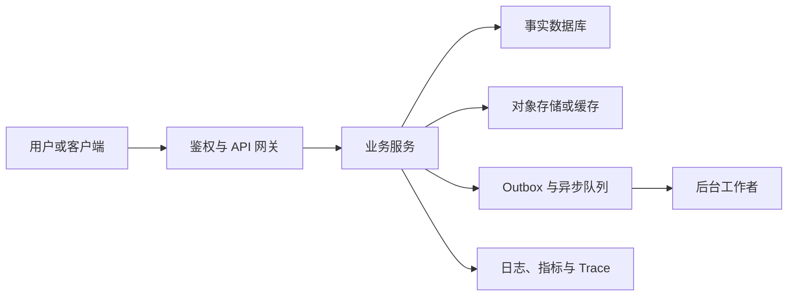

# 系统设计：需求、规模估算与架构取舍

系统设计不是列出 Redis、Kafka、Kubernetes 的练习，而是把一个可验证的需求转换为在明确规模、故障和成本约束下可运行、可恢复、可演进的方案。

## 设计输出与学习边界

本篇覆盖需求、非功能需求、规模估算、API、数据模型、高层架构、读写流程、扩展性、一致性、高可用、安全、可观测性、成本和 Trade-off。

文末用 URL Shortener 与文件存储演示完整推理。通知、任务队列、订单、支付、搜索、IM、协作文档、设计工具、聊天与 RAG 平台也应使用相同顺序，但每个系统的事实来源和不变量不同。

前置知识：HTTP API、关系数据库、缓存、对象存储、消息队列、认证授权与基础指标。

## 从问题而不是组件开始

功能需求描述用户可以完成什么，以及结果如何验收。

非功能需求描述系统在什么条件下仍算可用，包括延迟、可用性、数据丢失、隔离、安全、合规与预算。

约束描述已经存在的系统、团队能力、地域、交付时间和不能破坏的兼容性。

未知项必须列为待确认假设，不能被悄悄填成“无限流量”或“绝不失败”。

图中的顺序不是瀑布流程。发现容量、权限或恢复约束后，应回到 API、数据模型或需求重新收敛。

## 需求清单

### 功能需求

写出主用户路径、管理员路径和后台路径。

每条路径给出输入、成功结果、可见状态和失败结果。

例如“创建短链接”不是完整需求；还应说明是否允许自定义别名、过期、删除、修改目标和统计。

例如“上传文件”不是完整需求；还应说明最大大小、可见范围、病毒扫描、预览和删除后的行为。

### 不变量

不变量是无论重试、并发、故障切换还是后台重放都必须成立的规则。

短链接别名在其有效范围内只能映射到一个目标。

订单只能由被授权主体查看或修改。

文件下载必须在授权检查后进行，签名地址过期后不能继续作为长期凭证。

把不变量放在服务端状态转换、数据库约束或受控存储策略中；不要仅依靠前端校验或提示词。

### 非功能目标

定义延迟时使用百分位和请求范围，例如“已认证重定向的 99% 在 100ms 内完成”。

定义可用性时说明分母、排除条件和时间窗。

定义数据目标时区分 RPO 与 RTO：前者允许丢失多少时间的数据，后者允许多长时间恢复服务。

定义成本时区分固定资源、按请求、存储、出网、日志保留与人工运维成本。

## 规模估算

估算不是猜测精确数字，而是让架构选择有量级依据。

先记录日活、每用户操作数、读写比、峰值系数、对象大小、保留期和增长率。

平均 QPS 约等于日请求数除以 86,400。

峰值 QPS 等于平均 QPS 乘峰值系数；峰值系数应来自活动、时区或历史流量，而非固定写成十倍。

存储量等于每日新增对象数乘平均对象大小乘保留天数，再加副本、索引、版本和恢复余量。

网络量同时计算入站与出站。文件下载和 CDN 回源常常比元数据数据库先成为成本与容量瓶颈。

连接、队列和并发的上限要从下游能力倒推。数据库只能安全承受 200 个并发查询时，入口不能无限接收并把等待转化为内存占用。

把每个假设写在设计文档中，并在压测、真实指标或业务变化后更新。

## API 设计

API 是调用者与服务端之间的契约，不是数据库表的镜像。

为创建、读取、更新、删除和异步操作分别定义资源、方法、状态码、认证和错误模型。

创建具有外部副作用的资源时接受幂等键；服务端把同一主体和同一键绑定到第一次完成的结果。

分页使用稳定排序和游标时，游标应编码排序位置与过滤条件的必要版本，不能被任意猜测后读取越权数据。

错误响应至少区分输入无效、未认证、无权、资源不存在、冲突、限流、依赖暂时失败和内部错误。

不要因安全而总把越权返回 404；选择 403 或 404 是产品泄露模型的一部分，但内部审计必须保留真实原因。

## 数据模型与事实来源

数据模型先列实体、关系、生命周期和唯一性。

为每个字段说明来源、可修改者、审计要求和删除策略。

事务内的数据是该服务的事实来源；缓存、搜索索引、统计表和通知是派生数据。

派生数据延迟、重放或丢失时，系统应能从事实来源重建，而不是把搜索索引当主数据库更新。

高频读取数据可缓存，但权限、库存、支付状态和删除状态需要明确的失效与回源语义。

## 高层架构

组件图只保留职责和数据流。每个箭头都应回答认证在哪里发生、超时多少、重试是否幂等、失败后保留什么状态。

网关可处理 TLS 终止、路由与粗粒度限流，但业务授权不能只依赖网关规则。

数据库维护事实和约束；对象存储保存大对象；消息系统解耦可延后工作；观测系统帮助判断方案是否仍满足目标。

## 读写流程

写流程从认证开始，验证输入和对象权限，再执行事务状态转换。

需要异步处理时，在同一事务写入 outbox；后台转发事件，消费者按稳定业务键去重。

读流程先确认主体可读取资源，再选择缓存、数据库、对象存储或搜索索引。

缓存未命中只能回源到事实来源或受控派生过程；不能用一个过期缓存值绕过删除和权限变更。

为每个流程写明 deadline、取消、错误响应和审计字段。

## 扩展性与一致性

扩展性是测得瓶颈后的改变。

读多时可先增加缓存、CDN 或读取副本；写多时检查索引、批量、队列、分区和事务竞争。

数据大到单库无法满足容量、隔离或恢复目标时再评估分片；先确定分片键、跨分片查询与迁移路径。

一致性目标按不变量选择。用户名唯一、扣库存和权限撤销可能需要强协调；点击统计、搜索结果和通知展示通常允许最终收敛。

Read-after-write 只应作用于刚保存、刚支付等需要会话保证的路径，避免把全部读取压到主库。

## 高可用与恢复

高可用不等于多部署几个副本。依赖的数据库、DNS、身份服务、密钥、对象存储、队列和发布系统都可能决定可用性。

先定义故障域：进程、节点、可用区、区域和供应商。

为每个故障域定义检测、隔离、切换、数据校验、回滚和通知责任。

备份必须定期 restore 到隔离环境，验证密钥、版本、权限、容量和业务校验和。

## 安全与隐私

身份认证、资源授权、租户隔离、速率限制和输入限制在服务端执行。

参数化查询防 SQL 注入；对象路径在规范化后验证根目录；服务端取 URL 时防 SSRF；更新接口使用允许字段列表防 Mass Assignment。

Secret 由密钥管理或部署平台注入，不写入镜像、仓库、日志、错误响应或前端包。

遥测采用字段白名单和脱敏，避免记录 Cookie、Authorization、密码、签名 URL 与原始个人内容。

## 可观测性

每个请求生成或传播 request ID 与 trace context。

记录结构化日志：服务、版本、路由、状态、延迟、错误类别和脱敏主体标识。

指标至少包含请求 rate、错误率、延迟直方图、队列积压、资源饱和与业务成功率。

告警应指向用户影响或容量风险，并附 runbook、仪表盘和升级条件。

## 案例一：URL Shortener

需求：创建短链接、重定向、别名、过期、删除和访问统计。

不变量：有效别名唯一；删除后不可继续重定向；管理员只能管理自身或被授权域名。

写 API 为 `POST /links`，接受目标 URL、可选别名、过期时间和幂等键。

数据库以别名唯一索引保护并发创建；链接表是事实来源。

重定向读取先查缓存，未命中查数据库并回填短 TTL；过期或删除状态必须在回填前检查。

点击事件异步写入队列，统计系统失败不影响重定向主路径。

验证：并发创建同一别名只有一个成功；暂停统计消费者后重定向仍可用；删除后缓存失效且访问得到受控结果。

失败分支：把访问统计同步写关系库会把分析负载和数据库延迟直接加入用户跳转延迟。

成本取舍：小规模可单库加缓存；超大读流量再引入 CDN 和多区域读取，前提是删除与权限变化的失效语义仍可验证。

## 案例二：用户文件存储

需求：用户上传、列出、下载、删除、扫描和预览文件。

客户端先请求上传会话；服务检查身份、租户配额、文件用途和允许大小后返回短时、受限操作的上传凭证。

文件数据直接进入对象存储，应用只持久化对象 key、大小、内容摘要、所有者、扫描状态和生命周期。

上传完成事件触发扫描与预览工作者；下载仅对 `SAFE` 状态且通过资源授权的对象签发短时下载凭证。

验证：伪造 MIME、超大文件、扫描超时、重复完成回调、已删除对象和跨租户 object key 都有明确状态和审计。

失败分支：让大文件经 API 服务器中转会耗尽连接、内存和带宽；把对象 key 当授权凭证会造成 IDOR。

成本取舍：对象存储降低持久化运维，但版本、生命周期、出网、预览和病毒扫描仍会产生可观成本。

## 设计评审清单

1. 是否写明用户目标、管理员目标和明确不做的范围？

2. 每个吞吐、存储和延迟数字是否有来源或可验证假设？

3. 每条 API 是否定义认证、授权、幂等、错误和限流？

4. 事实来源、派生数据、重建路径和删除语义是否清楚？

5. 关键读写流程是否包含超时、重试、取消和重复请求？

6. 哪些不变量强一致，哪些数据允许最终一致，理由是什么？

7. 一个区域、一个依赖或一次发布失败时，如何检测、降级和恢复？

8. 是否能从线上版本反查 commit、镜像、配置和基础设施变更？

9. 成本是否包含日志、备份、网络、恢复演练和人工维护？

10. 更简单方案为何暂时不足，更复杂方案为何暂时不需要？

## 练习

任选通知、任务队列、订单、支付、搜索、IM、协作文档、设计工具、聊天或 RAG 平台，写一页系统设计。

验收：评审者能够指出一个事实来源、三个不变量、两个量级假设、一次部分失败处理、一条 SLO 指标和一个被明确拒绝的复杂方案。

## 来源

- [Google SRE：非抽象的大规模设计](https://sre.google/workbook/non-abstract-design/)（访问日期：2026-07-23）
- [AWS Well-Architected Framework](https://docs.aws.amazon.com/wellarchitected/latest/framework/welcome.html)（访问日期：2026-07-23）
- [Google SRE：处理过载](https://sre.google/sre-book/handling-overload/)（访问日期：2026-07-23）
