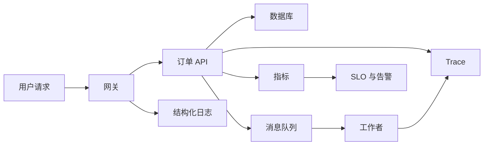

# 可观测性、SRE 与应用安全：用证据恢复服务并保护边界

服务故障时，日志、指标和 trace 用于回答不同问题：发生了什么、影响有多大、请求经过了哪里。SRE 用 SLI、SLO 与错误预算把可靠性目标变成可决策的约束；安全把身份、权限、输入和敏感数据的边界放进系统执行点。本篇以一个多租户订单 API 为对象，说明三者如何共同工作。

## 前置知识和边界

前置知识是 HTTP、数据库事务、认证授权、部署和缓存。可观测性不是“装一个仪表盘”，SRE 不是要求所有请求永不失败，安全也不是在网关开一个 WAF 后停止编码审查。它们必须落实到应用协议、数据模型、运行时和恢复演练。



每个箭头对应一种可观察证据：网关记录请求入口，服务记录授权决定和错误类别，数据库与队列暴露饱和度，trace 连接异步任务。遥测不能记录原始密码、Cookie、Authorization header、签名 URL 或完整支付信息。

## 三种信号与上下文传播

日志是离散事件，适合保留错误详情和审计事实。结构化日志使用稳定字段而不是拼接文本，例如 `service`、`version`、`route`、`method`、`status_code`、`duration_ms`、`request_id`、`trace_id`、`tenant_hash`、`error_kind`。`tenant_hash` 仍需评估是否能被反查；不要误以为哈希自动满足隐私要求。

指标是可聚合数值。Counter 只增不减，适合请求数和错误数；Gauge 表示某时刻量，如队列长度；Histogram 记录观测值分布并可估算分位数。Prometheus 的 summary 与 histogram 有不同聚合边界；跨实例计算分位数通常使用 histogram bucket 的聚合查询，而不是平均每实例的 p99。

trace 是一个请求的因果树。trace 由 spans 构成；span 有开始、结束、属性、事件和状态。HTTP 服务接收 W3C Trace Context 的 `traceparent` 时应继续同一 trace；向消息队列发送消息时把 context 注入消息 headers，消费者提取后创建处理 span。request ID 可以方便人工检索，但不替代标准 trace context。

| 信号 | 适合的问题 | 不适合的问题 | 保留与成本边界 |
| --- | --- | --- | --- |
| 日志 | 某次失败的字段和堆栈 | 精确全站延迟分布 | 采样、脱敏、保留期 |
| 指标 | 错误率、容量、SLO 是否耗尽 | 某用户请求的全部链路 | 标签基数必须受限 |
| Trace | 延迟在哪个依赖和重试中产生 | 统计全量业务总数 | 采样策略和敏感属性 |

指标标签不能放 request ID、完整 URL、邮箱或订单号。这些值近乎无限，会产生高基数 time series，增加内存、查询和告警成本。把路由归一化为 `/orders/{id}`，把错误归类为有限枚举。

## RED、USE 与业务指标

RED 面向请求服务：Rate 是每秒请求数，Errors 是失败请求数或比率，Duration 是延迟分布。先定义什么是失败：对读 API，5xx 通常失败；对创建订单，数据库已提交但响应在网络断开前丢失，服务端业务成功而客户端需要靠幂等键安全重试。指标定义要反映用户结果，不能只统计 HTTP 状态码。

USE 面向资源：Utilization 表示资源忙碌比例，Saturation 是排队或超出可服务能力的工作量，Errors 是资源层错误。CPU 95% 不必然是故障；如果队列持续增长、p99 上升且请求被拒绝，才说明供给不足或并发策略错误。

业务指标补足技术指标。例如下单成功率、支付回调处理滞后、库存预留冲突率、待处理退款数。它们要明确分子、分母、时间窗口、数据延迟与去重规则；否则“成功率”会把重试或测试流量混入结论。

```promql
sum(rate(http_server_requests_total{route="/orders",code=~"5.."}[5m]))
/
sum(rate(http_server_requests_total{route="/orders"}[5m]))
```

这个查询得到五分钟窗口内指定路由的 5xx 比率。它没有自动排除计划维护、客户端取消、采样丢失或业务失败；SLO 查询必须把这些规则写清楚。

## SLI、SLO、SLA 与错误预算

SLI 是已定义的可测量服务水平指标；SLO 是该指标的目标；SLA 是与外部客户约定的合同目标和后果。不要把三者互换。一个典型可用性 SLI 是“符合条件的有效请求中，成功且在延迟阈值内完成的比例”。

若 30 天有 43,200 分钟，99.9% 目标的时间预算约为 43.2 分钟；但真正的错误预算应从请求计数或事件计数计算，因为流量并不均匀。错误预算 = 允许失败量 − 已观察失败量。预算接近耗尽时，团队应优先处理可靠性风险、暂停高风险发布或收紧灰度；它不是自动惩罚开发的指标。

| 目标 | 分子 | 分母 | 窗口 | 例外 |
| --- | --- | --- | --- | --- |
| 下单可用性 99.9% | 有效且 2xx/409 幂等重放成功的请求 | 已认证下单请求 | 30 天滚动 | 已公告维护须单独记录 |
| 读取延迟 | 小于 300ms 的成功读取 | 成功读取 | 7 天滚动 | 不把客户端超时误算为服务成功 |
| 退款处理 | 15 分钟内完成的合法退款任务 | 已接受退款任务 | 24 小时滚动 | 依赖方故障仍计入用户影响 |

告警应针对正在或即将影响 SLO 的事件，而不是每个瞬时 CPU 峰值。多窗口、不同 burn rate 的告警可以同时捕捉快速大量消耗和缓慢持续消耗。每条告警应有明确服务、SLO、仪表盘、runbook、升级路径和停止条件；没有行动的告警应被删除、聚合或改为看板。

## 案例一：从告警定位订单创建超时

现象：`POST /orders` 的 p99 超过 2 秒，5xx 比率开始消耗错误预算。处理过程不是先重启 Pod。

1. 看 RED：请求 rate 稳定，错误率从 0.05% 到 2%，p50 未明显上升而 p99 上升，说明少数路径变慢或失败。
2. 按 `trace_id` 查慢请求：订单服务中 `inventory.reserve` span 占 1.8 秒，并显示三次重试。
3. 看库存服务的 USE：数据库连接池等待时间上升，活跃连接达到上限，CPU 不高。
4. 查结构化日志：新版本把一条查询放到事务中并缺少复合索引，连接被慢查询占用。
5. 缓解：停止扩大发布，回滚该版本或启用受控降级；修复索引和事务边界后用真实数据量的预发布环境压测。

失败分支是对库存服务立即开启无限重试。请求越慢，更多 goroutine 和连接排队，反而使健康请求也失效。每次调用应有 deadline；只对明确可重试、幂等的临时错误做有限次数指数退避并加入 jitter。调用者取消时应停止等待和重试。

```go
for attempt := 0; attempt < 3; attempt++ {
    err := reserve(ctx, orderID)
    if err == nil { return nil }
    if !retryable(err) || ctx.Err() != nil { return err }
    delay := time.Duration(100*(1<<attempt))*time.Millisecond + jitter(50*time.Millisecond)
    if err := sleepContext(ctx, delay); err != nil { return err }
}
return ErrInventoryUnavailable
```

该代码的前提是 `reserve` 对同一 `orderID` 幂等，且 `sleepContext` 在 deadline 到达后立即返回。jitter 不需要随机到不可复现；其目的在于打散大量同时重试的峰值。

## 弹性模式的应用条件

timeout 是调用者愿意等待的上限，应小于上层 deadline 并为序列中的后续工作留下预算。retry 只用于临时失败且操作可安全重放的情况；不能对输入错误、权限错误、资源不存在或非幂等支付扣款重试。

熔断器在连续失败或延迟异常时快速拒绝后续调用，避免耗尽线程、连接和队列；半开状态只允许少量探测请求。隔舱把关键依赖的连接池、线程池、队列或租户配额分开，避免一个慢租户占满全局资源。限流控制入口速率；负载削减在容量不足时明确拒绝低优先级工作；降级返回已定义的替代结果，如暂不显示推荐，而不是伪造订单成功。

| 机制 | 保护对象 | 必要前提 | 常见误用 |
| --- | --- | --- | --- |
| Timeout | 调用者资源 | 可传播取消 | 每层都设同样超时导致预算错配 |
| Retry + jitter | 短暂依赖故障 | 幂等、次数上限 | 对永久错误或全局故障重试 |
| Circuit breaker | 下游与调用者 | 可靠失败分类 | 把业务 4xx 当依赖故障 |
| Rate limit | 入口公平性 | 身份或租户维度 | 只按 IP 限制而误伤 NAT 用户 |
| Bulkhead | 关键路径隔离 | 可分离资源池 | 创建过多小池造成低利用率 |
| Load shedding | 服务存活 | 优先级规则 | 静默丢弃有账务副作用的请求 |

## 备份、恢复、演练与复盘

备份是恢复输入，不是恢复证据。RPO 是可接受的数据丢失时间，RTO 是可接受的恢复服务时间。它们由业务影响决定：若 RPO 为 15 分钟，备份频率、日志归档和复制延迟都必须支持这一上限；若 RTO 为 1 小时，恢复 runbook、权限、密钥、容量和 DNS 切换必须在演练中测得小于该值。

恢复演练必须在隔离环境执行：从一个指定时间点恢复数据库，验证 schema 版本、行数或校验和、关键业务不变量、应用连接、密钥访问和只读查询。不要在生产备份上进行破坏性试验。对象存储、Terraform state、配置、镜像、密钥和外部依赖的恢复路径也要包含在系统恢复范围内。

无责复盘的输出是可验证的改进，而不是“某人操作失误”。记录时间线、用户影响、检测方式、技术和组织条件、已缓解动作、未缓解原因，以及每项改进的负责人和完成标准。复盘不等于免除安全或权限审计；审计仍应保留谁在何时执行了什么受控操作。

## 安全控制点：认证、授权和租户隔离

密码必须使用专门的慢哈希算法和每个密码独立 salt；不要用快速通用哈希保存密码。Session ID 应来自足够随机的不可预测值，使用 `Secure`、`HttpOnly` 和适当 `SameSite` cookie 属性，并在登录、密码重置和权限改变时轮换或撤销会话。MFA 增加第二个独立因子，但恢复流程同样需要防止社工绕过。

认证回答“主体是谁”，授权回答“主体能对这个资源做什么”。RBAC 适合稳定角色权限，ABAC 根据主体、资源、操作和环境属性做策略，例如租户、所有者、区域、时间和风险级别。两者常组合使用：角色给出能力上限，资源与租户属性决定是否允许具体请求。

多租户隔离不能只依赖前端传递的 `tenant_id`。服务从已验证身份和受控成员关系得到租户上下文；查询在服务层显式按租户约束，数据库可进一步使用行级安全或独立 schema/database。导出、缓存 key、对象存储路径、搜索索引、后台任务和审计查询都必须携带并验证同一隔离边界。

## 常见攻击与精确修复位置

| 风险 | 根因 | 修复位置 | 验证 |
| --- | --- | --- | --- |
| SQL Injection | 拼接不可信输入 | 参数化查询、允许字段映射 | 注入字符不改变查询结构 |
| Command Injection | 将输入拼入 shell | 不调用 shell；使用参数数组 | 输入含分号仍只作数据 |
| Path Traversal | 未规范化路径 | 固定根目录后验证规范路径 | `../` 不能逃出根目录 |
| SSRF | 服务端任意抓取 URL | allowlist、DNS/IP 重解析防护、禁私网 | 不能访问 metadata/内网地址 |
| IDOR | 只按资源 ID 查询 | 每次资源读取做主体授权 | 换 ID 不可读取他人资源 |
| Replay | 请求可被再次接受 | nonce、时间窗、幂等键或签名 | 重放得到受控拒绝/同结果 |
| Mass Assignment | 直接绑定请求到模型 | 允许字段 DTO 与服务端授权 | `role` 等字段不会被更新 |

传输层使用 TLS；静态数据加密要明确密钥在哪里、谁能解密、如何轮换和恢复。应用日志采用字段白名单，将敏感值替换为类型、长度、哈希或受控标识。Secret 管理由部署环境或专门密钥系统完成，应用只在运行时获得最小范围、短生命周期凭据。

## 案例二：阻止跨租户订单读取和审计泄露

错误实现：`GET /orders/{id}` 直接按 UUID 查询并返回。攻击者获得另一个订单 UUID 后可以读取对方订单，这就是 IDOR。修复不是把 UUID 换得更长，而是在同一授权路径中从 session 得到主体和租户，再以 `id AND tenant_id` 查询，并校验该主体是否拥有读取动作。

```sql
SELECT id, status, total_cents, created_at
FROM orders
WHERE id = $1 AND tenant_id = $2 AND deleted_at IS NULL;
```

这里的 `$2` 来自服务端认证上下文，不来自请求 body 或 query。若查询无结果，产品决定对未授权资源返回 403 还是 404；日志和审计事件必须记录真实授权拒绝类别，但不记录完整订单内容或 session token。

再检查异步链路：导出 Job 的 payload 放 `tenant_id`、请求者和授权快照；worker 在执行时重新验证策略或使用短期受控凭据。对象存储 key 带租户前缀但不把前缀当授权，下载前仍检查应用授权并签发短时、指定对象的 URL。缓存 key 包含租户和权限版本，权限撤销时使相关缓存失效。

验证方式：使用两个测试租户创建订单，对每个 API、导出、搜索、缓存命中和下载路径做负向集成测试；在日志采样中确认没有 token、邮箱全文或订单明细；查看 audit trail 能关联请求、主体、动作、资源类别和结果。

## OpenTelemetry 落地检查

OpenTelemetry 定义 traces、metrics、logs 等信号的生成和传输模型，具体后端可为 Prometheus、Grafana、Loki、Tempo 或 Jaeger。Collector 可以接收、处理、采样和导出遥测，但不应成为单点：应用要能在 Collector 不可用时有界地丢弃或缓冲，不能因上报失败阻塞业务请求。

为 HTTP 服务自动创建 server span，为数据库、HTTP client、消息生产/消费创建 client 或 consumer span；手工 span 只包围有业务意义的步骤，例如 `order.authorize_payment`。属性名称采用稳定语义约定，且只添加低基数、已脱敏值。错误要记录异常类型与受控摘要，不把堆栈和请求 body 无限制复制到每个 span。

## 综合练习与验收

为订单 API 实现一个 SLO、三类信号、故障注入和安全测试。

- 记录 route、版本、request/trace ID 和有限错误分类，且扫描日志确认没有 Secret。
- 以 histogram 计算请求延迟，仪表盘同时展示 RED、数据库连接池和队列积压。
- 定义一个有分子、分母、窗口和例外的下单 SLO，并为快速燃尽和慢燃尽写 runbook。
- 注入库存依赖超时，验证 deadline、有限重试、熔断/降级和告警不会制造重试风暴。
- 从备份恢复到隔离环境，记录实测 RPO/RTO 与业务不变量验证结果。
- 对跨租户 IDOR、Mass Assignment、SSRF 与日志脱敏写自动化负向测试。

## 告警响应的最小 runbook

当下单 SLO 触发快速燃尽告警时，值班人员先确认告警查询的分子、分母和时间窗口没有被采集故障污染，再确认是否存在真实用户影响。随后固定一个 incident channel 和事件负责人，记录首次检测时间、当前版本、受影响区域和已执行动作。

排查顺序应从入口到依赖：检查最近发布、路由错误率和延迟分位数；按 trace 找到最长 span；再检查对应服务的连接池、队列积压、CPU、内存、数据库锁和第三方状态。每一步都记录证据与时间，避免轮班时重复猜测。

缓解动作应选择可逆且最小的变化：停止继续发布、回滚最近可疑版本、按既定策略限流、关闭非关键功能或扩大已经验证安全的容量。修改配置后观察一个事先定义的窗口；只因图表短暂下降就宣布恢复，会遗漏排队请求和后台失败。

恢复条件包括用户 SLI 回到阈值内、错误预算燃尽速度下降、关键依赖饱和度恢复、队列开始清空且没有持续增长。恢复后保留 trace、日志查询和 dashboard 快照链接，进入复盘而不是删除告警。

## 数据删除与审计的并存

数据删除请求需要区分业务删除、账户停用、可恢复软删除、法律保留和物理擦除。每种状态的授权、可见性、保留期和异步清理责任要明确。将记录标记为删除不等于所有副本、缓存、搜索索引、对象和分析表都已删除。

审计日志应记录删除请求的主体、授权依据、资源类别、时间和执行结果，但只保留完成审计所需的最小字段。审计存储的访问权限通常比业务读库更严格；审计系统本身也需要保留与删除策略，不能以“审计”为理由永久复制全部个人数据。

当异步清理失败时，系统应重试并有可观测积压，而不是把资源重新暴露给用户。恢复备份时也要考虑已删除数据是否会被重新带回：恢复流程需要补放删除 tombstone 或重新执行受控清理。

## 来源

- [OpenTelemetry：Signals](https://opentelemetry.io/docs/concepts/signals/)（访问日期：2026-07-23）
- [Google SRE Workbook：Implementing SLOs](https://sre.google/workbook/implementing-slos/)（访问日期：2026-07-23）
- [Prometheus：Metric types](https://prometheus.io/docs/concepts/metric_types/)（访问日期：2026-07-23）
- [OWASP Top 10](https://owasp.org/www-project-top-ten/)（访问日期：2026-07-23）
- [OWASP：Authorization Cheat Sheet](https://cheatsheetseries.owasp.org/cheatsheets/Authorization_Cheat_Sheet.html)（访问日期：2026-07-23）
