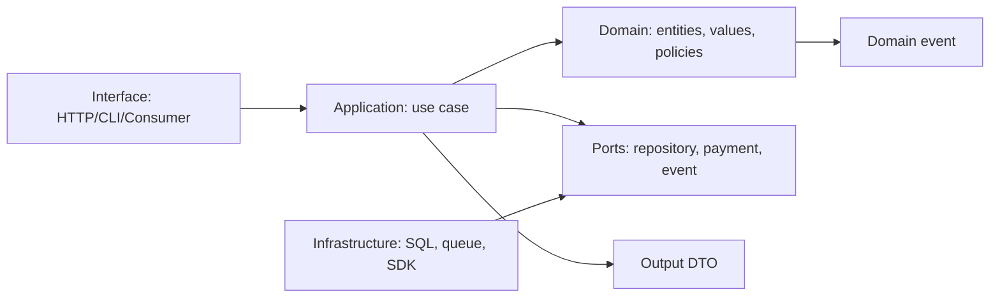

# 领域建模与分层架构：让业务规则拥有明确的执行位置

领域建模的目标不是为每个表创建一个类，而是让业务概念、规则和变化边界在代码中可读、可测试、可替换。分层架构把输入输出、用例编排、业务决策和技术细节隔离；限界上下文限制同一个词在一个模型中的含义。默认选择模块化单体：先在一个可部署单元内建立模块边界，只有独立扩缩容、团队边界或故障隔离等证据成立时再拆服务。

## 先建立业务语言和不变量

统一业务语言是产品、运营、设计和工程在一个明确语境中使用的词汇。它不是词典装饰。例如“订单”在结算上下文可能是待支付承诺，在履约上下文可能是已确认发货指令；把两个概念强行放进同一万能 `Order` 模型，会产生互相矛盾的字段、状态和权限。

领域规则应写成可判断的不变量：

- 一个订单只能由其所属租户的授权主体查看。
- 已支付订单不能再次支付；支付网关重试只能返回同一结果。
- 库存预留不能使可售数量为负。
- 已取消且未发货的订单可释放预留；已发货订单进入退款或售后流程，而不是回到“未支付”。

不变量必须由领域代码、数据库约束或受控事务执行。前端禁用按钮、Handler 中的一个 `if`、文档约定都不足以保证并发请求、后台任务和未来调用者仍遵守规则。



依赖方向指向业务核心：interface 和 infrastructure 依赖 application/domain 的抽象；domain 不导入 HTTP framework、ORM、消息 SDK 或数据库连接。这个方向不是“必须四个目录”的教条，小型程序可以少层，但业务规则不能被技术类型绑死。

## 四层的职责、输入和禁止项

| 层 | 负责什么 | 可以依赖 | 不应承担 |
| --- | --- | --- | --- |
| Interface | 解析协议、认证上下文、DTO 校验、映射响应 | application | SQL、业务状态机、支付决定 |
| Application | 编排一个用例、事务边界、调用 port、授权动作 | domain、ports | HTTP 细节、ORM 查询链 |
| Domain | 概念、规则、状态转换、计算 | 标准库与领域抽象 | JSON、SQL、网络、框架 |
| Infrastructure | 实现 repository、支付客户端、消息发布、缓存 | domain/application port | 决定业务语义 |

Interface 层做语法和协议校验，如 JSON 是否可解析、字段类型和认证是否存在；domain 层做业务有效性，如订单是否允许取消。application 层把一次用例的事务、幂等、授权检查和副作用排序清楚。infrastructure 层可以把数据库唯一冲突翻译为领域定义的冲突错误，但不应让 PostgreSQL 错误码泄漏到 HTTP 响应。

## Entity、Value Object、Aggregate 与 Repository

Entity 有跨时间保持的身份，属性可变但仍是同一个对象，如 `OrderID=...` 的订单。Value Object 由值定义，没有独立身份，通常不可变，如金额、货币、邮箱、地址或日期区间。Value Object 在构造时验证，使不合法状态难以进入领域对象。

```go
type Money struct { cents int64; currency string }

func NewMoney(cents int64, currency string) (Money, error) {
    if cents < 0 { return Money{}, ErrNegativeMoney }
    if currency != "CNY" && currency != "USD" { return Money{}, ErrUnsupportedCurrency }
    return Money{cents: cents, currency: currency}, nil
}

func (m Money) Add(other Money) (Money, error) {
    if m.currency != other.currency { return Money{}, ErrCurrencyMismatch }
    return NewMoney(m.cents+other.cents, m.currency)
}
```

金额不用浮点数保存，因为二进制浮点不能精确表示许多十进制小数。实际货币精度、舍入方向、税费和汇率规则需由所在业务与法规定义；上例仅展示最小整数分与币种一致性。

Aggregate 是一组对象的一致性边界，Aggregate Root 是外部访问入口。一次事务内强制的规则应只跨越一个 aggregate；跨 aggregate 的协作通常通过事件、流程管理器或受控应用服务实现，接受延迟和补偿。大 aggregate 会提高锁冲突并拖慢并发，小 aggregate 又可能让关键不变量无处落地，因此边界由业务一致性需要决定，不由表之间是否有外键决定。

Repository 是按领域需要读取和保存 aggregate 的抽象，例如 `OrderRepository.Find(ctx, orderID)` 与 `Save(ctx, order)`；它不是向每个表暴露通用 CRUD 的“万能 DAO”。查询报表或列表可使用专用 query service/读模型，避免为了展示页面加载一个庞大 aggregate。

## 领域事件不是消息队列的同义词

Domain Event 表示领域中已经发生的事实，如 `OrderPaid`、`InventoryReserved`。它应使用过去式，包含稳定标识、发生时间、版本和最小必要数据。事件可以先在进程内收集，最终是否发布到 Kafka、SNS 或 outbox 取决于跨模块/跨服务和可靠投递需求。

事件发布必须和事实写入协调。若订单事务提交后进程崩溃，直接发消息可能丢失；若先发消息再回滚数据库，消费者会看见不存在的事实。Transactional Outbox 在同一事务写业务状态与 outbox 表，后台转发器再发布；消费者按事件 ID 或业务键幂等处理。它提供至少一次投递下的可恢复协作，不自动提供“全系统恰好一次”。

## 案例一：订单支付用例的完整边界

输入：已认证用户请求支付订单 `o-100`，携带幂等键。订单属于同一租户，金额为 12,800 分，状态为 `PendingPayment`。支付网关可能超时，回调可能重复。

Interface 层提取可信身份和 tenant，不接受 body 中的 `tenant_id`。application 层先按 tenant 读取订单、验证主体动作、查询幂等记录，然后调用 domain 状态转换；外部支付调用必须有 timeout，支付成功后的本地状态和 outbox 在一个数据库事务中提交。网关调用若不能与本地事务原子化，应使用 provider idempotency key、明确 pending 状态和回调/查询恢复流程。

```go
type OrderStatus string
const (
    PendingPayment OrderStatus = "pending_payment"
    Paid OrderStatus = "paid"
)
type Order struct { ID, TenantID string; Status OrderStatus; Total Money; events []DomainEvent }

func (o *Order) MarkPaid(paymentID string) error {
    if o.Status == Paid { return nil }
    if o.Status != PendingPayment { return ErrOrderNotPayable }
    if paymentID == "" { return ErrPaymentReferenceRequired }
    o.Status = Paid
    o.events = append(o.events, OrderPaid{OrderID: o.ID, PaymentID: paymentID})
    return nil
}
```

`MarkPaid` 不发 HTTP、不执行 SQL、不读取当前用户；它只保证订单状态规则。application service 保证调用者已授权、聚合来自正确租户、保存与 outbox 原子提交。数据库可用 `(tenant_id, provider_payment_id)` 唯一约束阻止同一支付回调造成两条支付记录。

失败分支：把 `status = "paid"` 直接写在 Handler。以后来自管理后台、消息消费者和批处理的调用会各自复制校验，某一路遗漏状态检查即可破坏规则。修正是让所有改变订单生命周期的路径调用同一个领域操作或受控应用用例。

验证：对 `MarkPaid` 写纯单元测试；对 application service 用事务和 outbox 测试幂等回放；对 HTTP 层测试跨租户读取被拒绝。模拟“网关成功但响应丢失”，再次提交相同幂等键必须得到同一订单结果，而不是二次扣款。

## 限界上下文和上下文映射

Bounded Context 是一个模型和语言有效的边界，内部术语、规则和数据可以一致；边界外通过明确契约协作。它不等于微服务：一个模块化单体中的 package、schema 或部署内模块同样可以是 bounded context。

以电商为例：Catalog 管理商品描述和定价展示；Ordering 管理提交、取消和付款状态；Inventory 管理可售与预留；Fulfillment 管理拣货和发货。四者都可能出现“商品”或“订单”，但不需要共享一个数据库模型。Ordering 向 Inventory 请求预留，只传 SKU、数量、订单 ID 和租户；不把 Inventory 的库存表映射成 Ordering 的 ORM 关联。

| 协作形式 | 适用条件 | 代价与要求 |
| --- | --- | --- |
| 同步 API | 调用者需立即结果 | timeout、版本、降级、可用性耦合 |
| 异步事件 | 可接受最终一致 | 幂等、顺序、schema 演进、补偿 |
| 共享内核 | 两团队确实共同维护小模型 | 变更协调成本高，应保持极小 |
| Anti-corruption Layer | 对接旧系统或外部模型 | 需要显式翻译与测试，防止外部术语渗透 |

上下文映射的输出应包含所有者、上游/下游、传输契约、失败语义、数据延迟、版本和删除语义。仅画模块箭头不够：例如库存预留失败是立即拒绝订单、进入等待队列还是允许超卖，属于产品与领域决定。

## 模块化单体：先获得可演进边界

模块化单体是一个部署单元内的多个高内聚模块。它优先于微服务，因为进程内调用、单一事务、调试和部署更简单，且不引入网络部分失败、分布式追踪、独立发布和跨服务数据一致性成本。模块化单体不是把所有代码放进一个 `services` 目录；关键是模块不能随意读取对方私有表或内部类型。

一种 Go 目录方式：

```text
internal/
  ordering/
    domain/
    application/
    infrastructure/
    interface/
  inventory/
    domain/
    application/
    infrastructure/
  platform/
    db/
    observability/
cmd/api/
```

模块对外暴露窄接口或应用命令，内部 repository 实现不被其他模块导入。数据库可先共享实例但使用模块拥有的 schema/table 和迁移；跨模块读取通过查询契约或事件投影，避免任意 join 逐渐把所有模块绑成一个隐形大 aggregate。

拆成微服务的证据包括：不同模块需要独立扩缩容或故障隔离；团队能独立拥有 on-call、发布、数据和契约；部署频率确实被单体耦合阻塞；边界内数据和不变量已足够稳定。仅因为“公司使用微服务”或“代码很多”不是充分理由。拆分前先在单体中实施接口、事件、独立迁移和可观测性，能暴露真正的契约缺口。

## 案例二：从库存耦合到可恢复协作

初始实现中订单 Handler 在一次数据库事务中同时更新 `orders` 和 `inventory` 表，随后直接调用邮件服务。问题是库存模块无法独立演进，邮件慢会拉长事务，未来异步消费者也可能绕过库存规则。

重构步骤：

1. 把库存可售和预留规则移动到 Inventory aggregate：`Reserve(orderID, sku, quantity)`。
2. Ordering application service 提交订单后写 `OrderSubmitted` outbox event。
3. Inventory consumer 用 `orderID + sku` 去重，原子创建预留并发布 `InventoryReserved` 或 `InventoryRejected`。
4. Ordering consumer 收到结果，将订单变为 `Confirmed` 或 `AwaitingStock`；取消时发布释放预留命令/事件。
5. 邮件模块订阅已确认订单事件，失败重试不会回滚订单事实。

这条链路是最终一致的。用户在提交后的短时间会看到 `AwaitingStock`，而不是虚假“已确认”。若业务要求在支付前绝不超卖，支付 application service 必须等待可证明的库存预留成功，或者选择同步库存命令；选哪个由延迟、可用性与超卖成本决定。

失败分支：消费者收到同一 `OrderSubmitted` 两次，重复扣减库存。修正是把去重键或唯一约束置于库存事务中，不能仅靠内存 Set。另一个失败分支是事件 schema 删除字段；采用 schema version、兼容读取和按消费者迁移，不能强制所有消费者瞬时升级。

## 领域模型、数据库模型和 API 模型为何不同

数据库模型优化持久化、索引、约束和迁移；API DTO 优化外部契约、序列化和兼容性；领域模型优化规则表达。三者可以在小 CRUD 场景接近，但不应强制完全相同。

例如 `orders` 表可有 `total_cents`、`currency`、`status` 和审计列；HTTP DTO 可暴露格式化金额和可执行动作；领域 `Money` 负责同币种计算，`Order` 负责状态转换。把 ORM entity 直接 JSON 序列化会泄漏内部字段、把 schema 迁移变成 API breaking change，并让数据访问懒加载等技术行为进入业务规则。

Repository 保存 aggregate 时可映射到多张表；读列表可直接投影为 DTO。事务边界由 use case 不变量定义，不要为了“repository 每次 Save”自动开启长事务。数据库仍保留唯一、外键、check 等最后防线，领域规则与数据库约束是互补关系。

## 调试、测试和演进

领域单元测试不需要数据库：给定对象初始状态和命令，断言状态或事件。application 集成测试使用真实事务、repository 和 outbox，验证幂等、回滚和映射。契约测试验证模块或服务间 request/event schema；端到端测试只覆盖少数关键路径，不替代底层快速测试。

调试先问规则在哪一层失效：若非法状态可被持久化，检查 domain 操作与数据库约束；若正确状态被错误主体触发，检查 application 授权和 interface 身份映射；若事件丢失，检查 outbox 事务与转发监控；若跨模块数据不同步，检查事件版本、幂等和补偿。

演进领域模型时，先写新概念和兼容适配器，再逐步迁移调用方和历史数据，最后删除旧概念。不要用一次全局重命名掩盖词义变化。对于外部 API 和事件，保持向后兼容、提供版本/弃用窗口，并以真实消费者使用情况决定删除时间。

## 综合练习与验收

在模块化单体中实现 Ordering 与 Inventory 两个 bounded context。

- 画出上下文映射，列出每个概念的所属模块、所有者和失败语义。
- 为 `Money`、订单支付和库存预留编写纯领域测试，覆盖非法状态和重复命令。
- 用 application service 把授权、幂等、事务和 outbox 放在明确位置；Handler 不直接操作 ORM entity。
- 重复投递事件不会重复扣减库存；消费者故障后可从 outbox/消息重新处理。
- 数据库迁移与 API/event 契约可向后兼容；跨模块没有任意 SQL join。
- 给出继续保持模块化单体或拆分服务的量化证据，而不是以目录结构作为结论。

## 反例：不要把 DDD 变成对象数量竞赛

简单的后台配置、只读报表或稳定的 CRUD 管理页面未必需要 aggregate、domain event 和多层 mapper。若规则只是字段合法性、唯一约束和权限过滤，清晰的 application service、参数化查询和数据库约束通常更直接。模型复杂度应随业务不变量、协作数量和变化频率增长。

相反，涉及状态机、金额计算、库存、审批、配额、权限继承或跨步骤补偿的代码，即使最初只有一个 HTTP endpoint，也不应把规则散落在 controller、SQL trigger 和前端。先抽取可测试的领域操作，比过早引入事件总线或微服务更能降低未来修改风险。

识别错误抽象的方法是观察每次需求变化要修改多少处：若“取消订单”同时需要更改三个 Handler、两个定时任务和一条 SQL，说明规则没有单一入口；若一个共享 `CommonService` 被所有模块调用，说明模块边界被通用工具类绕过。修复应回到具体业务语言和用例，而不是再创建一个更大的基类。

## 发布新领域规则时的检查

新规则发布前，列出旧数据是否存在不合法状态、旧客户端会发送什么命令、后台任务是否会绕过新入口、消息重放是否仍可解析、数据库约束是否会在回填中阻塞。先添加兼容读写路径和观测指标，再执行小批量回填；最后把新规则设为强制并删除旧路径。

领域事件的新增字段通常可向后兼容；删除或改变字段语义则需要新版本事件或适配器。每次迁移应能回答：失败后如何停止、已处理与未处理对象如何区分、重试是否幂等、何时可以清理旧数据。这样领域架构才能支持演进，而不是在第一次重构后冻结。

## 来源

- [Martin Fowler：Bounded Context](https://martinfowler.com/bliki/BoundedContext.html)（访问日期：2026-07-23）
- [Martin Fowler：Domain Model](https://martinfowler.com/eaaCatalog/domainModel.html)（访问日期：2026-07-23）
- [Microsoft：DDD microservices architecture](https://learn.microsoft.com/en-us/azure/architecture/microservices/model/domain-analysis)（访问日期：2026-07-23）
- [Domain-Driven Design Reference](https://www.domainlanguage.com/ddd/reference/)（访问日期：2026-07-23）
- [AWS Prescriptive Guidance：Transactional outbox](https://docs.aws.amazon.com/prescriptive-guidance/latest/cloud-design-patterns/transactional-outbox.html)（访问日期：2026-07-23）
