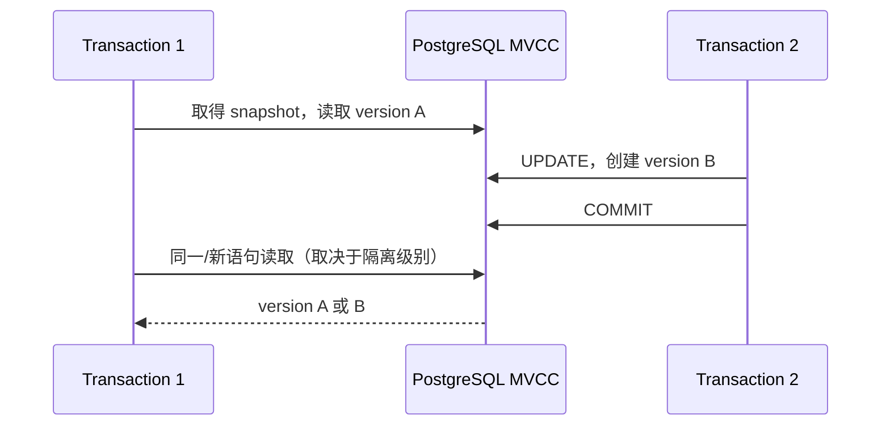

# ACID、MVCC、事务隔离、锁与死锁

数据库事务把一组读写作为一个提交/回滚边界。ACID 描述事务提供的性质；隔离级别定义并发事务可观察的交错；PostgreSQL 通过 MVCC、行/表锁和可序列化冲突检测共同实现这些语义。

## 1. ACID 逐项定义

- Atomicity（原子性）：事务中的变更一起提交或回滚。它不让外部 HTTP、邮件或另一个数据库自动加入原子边界。
- Consistency（一致性）：事务把数据库从满足已声明不变量的状态带到另一个满足不变量的状态。数据库只能执行已编码的约束、触发器和事务逻辑，不能理解未表达的业务规则。
- Isolation（隔离性）：并发执行的可见结果受隔离级别约束。它不是所有级别都等同串行执行。
- Durability（持久性）：提交确认后的变更按配置承诺在故障后可恢复。`synchronous_commit`、复制与存储故障模型会改变具体保证。

## 2. PostgreSQL MVCC 的核心

MVCC 为行保存多个版本。事务读取由快照判断可见的版本，普通读取通常不阻塞普通写入，写入也不会覆盖其他快照仍需要的旧版本。



旧版本最终由 VACUUM 回收。长事务、闲置事务和长时间复制槽会阻止回收，导致表膨胀与事务 ID 风险。事务应短小，应用设置 `idle_in_transaction_session_timeout` 等保护，并监控最老事务。

## 3. PostgreSQL 18 的隔离级别

### Read Committed（默认）

每条语句开始取得新快照。同一事务两次 SELECT 可能看到别的事务在中间提交的新值（不可重复读）。一条 UPDATE 查找目标时会处理并发变化，并可能重新检查 WHERE 条件。

适合大多数短事务，但“先读后写”的跨语句不变量需要条件写、锁或更高隔离保护。

### Repeatable Read

事务内普通查询看到事务开始时一致快照（准确说首次非事务控制语句建立的快照），避免不可重复读；PostgreSQL 实现还不会出现标准允许的幻读。但并发更新可能导致 serialization failure，应用必须重试整个事务。

### Serializable

目标是让成功提交的并发事务效果等价于某种串行顺序。PostgreSQL 使用 Serializable Snapshot Isolation，跟踪读写依赖，发现危险结构时中止一个事务并返回 `40001`。它不等于把所有事务排队，也不取消显式锁需要。

只把隔离级别字符串改为 serializable 而不实现有界的整事务重试，会把并发冲突变成用户错误。

### Read Uncommitted

PostgreSQL 把它当 Read Committed 处理，不提供脏读。SQLite 和 MySQL 的具体默认、快照与锁行为不同，不能把 PostgreSQL 结论直接套用。

## 4. 典型并发现象

| 现象 | 含义 | PostgreSQL RC | RR | Serializable |
|---|---|---:|---:|---:|
| 脏读 | 读到未提交值 | 不会 | 不会 | 不会 |
| 不可重复读 | 同事务重复读值变化 | 可能 | 不会 | 不会 |
| 幻读 | 条件查询出现新匹配行 | 可能 | 不会（PG实现） | 不会 |
| 丢失更新 | 基于旧读覆盖新值 | 需设计防止 | 可能报并发更新错误 | 冲突事务中止 |
| 写偏差 | 两事务读共同条件、写不同对象破坏不变量 | 可能 | 可能 | 检测并中止之一 |

约束优先于应用检查。唯一、外键、CHECK、排除约束能表达的不变量应放数据库。跨多行复杂不变量可用 serializable、显式锁或重新建模为可锁单行。

## 5. 行级锁

`SELECT ... FOR UPDATE` 锁定选中行，阻止其他事务修改/删除或取得冲突锁。其他模式包括 `FOR NO KEY UPDATE`、`FOR SHARE`、`FOR KEY SHARE`，冲突强度不同。

```sql
BEGIN;
SELECT available
FROM inventory
WHERE sku = 'sku_8'
FOR UPDATE;

UPDATE inventory
SET available = available - 1
WHERE sku = 'sku_8';
COMMIT;
```

锁只保护实际锁到的行。查询“没有任何预约”然后锁零行，不能阻止另一个事务插入新预约；需要唯一/排除约束、锁定共同父行或 serializable。

`NOWAIT` 在不能立即获得锁时失败；`SKIP LOCKED` 跳过被锁行，适合多个 worker 领取队列，不适合需要完整一致视图的普通查询。

## 6. 表级锁与 DDL

PostgreSQL 表锁从 ACCESS SHARE 到 ACCESS EXCLUSIVE 有多种模式。普通 SELECT 取得 ACCESS SHARE；许多 ALTER TABLE 操作需要较强锁。`ACCESS EXCLUSIVE` 与所有模式冲突。即使 DDL 本身很快，也可能排在长事务后等待，而后续查询又排在 DDL 后形成阻塞队列。

迁移前设置短 `lock_timeout`，监控阻塞者，在低风险窗口执行。不要误以为 `CREATE INDEX CONCURRENTLY` 没有任何锁或失败状态；它减少写阻塞，但耗时更长且失败可能留下 INVALID 索引。

## 7. 死锁机制

死锁是事务形成等待环：


PostgreSQL 检测后中止一个事务，SQLSTATE `40P01`。避免方法：所有路径按稳定顺序锁资源；缩短事务；先确定目标再锁；不要在持锁事务中调用慢外部服务。死锁仍可能发生，应用应将其作为可重试的整事务失败。

锁等待与死锁不同。单向长等待不会形成环，要通过 `lock_timeout`、`statement_timeout`、监控和终止阻塞源处理。

## 8. 保存点与失败状态

PostgreSQL 事务中任一语句报错后，事务进入 aborted 状态，必须 ROLLBACK；若要局部恢复，事先建立 SAVEPOINT：

```sql
BEGIN;
SAVEPOINT before_optional;
INSERT INTO optional_events ...;
-- 若失败：ROLLBACK TO SAVEPOINT before_optional;
COMMIT;
```

保存点不是把业务不变量拆成可忽略错误的工具。应用驱动的嵌套事务通常由 savepoint 模拟，需清楚最终仍由外层提交决定。

## 9. 重试事务的正确方式

可序列化失败 `40001`、死锁 `40P01` 和部分连接错误可能重试，但必须重新开始整个事务并重新读取。仅重试最后一条 UPDATE 会使用旧决策。使用最大次数、总 deadline 和抖动；外部副作用放事务外并由 outbox/幂等协调。

```text
for attempt within budget:
  begin new transaction
  read current state
  validate invariant
  write
  commit
  if 40001 or 40P01: rollback, jitter, retry whole closure
```

事务 closure 可能多次运行，内部不能直接发送邮件、扣第三方款或生成不可重复随机业务结果。需要把确定结果落库或使用 outbox。

## 10. 完整案例：值班医生写偏差

### 输入

规则：至少一名医生处于 on_call。当前 A、B 都值班。两个 Repeatable Read 事务同时读取总数 2，A 将自己设为 false，B 也将自己设为 false；它们更新不同的行。

### 步骤

1. T1 和 T2 在同一快照看到两人值班。
2. T1 更新 A，T2 更新 B，行锁不冲突。
3. Repeatable Read 下两者可能都提交，规则被破坏。
4. 改为 Serializable，SSI 检测读写依赖危险结构并中止一个事务。
5. 应用捕获 `40001`，重新执行被中止事务；新快照看到只剩一人，因此拒绝下线。

### 输出

最终至少一人值班。也可重新建模，把班次的最小人数/版本放在共同父行并锁定，或用可表达的数据库约束；选择取决于访问模式和争用。

### 验证

- 两连接并发运行相同场景数百次，Repeatable Read 能复现风险。
- Serializable 下不会提交非法最终状态，且应用对 40001 有界重试。
- 重试 closure 内没有外部副作用。
- 事务时长、重试率和最老事务有指标。

### 失败分支

若只在 UPDATE 前运行 `SELECT count(*)` 而仍用 Read Committed，两事务都可能通过。若分别 `FOR UPDATE` 自己的行，也没有锁住共同不变量。修正为锁定代表规则的共同对象，或使用 Serializable 并重试整个事务。

## 11. 锁诊断

定位阻塞时查看 `pg_stat_activity` 的事务开始、query、wait event，以及 `pg_blocking_pids(pid)`。终止连接是最后手段：取消当前语句与终止 session 影响不同，终止会回滚其事务。

记录规范化 SQL 和业务操作，不在共享诊断输出泄露敏感参数。重点找 idle in transaction、长报表事务、未提交迁移和不同代码路径的锁顺序。

## 12. 常见错误

- 将 ACID 的一致性理解为数据库自动知道全部业务规则。
- 认为 PostgreSQL Repeatable Read 与所有数据库完全相同。
- Serializable 不实现重试。
- 只锁已有行，却要保护“没有行”的条件。
- 事务里调用慢外部 API，长时间持锁。
- 发生错误后继续使用已 aborted 的事务。
- 捕获死锁只重试最后一条语句。
- 长事务阻止 VACUUM，却只扩容磁盘。

## 13. 练习

分别实现账户转账、值班医生和队列领取。为每个场景选择约束、条件 UPDATE、显式锁或 Serializable，并写两连接并发测试。

完成标准：转账守恒且余额不为负；写偏差场景不能产生非法状态；队列使用 `SKIP LOCKED` 不重复领取；死锁采用稳定锁顺序并有整事务重试；监控能定位 idle transaction 和阻塞链。

## 来源

- [PostgreSQL 18: Transaction Isolation](https://www.postgresql.org/docs/18/transaction-iso.html)（访问日期：2026-07-17）
- [PostgreSQL 18: Explicit Locking](https://www.postgresql.org/docs/18/explicit-locking.html)（访问日期：2026-07-17）
- [PostgreSQL 18: MVCC Introduction](https://www.postgresql.org/docs/18/mvcc-intro.html)（访问日期：2026-07-17）
- [PostgreSQL 18: Routine Vacuuming](https://www.postgresql.org/docs/18/routine-vacuuming.html)（访问日期：2026-07-17）
- [PostgreSQL 18.4 Release Notes](https://www.postgresql.org/docs/release/18.4/)（访问日期：2026-07-17）
