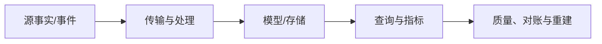

# Warehouse、Lake、Batch、Streaming、Lineage 与 Data Quality

Warehouse、Lake 与 Lakehouse 是存储和治理架构选择；Batch 与 Streaming 是处理时效模型。Lineage 记录数据从输入到输出的依赖，Data Quality 将完整性、唯一性、及时性和业务不变量变成可执行门禁。

## 1. 数据流与决策边界

每个输出必须能追溯输入水位、代码或模型版本、质量结果和权限范围；低延迟不能替代可恢复性。

## 2. Warehouse

机制：受治理的结构化分析存储与计算。

实际用途：BI、统一指标、维度模型。

失败方式：原始数据和生产写混入同层。

验证：权限、成本、模型测试。

取舍：治理强但加载和模型协调。

Warehouse 的生产契约还要定义输入schema、业务/事件时间、幂等键、水位、迟到/删除和重跑行为；成功状态必须对应已发布且通过质量门禁的数据。

## 3. Data Lake

机制：对象存储保存开放格式数据。

实际用途：原始历史、ML和可重放输入。

失败方式：无catalog/schema/owner形成data swamp。

验证：manifest、catalog、partition与访问审计。

取舍：低成本灵活但治理责任高。

Data Lake 的生产契约还要定义输入schema、业务/事件时间、幂等键、水位、迟到/删除和重跑行为；成功状态必须对应已发布且通过质量门禁的数据。

## 4. Lakehouse/Table format

机制：在对象文件上增加事务元数据、snapshot和schema evolution。

实际用途：统一批流和可重复读取。

失败方式：认为对象存储文件天然事务表。

验证：commit log/snapshot/compaction测试。

取舍：开放存储与表管理复杂度。

Lakehouse/Table format 的生产契约还要定义输入schema、业务/事件时间、幂等键、水位、迟到/删除和重跑行为；成功状态必须对应已发布且通过质量门禁的数据。

## 5. Batch

机制：对有界输入按调度运行。

实际用途：日报、回填、复杂重算。

失败方式：超大单批无checkpoint。

验证：batch ID、partition、重跑和SLA。

取舍：吞吐高但延迟由周期决定。

Batch 的生产契约还要定义输入schema、业务/事件时间、幂等键、水位、迟到/删除和重跑行为；成功状态必须对应已发布且通过质量门禁的数据。

## 6. Streaming

机制：持续处理无界事件。

实际用途：实时告警、分钟级指标。

失败方式：假定事件按时按序只来一次。

验证：checkpoint、lag、late data和recovery。

取舍：低延迟但状态/运维复杂。

Streaming 的生产契约还要定义输入schema、业务/事件时间、幂等键、水位、迟到/删除和重跑行为；成功状态必须对应已发布且通过质量门禁的数据。

## 7. Event time

机制：事件实际发生时间用于窗口。

实际用途：业务时间聚合。

失败方式：使用处理时间导致延迟事件错桶。

验证：构造late/out-of-order样例。

取舍：需要watermark和更新结果。

Event time 的生产契约还要定义输入schema、业务/事件时间、幂等键、水位、迟到/删除和重跑行为；成功状态必须对应已发布且通过质量门禁的数据。

## 8. Watermark

机制：系统对事件时间进度的估计。

实际用途：关闭窗口/处理迟到。

失败方式：把watermark当绝无更早事件。

验证：跟踪late rate和允许迟到。

取舍：及时性与完整性取舍。

Watermark 的生产契约还要定义输入schema、业务/事件时间、幂等键、水位、迟到/删除和重跑行为；成功状态必须对应已发布且通过质量门禁的数据。

## 9. Lineage

机制：dataset/column/job之间的来源与变换关系。

实际用途：影响分析、审计、事故定位。

失败方式：只画静态图不接运行版本。

验证：从run manifest验证输入输出。

取舍：采集成本但降低变更风险。

Lineage 的生产契约还要定义输入schema、业务/事件时间、幂等键、水位、迟到/删除和重跑行为；成功状态必须对应已发布且通过质量门禁的数据。

## 10. Data quality

机制：schema、not null、unique、referential、range、freshness、业务守恒。

实际用途：阻止错误发布。

失败方式：只测行数/成功状态。

验证：分层规则、阈值和quarantine。

取舍：严格门禁与可用性取舍。

Data quality 的生产契约还要定义输入schema、业务/事件时间、幂等键、水位、迟到/删除和重跑行为；成功状态必须对应已发布且通过质量门禁的数据。

## 11. Partition/Compaction

机制：按查询/生命周期组织文件并合并小文件。

实际用途：减少扫描和元数据。

失败方式：按高基数ID分区或产生百万小文件。

验证：files/partition、scan bytes和compaction lag。

取舍：写入灵活与读效率平衡。

Partition/Compaction 的生产契约还要定义输入schema、业务/事件时间、幂等键、水位、迟到/删除和重跑行为；成功状态必须对应已发布且通过质量门禁的数据。

## 12. 方案比较

|方案|主要能力|边界|
|---|---|---|
|Warehouse|治理BI|存储/计算成本|
|Lake|低成本原始历史|目录与质量复杂|
|Batch|简单可重算|高延迟|
|Streaming|低延迟|状态/迟到复杂|
|Lakehouse|对象开放+表事务|元数据运维|

## 13. 完整案例：产品事件湖仓

### 输入与约束

10万事件/s，保留原始一年，分析延迟10分钟，事件可能晚到24小时。

### 处理步骤

1. Kafka保存短期流，对象存储按event_date/hour写Parquet原始层。
2. 表格式提交snapshot并小文件compaction。
3. 流任务按event time窗口，watermark允许常见迟到。
4. 24小时内迟到更新聚合，超窗进入修正批次。
5. curated层质量门禁后供warehouse/BI。

### 输出

原始可重放、实时可查询、迟到有明确修正。

### 验证

乱序/重复/晚到样本；snapshot回滚；files与scan成本可控。

### 失败分支

按processing time分区会让迟到事件落错日并难以修正；同时保存event/ingest时间。

### 恢复与重跑

作业以batch/run ID和输入水位幂等重跑，已发布版本不被未验证结果原地覆盖；修复先写隔离版本，对账通过后再切换读指针。

## 14. 完整案例：上游字段删除影响分析

### 输入与约束

订单源计划删除coupon_code，30个模型和5个看板可能依赖。

### 处理步骤

1. lineage从源列映射到staging、模型、指标和dashboard。
2. 识别直接/间接consumer和owner。
3. expand新字段/替代逻辑并双跑对比。
4. 监控旧列读取归零和质量差异。
5. 超过保留/回退窗口后contract。

### 输出

变更影响可枚举，旧模型不在发布时突然失败。

### 验证

运行manifest与仓库query history交叉检查；删除前CI阻断未迁移依赖。

### 失败分支

只有表级lineage会漏列级语义；关键财务字段维护column-level lineage。

### 恢复与重跑

作业以batch/run ID和输入水位幂等重跑，已发布版本不被未验证结果原地覆盖；修复先写隔离版本，对账通过后再切换读指针。

## 15. 失败注入矩阵

|注入|预期信号与恢复|禁止结果|
|---|---|---|
|重复输入|`dataset_freshness` 变化可解释，按水位/版本恢复|静默丢行、重复计量、越权或覆盖已发布版本|
|乱序和迟到|`stream_lag` 变化可解释，按水位/版本恢复|静默丢行、重复计量、越权或覆盖已发布版本|
|源schema变化|`late_event_rate` 变化可解释，按水位/版本恢复|静默丢行、重复计量、越权或覆盖已发布版本|
|任务中途崩溃|`small_files` 变化可解释，按水位/版本恢复|静默丢行、重复计量、越权或覆盖已发布版本|
|下游429/503|`compaction_lag` 变化可解释，按水位/版本恢复|静默丢行、重复计量、越权或覆盖已发布版本|
|checkpoint损坏|`quality_failures` 变化可解释，按水位/版本恢复|静默丢行、重复计量、越权或覆盖已发布版本|
|质量规则失败|`quarantine_rows` 变化可解释，按水位/版本恢复|静默丢行、重复计量、越权或覆盖已发布版本|
|回填与实时并发|`lineage_coverage` 变化可解释，按水位/版本恢复|静默丢行、重复计量、越权或覆盖已发布版本|
|权限撤销|`scan_cost` 变化可解释，按水位/版本恢复|静默丢行、重复计量、越权或覆盖已发布版本|
|成本超预算|`sla_miss` 变化可解释，按水位/版本恢复|静默丢行、重复计量、越权或覆盖已发布版本|

## 16. 数据质量与对账

1. Lake 与 Warehouse 数据集的行数和唯一业务键：定义通过阈值、严重级别、quarantine和是否阻断发布；规则本身进入版本控制。
2. 金额/数量守恒：定义通过阈值、严重级别、quarantine和是否阻断发布；规则本身进入版本控制。
3. not null与范围：定义通过阈值、严重级别、quarantine和是否阻断发布；规则本身进入版本控制。
4. 引用完整性：定义通过阈值、严重级别、quarantine和是否阻断发布；规则本身进入版本控制。
5. 源/目标最大版本：定义通过阈值、严重级别、quarantine和是否阻断发布；规则本身进入版本控制。
6. 删除和tombstone：定义通过阈值、严重级别、quarantine和是否阻断发布；规则本身进入版本控制。
7. freshness/迟到：定义通过阈值、严重级别、quarantine和是否阻断发布；规则本身进入版本控制。
8. 分区完整性：定义通过阈值、严重级别、quarantine和是否阻断发布；规则本身进入版本控制。
9. schema版本：定义通过阈值、严重级别、quarantine和是否阻断发布；规则本身进入版本控制。
10. 抽样hash：定义通过阈值、严重级别、quarantine和是否阻断发布；规则本身进入版本控制。

## 17. 调试与观测

1. `dataset_freshness`：明确单位、采样点、聚合窗口和低基数维度，并与run ID、水位和代码版本关联。
2. `stream_lag`：明确单位、采样点、聚合窗口和低基数维度，并与run ID、水位和代码版本关联。
3. `late_event_rate`：明确单位、采样点、聚合窗口和低基数维度，并与run ID、水位和代码版本关联。
4. `small_files`：明确单位、采样点、聚合窗口和低基数维度，并与run ID、水位和代码版本关联。
5. `compaction_lag`：明确单位、采样点、聚合窗口和低基数维度，并与run ID、水位和代码版本关联。
6. `quality_failures`：明确单位、采样点、聚合窗口和低基数维度，并与run ID、水位和代码版本关联。
7. `quarantine_rows`：明确单位、采样点、聚合窗口和低基数维度，并与run ID、水位和代码版本关联。
8. `lineage_coverage`：明确单位、采样点、聚合窗口和低基数维度，并与run ID、水位和代码版本关联。
9. `scan_cost`：明确单位、采样点、聚合窗口和低基数维度，并与run ID、水位和代码版本关联。
10. `sla_miss`：明确单位、采样点、聚合窗口和低基数维度，并与run ID、水位和代码版本关联。

排障从一个可复现业务分片开始，沿源记录、传输offset、处理checkpoint、目标版本和指标SQL逐跳核对；只看job success不能证明数据正确。

## 18. 安全、成本与运维边界

1. 源凭据最小权限；Warehouse、Lake、Batch、Streaming、Lineage 与 Data Quality 的实现要提供owner、runbook、停止阈值和审计记录。
2. PII分层访问和脱敏；Warehouse、Lake、Batch、Streaming、Lineage 与 Data Quality 的实现要提供owner、runbook、停止阈值和审计记录。
3. 原始层不可被普通BI任意下载；Warehouse、Lake、Batch、Streaming、Lineage 与 Data Quality 的实现要提供owner、runbook、停止阈值和审计记录。
4. 重跑/回填有资源配额；Warehouse、Lake、Batch、Streaming、Lineage 与 Data Quality 的实现要提供owner、runbook、停止阈值和审计记录。
5. 流批共享sink有容量仲裁；Warehouse、Lake、Batch、Streaming、Lineage 与 Data Quality 的实现要提供owner、runbook、停止阈值和审计记录。
6. 删除请求传播到派生层；Warehouse、Lake、Batch、Streaming、Lineage 与 Data Quality 的实现要提供owner、runbook、停止阈值和审计记录。
7. schema发布兼容门禁；Warehouse、Lake、Batch、Streaming、Lineage 与 Data Quality 的实现要提供owner、runbook、停止阈值和审计记录。
8. checkpoint/manifest备份；Warehouse、Lake、Batch、Streaming、Lineage 与 Data Quality 的实现要提供owner、runbook、停止阈值和审计记录。
9. 灾备恢复演练；Warehouse、Lake、Batch、Streaming、Lineage 与 Data Quality 的实现要提供owner、runbook、停止阈值和审计记录。
10. 成本按pipeline/dataset/tenant归集；Warehouse、Lake、Batch、Streaming、Lineage 与 Data Quality 的实现要提供owner、runbook、停止阈值和审计记录。

## 19. 综合练习与验收

实现“产品事件湖仓”，再以“上游字段删除影响分析”验证另一类时效/治理约束。提交数据样例、模型、质量测试、故障注入、lineage和成本面板。

- [ ] Warehouse 的定义、应用、失败和验证均能用真实数据复现。
- [ ] Data Lake 的定义、应用、失败和验证均能用真实数据复现。
- [ ] Lakehouse/Table format 的定义、应用、失败和验证均能用真实数据复现。
- [ ] Batch 的定义、应用、失败和验证均能用真实数据复现。
- [ ] Streaming 的定义、应用、失败和验证均能用真实数据复现。
- [ ] Event time 的定义、应用、失败和验证均能用真实数据复现。
- [ ] Watermark 的定义、应用、失败和验证均能用真实数据复现。
- [ ] Lineage 的定义、应用、失败和验证均能用真实数据复现。
- [ ] 两个案例包含输入、步骤、输出、验证、失败与重跑。
- [ ] 源与目标按业务分片完成count/sum/version/hash对账。
- [ ] 历史发布版本可回退，回填不压垮在线事实系统。

## 来源

- [Apache Flink stable docs](https://nightlies.apache.org/flink/flink-docs-stable/)（访问日期：2026-07-17）
- [Apache Spark Structured Streaming](https://spark.apache.org/docs/latest/streaming/index.html)（访问日期：2026-07-17）
- [Apache Iceberg docs](https://iceberg.apache.org/docs/latest/)（访问日期：2026-07-17）
- [OpenLineage specification](https://openlineage.io/docs/spec/)（访问日期：2026-07-17）
- [dbt data tests](https://docs.getdbt.com/docs/build/data-tests)（访问日期：2026-07-17）
