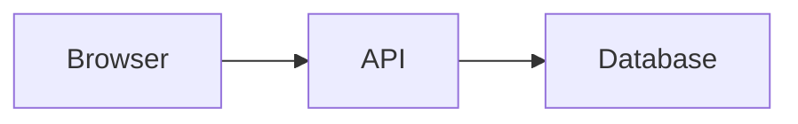

# 图解与实际渲染标准

## 选择视觉形式

- 流程、生命周期、请求链路：Mermaid flowchart 或 sequence diagram。
- 层级、DOM、目录、组件关系：树形图或小型 Mermaid graph。
- 状态迁移：state diagram 或状态表。
- 数据映射、属性比较、方案取舍：表格。
- 算法变化、性能趋势、指标分布：由真实数据生成的图表。
- HTML/CSS/组件/交互结果：可运行示例加真实浏览器截图。
- 命令行、数据库执行计划、网络面板：真实输出的裁剪截图或文本输出。

## 规则

1. 先确定视觉要回答的问题，再选择形式。
2. 不为单一事实添加装饰图。
3. Mermaid 节点文字包含标点时使用引号，保持 GitHub 与 Obsidian 兼容。
4. 图前说明阅读目标，图后解释关键关系。
5. 截图不得替代源码、状态或文字说明。
6. 截图只保留相关区域，隐藏个人信息、Secret、内部地址和无关浏览器界面。
7. 资源放入对应方向的 `notes/assets/`，可运行示例放入该方向的 `examples/`。
8. 使用小写连字符文件名；图片真实格式必须与扩展名一致。
9. 浏览器示例至少检查桌面布局、相关窄屏状态、交互状态、DOM/无障碍名称和控制台错误。
10. 图表数据必须可追踪到示例、脚本或来源。

## 正文写法

````markdown
下图展示请求从浏览器到服务端再到数据库的责任边界：



浏览器只持有用户会话；服务端执行授权和业务校验；数据库约束最终数据不变量。
````

实际渲染图必须链接仓库相对路径：

```markdown

```
